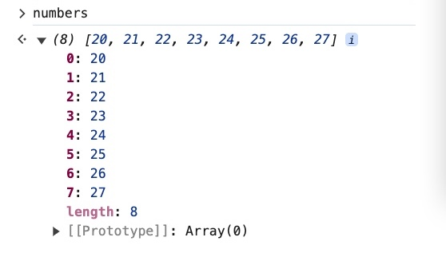

### map

> [**map**](https://developer.mozilla.org/en-US/docs/Web/JavaScript/Reference/Global_Objects/Array/map) creates a new array from an existing array
>

Output: Creates a new array with the results of calling a callback on every element in the array

- Uses:
    - Creates a new array from an existing array
    - Duplicate an array
    - Extract portions of an array
    - Transform an array into a new array
    - Double every number in the array
    - Reverse every string in the original array and make a new array with those reverse strings so it accepts a callback.

<aside>
💡

Similar to **forEach**, **map** calls that callback with every element in the array, but it builds a new array with those values.

</aside>

- Example: Given the 2 arrays

    ```jsx
    const numbers = [20, 21, 22, 23, 24, 25, 26, 27]
    const words = ['asap', 'byob', 'rsvp', 'diy']
    ```

    - Double every element in the array “numbers” using **map**

        ```jsx
        numbers.map(function (num) {
          return num * 2
        })
        ```

        Output:

        

        The original **numbers** array remains unchanged

        

        <aside>
        💡

        **map** does not mutate the original array!

        </aside>

        The **map** method in the **numbers** array maps the values to a new array so you need to capture that values.

        You can assign the **map** function to a variable (**double**) which has now become the new array

        ```jsx
        const double = [40, 42, 44, 46, 48, 50, 52, 54]
        ```

        The original array **numbers** remain unchanged

        ```jsx
        const numbers = [20, 21, 22, 23, 24, 25, 26, 27]
        ```

        

    - Deciding odd/even number
        - Format

            ```jsx
            [
              {
                num: 20,
                isEven: false
              }
            ]
            ```

        - Code

            ```jsx
            const numDetail = numbers.map(function (n) {
                return {
                    value: n,
                    isEven: n % 2 === 0
                }
            })
            ```

        - Screenshot

            


    - Make an array of **abbrevs** that contains strings from **words** IN CAPS

        ```jsx
        const words = ['asap', 'byob', 'rsvp', 'diy']
        ```

        - Expected output

            

        - Code

            ```jsx
            const apprevs = words.map(function (word) {
              return word.toUpperCase().split('').join('.')
            })
            ```


- Questions:
    - Why do you need to “return” for the **double** function?

        What if you don’t return anything for the **numbers** array?

        ```jsx
        numbers.map(function (num) {
          num * 2
        })
        ```

        **map** does not care what the “return” value is, it is going to take whatever is returned from your function and add it into a new array eight (8) times because it ran your function eight (8) times.

        ```jsx
        const numbers = [20, 21, 22, 23, 24, 25, 26, 27];
        ```

        

        There are eight (8) elements here and each time nothing is returned. When a function returns nothing, the value you get is *undefined*.

        So in order to receive the value from the **map** function, you will need to return the value for the function.

    - Why does **return** output “undefined” when using **map**?

        

    - **return** in a **for** loop shows error *Illegal return statement*
        - Problem:

            ```jsx
            const apprevs = []

            for (let i = 0; i < words.length - 1; i++) {
                return apprevs.push(words[i])
            }
            ```

            

        - Reason:
        In JavaScript, `return` can only be used within the context of a **function**.
        - Solutions:
            - With **return**: wrap the code in a function after the loop

                ```jsx
                function getApprevs(words) {
                    const apprevs = [];

                    for (let i = 0; i < words.length - 1; i++) {
                        apprevs.push(words[i]);
                    }

                    return apprevs;
                }
                ```

            - Without **return**

                ```jsx
                const apprevs = [];

                for (let i = 0; i < words.length - 1; i++) {
                    apprevs.push(words[i]);
                }
                ```

        - Output:

            


- Extra challenge:
    - Challenge: Create the array **apprevs** which is the copy of the array **words** following the requirements below
        - Array **apprevs** contains all the elements from the array **words**
        - All elements are in UPPER CASE
        - The characters of the elements are separated by the dot character.
        - Notes:
            - Create two functions, one adds the elements to the array with **push()**, the other uses **map()**
            - return the new values
    - Code: Using **push()**

        ```jsx
        const words = ['asap', 'byob', 'rsvp', 'diy']

        function getApprevs (word) {
          const apprevs = []

          for (const word of words) {
            const transformedWord = word.toUpperCase().split('').join('.')
            apprevs.push(transformedWord)
          }
          return apprevs;
        }
        ```

        

    - Code: using **map()**

        ```jsx
        const words = ['asap', 'byob', 'rsvp', 'diy'];

        function getApprevs(word) {
            const apprevs = words.map(function (word) {
                return word.toUpperCase().split('').join('.'); // Add return statement here
            });
            return apprevs;
        }
        ```

        

        - Question: Why do I have to **return** after **map** array **words** to **apprevs**?

            Without **returning**, the output will be an array of *undefined *****elements

            ```jsx
            const words = ['asap', 'byob', 'rsvp', 'diy']

            function getApprevs (word) {
              const apprevs = words.map(function (word) {
                word.toUpperCase().split('').join('.')
              })
              return apprevs;
            }
            ```

            

        - Reason:
            - The issue in your code arises because the function inside `map()` doesn't return anything explicitly.
            - In JavaScript, if a function does not have a `return` statement, it returns `undefined` by default.
