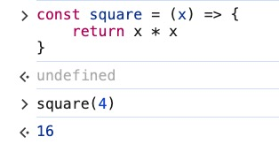
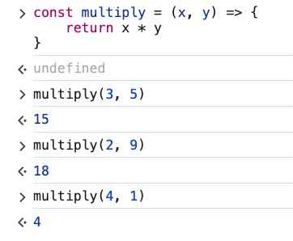

### Arrow Function Intro

> An alternative way of defining a function expression
>

- Example 1: Write function **square** that calculates the exponent of a number
    - Regular function expression

        ```jsx
        const square = function (x) {
          return x * x
        }
        ```

        

    - Arrow function

        ```jsx
        const square = (x) => {
          return x * x
        }
        ```

        

- Example 2: Write **isEven** function that checks for even number
    - Regular function expression

        ```jsx
        const isEven = function (num) {
          return num % 2 === 0
        }
        ```

        

    - Arrow function

        ```jsx
        const isEven = (num) => {
          return num % 2 === 0
        }
        ```

        

- Example 3: Write **multiply** function that does multiplication operation between numbers

    ```jsx
    const multiply = (x, y) => {
      return x * y
    }
    ```

    

- Notes:
    - If there is only one argument for the parameter, parenthesis are optional

        ```jsx
        const isEven = num => {
          return num % 2 === 0
        }
        ```

        

    - If the function requires no argument, you can use an empty parenthesis

        ```jsx
        const greeting = () => {
          console.log('HELLO!')
        }
        ```

        - Output

        

        - Question: Why does the code output *undefined* after every time it logs out "HELLO"?
        - Reason:
            - The arrow function does not return anything *explicitly*. In JavaScript, when a function does not have a `return` statement, it *implicitly* returns `undefined`. If you were to call `greeting()` in the developer console or from another `console.log` statement the function will first log `"HELLO!"` inside itself. Then, since it has *no return value*, the call to `console.log(greeting())` would print `undefined`.
            - So in your case, if you are directly calling `greeting()` in the console, after it logs `"HELLO!"`, the console automatically shows the return value of the function, which is `undefined`.
        - Solution:

            If you don’t want to see the *undefined*, you can call the **greeting()** from within a console.log
