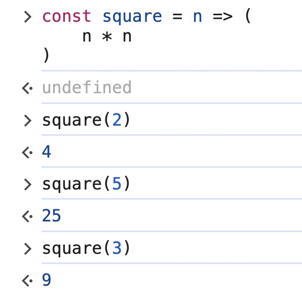
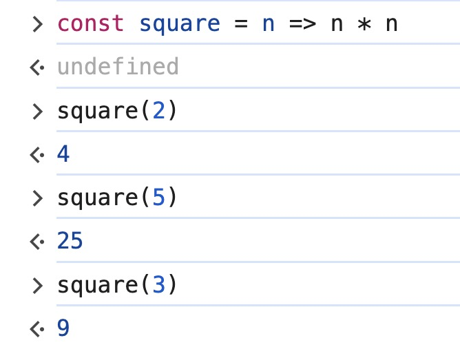
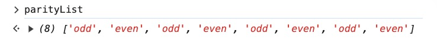

### 05. Arrow Functions: Implicit Returns

> Adding an implicit return to an arrow function means that you don’t have to write the return keyword, in some scenarios you can write a one liner arrow function.
>

- Example 1: Implicit returns
    - Arrow function using **curly braces**

        ```jsx
        const square = n => {
          return n * n;
        }
        ```

        

        This function expression returns an expression **n * n**

        The code could have been written using **implicit return**

        - Replace the *curly braces* with the *parenthesis*
        - Leave off the **return** keyword

    - Modified code
        - Using parenthesis

            ```jsx
            const square = n => (
              n * n
            )
            ```

            

        - Simplified more: One liner function

            ```jsx
            const square = n => n * n
            ```

            

            Notes:

            - You don’t need the parenthesis for the one liner functions.
            - However, you should not turn everything to a one liner functions because they are hard to read
            - Even though the parenthesis are not necessary for the one liner functions most of the times, yet there are times that the one liner is too long and you will need to add in the parenthesis

                ```jsx
                const square = n => ([ksjhfd,kajsdhf,haksdfj,lkjhjf])
                ```

                In this case, the parenthesis makes it clear that the whole thing **([ksjhfd,kajsdhf,haksdfj,lkjhjf])** is the expression.


- Example 2: Invalid implicit returns

    ```jsx
    const square = n => (
      if (n < 0) {
        return false;
      }
      n * n
    )
    ```

    - Output

        

    - Reason:
        - This function does not know what it is supposed to return because you have multiple expressions, multiple lines. You have statement **return false** and condition **if (n < 0)** and you have the expression **n * n** at the bottom.
        - JavaScript does not know what it is suppose to return for this function.
    - Summary: You cannot do this if you are trying to use an implicit return.

- Example 3: Create the new array **double** that contains the doubled values of all the elements from the array **nums**
    - Array **nums**

        ```jsx
        const nums = [1, 2, 3, 4, 5, 6, 7, 8]
        ```

    - Code
        - Function expression

            ```jsx
            const double = nums.map(function (n) {
              return n * 2
            })
            ```

        - Arrow function

            ```jsx
            const double = nums.map(n => {
              return n * 2
            })
            ```

        - Arrow function with implicit return

            ```jsx
            const double = nums.map(n => n * 2)
            ```

    - Output

        

- Example 4: Create an array **parityList** that determine odd/even value from the array **nums** in Example 3
    - Code
        - Function expression

            ```jsx
            const parityList = nums.map(function (n) {
              if (n % 2 === 0) return "even";
              return "odd"
            })
            ```

        - Arrow function

            ```jsx
            const parityList = nums.map(n => {
              if (n % 2 === 0) return "even";
              return "odd"
            })
            ```

        - Arrow function with implicit return: This is **invalid**!
        - Other option for a one liner function: Use ternary operator

            ```jsx
            const parityList = nums.map(n => n % 2 === 0 ? "even" : "odd")
            ```

    - Output:

        


- Question
    - *Uncaught SyntaxError: Unexpected token '=’* when using **function** instead of **const** for the function. Why?
        - Code

            ```jsx
            function square = n => {
              return n * n;
            }
            ```

        - Error

            

        - Reason:

            The error `Uncaught SyntaxError: Unexpected token '='` occurs because the syntax you are using mixes two different function declaration styles in JavaScript.

            - Use `function` without an `=` for traditional function declarations.
            - Use `const` or `let` with `=` for arrow function expressions.
        - Solutions:
            - Using **function** keyword

                ```jsx
                function square(n) {
                  return n * n;
                }
                ```

            - **Arrow** function

                ```jsx
                const square = (n) => {
                  return n * n;
                }
                ```
