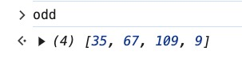
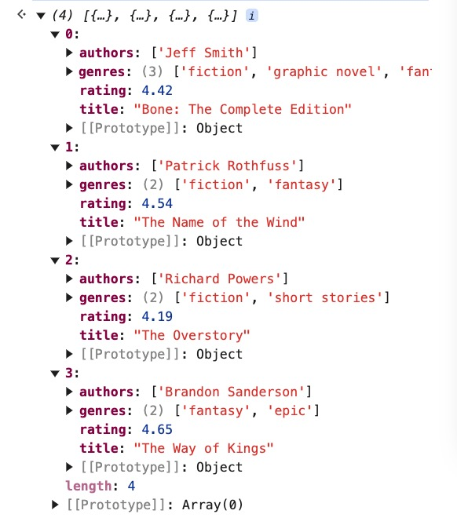

### 07. Filter

> The [**`filter()`**](https://developer.mozilla.org/en-US/docs/Web/JavaScript/Reference/Global_Objects/Array/filter) method of [`Array`](https://developer.mozilla.org/en-US/docs/Web/JavaScript/Reference/Global_Objects/Array) instances creates a [shallow copy](https://developer.mozilla.org/en-US/docs/Glossary/Shallow_copy) of a portion of a given array, filtered down to just the elements from the given array that pass the test implemented by the provided function.
>

- Example 1: Filter the odd numbers from array **nums**

    ```jsx
    const nums = [34, 35, 67, 54, 109, 102, 32, 9]
    ```

    - Arrow function

        ```jsx
        const num = nums.filter(num => {
          return num % 2 === 1;
        })
        ```

    - One liner

        ```jsx
        const odd = nums.filter(num => num % 2 === 1)
        ```


    Output:

    


- Example 2:

    Given array **books**

    ```jsx
    const books = [{
        title: 'Good Omens',
        authors: ['Terry Pratchett', 'Neil Gaiman'],
        rating: 4.25,
        genres: ['fiction', 'fantasy']
      },
      {
        title: 'Changing My Mind',
        authors: ['Zadie Smith'],
        rating: 3.83,
        genres: ['nonfiction', 'essays']
      },
      {
        title: 'Bone: The Complete Edition',
        authors: ['Jeff Smith'],
        rating: 4.42,
        genres: ['fiction', 'graphic novel', 'fantasy']
      },
      {
        title: 'American Gods',
        authors: ['Neil Gaiman'],
        rating: 4.11,
        genres: ['fiction', 'fantasy']
      },
      {
        title: 'A Gentleman in Moscow',
        authors: ['Amor Towles'],
        rating: 4.36,
        genres: ['fiction', 'historical fiction']
      },
      {
        title: 'The Name of the Wind',
        authors: ['Patrick Rothfuss'],
        rating: 4.54,
        genres: ['fiction', 'fantasy']
      },
      {
        title: 'The Overstory',
        authors: ['Richard Powers'],
        rating: 4.19,
        genres: ['fiction', 'short stories']
      },
      {
        title: 'The Way of Kings',
        authors: ['Brandon Sanderson'],
        rating: 4.65,
        genres: ['fantasy', 'epic']
      },
      {
        title: 'Lord of the flies',
        authors: ['William Golding'],
        rating: 3.67,
        genres: ['fiction']
      }
    ]
    ```

    - Filter out the the books which have the rating greater than 4.3

        ```jsx
        const goodBooks = books.filter(b => b.rating > 4.3)
        ```

        Output:

        


    - Filter out the books which are of genre “fantasy” or a mix of “fantasy” and a different genre

        ```jsx
        const fantasyBooks = books.filter(book => {
          return book.genres.includes("fantasy")
        })
        ```

        Output:

        


    - Filter out the books that are either of genre “short stories” or “essays” or a mix of each of those and a different genre.

        ```jsx
        const shortForm = books.filter(book => {
          return book.genres.includes("short stories") || book.genres.includes("essays")
        })
        ```

        Output:

        

    - Filter out the books that has string “**The**” in the title of the book regardless of the case sensitivity (both upper and lower case)

        ```jsx
        const query = "The"
        const results = books.filter(book => {
          const title = book.title.toLowerCase();
          return title.includes(query.toLowerCase())
        })
        ```

        - Output:

        

        - Explanations:
            1. Define the Search Query

                ```jsx
                const query = "The";
                ```

            2. Filter the array

                ```jsx
                const results = books.filter(book => {
                  const title = book.title.toLowerCase(); // Convert the book title to lowercase
                  return title.includes(query.toLowerCase()); // Check if the title contains the lowercase version of the query
                });
                ```

                - The code converts both the book title and the query to lowercase using `toLowerCase()`. This makes the search case-insensitive.
                - It then checks if the lowercase version of the title includes the lowercase version of the query.
                - If the condition is `true`, the book is included in the `results` array.
            3. Result

                The code will output an array containing all books whose titles include the word "The" (case-insensitively). For the given `books` array, the `results` array will contain:

                - "The Name of the Wind"
                - "The Overstory"
                - "The Way of Kings"
                - "Lord of the flies"
        - Without checking for case-sensitive, the program outputs 4 books

            Book title “Lord of the flies” is missing because the title has the lower case “the” so without checking for case-sensitive that book title will be skipped.

            


- Extra challenge
    - Use the same array **nums**, print out even and odd numbers using….
        - for loop

            ```jsx
            for (let i = 0; i <= nums.length - 1; i++) {
                if (nums[i] % 2 === 1) {
                    console.log(`${nums[i]} is Odd`)
                }
                console.log(`${nums[i]} is Even`)
            }
            ```

        - for….of

            ```jsx
            for (const num of nums) {
                if (num % 2 === 1) {
                    console.log(`${num} is Odd`)
                }
                console.log(`${num} is Even`)
            }
            ```


        Ouput:

        
