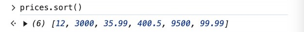
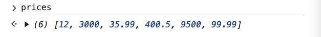
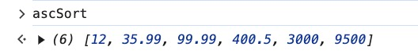
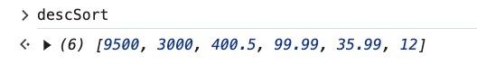
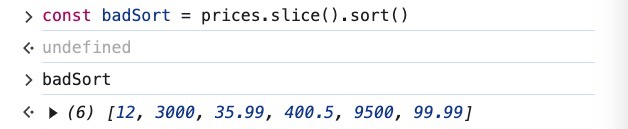
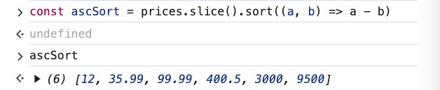
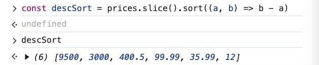
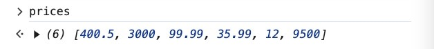
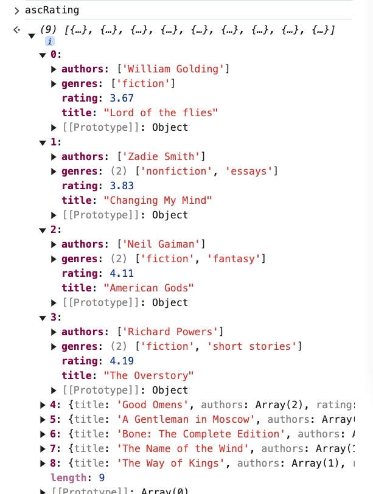
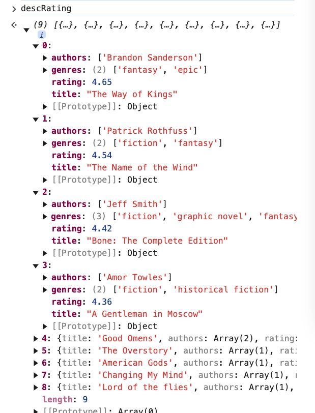

### 9. Revisiting Sort!

- [sort](https://developer.mozilla.org/en-US/docs/Web/JavaScript/Reference/Global_Objects/Array/sort) definition
    - sorts the elements of an array [*in place*](https://en.wikipedia.org/wiki/In-place_algorithm) and returns the reference to the same array, now sorted.
    - The default sort order is ascending, built upon converting the elements into strings, then comparing their sequences of UTF-16 code units values.

- Example 1: Simple sort based on the first digits of the number

    Given array **prices**

    ```jsx
    const prices = [400.50, 3000, 99.99, 35.99, 12.00, 9500]
    ```

    Code

    ```jsx
    prices.sort()
    ```

    Output

    

    Note: The original array is mutated

    

    Explanations:

    - The numbers are sorted based on the comparison starting with the first digit and then the second digit.
    - As long as the first two digits equal, the comparison will move on to the third digit, so on and so forth.

- Example 2: Sort based on the value of the number (ascending & descending)

    Syntax: `sort(compareFn)`

    Given array **prices**

    ```jsx
    const prices = [400.50, 3000, 99.99, 35.99, 12.00, 9500]
    ```

    - Ascending sort

        Code

        ```jsx
        const ascSort = prices.sort((a, b) => a - b)
        ```

        Output

        

        Explanations:

        `compareFn` parameter should return a number where:

        - A negative value indicates that `a` should come before `b`.
        - A positive value indicates that `a` should come after `b`.
        - Zero or `NaN` indicates that `a` and `b` are considered equal.

    - Descending sort

        Code

        ```jsx
        const descSort = prices.sort((a, b) => b - a)
        ```

        Output

        


- Example 3:

    If you DON’T want to sort the array in-place (the original array is mutated), you can use [**slice()**](https://developer.mozilla.org/en-US/docs/Web/JavaScript/Reference/Global_Objects/Array/slice) to make a [shallow copy](https://developer.mozilla.org/en-US/docs/Glossary/Shallow_copy) of the original array which will be mutated by **sort()** and then assigned to a variable.

    Given the same array **prices**

    ```jsx
    const prices = [400.50, 3000, 99.99, 35.99, 12.00, 9500]
    ```

    - Default sort()

        ```jsx
        const badSort = prices.slice().sort()
        // We name it "badSort" because there is not order for the sorting array
        // Neither is it ascending or descending
        ```

        


    - Ascending sort()

        ```jsx
        const ascSort = prices.slice().sort((a, b) => a - b)
        ```

        


    - Descending sort()

        ```jsx
        const descSort = prices.slice().sort((a, b) => b - a)
        ```

        


    The original array is not mutated, it stays the same

    


- Example 4: Sort the **books** array of objects

    ```jsx
    const books = [{
        title: 'Good Omens',
        authors: ['Terry Pratchett', 'Neil Gaiman'],
        rating: 4.25,
        genres: ['fiction', 'fantasy']
      },
      {
        title: 'Changing My Mind',
        authors: ['Zadie Smith'],
        rating: 3.83,
        genres: ['nonfiction', 'essays']
      },
      {
        title: 'Bone: The Complete Edition',
        authors: ['Jeff Smith'],
        rating: 4.42,
        genres: ['fiction', 'graphic novel', 'fantasy']
      },
      {
        title: 'American Gods',
        authors: ['Neil Gaiman'],
        rating: 4.11,
        genres: ['fiction', 'fantasy']
      },
      {
        title: 'A Gentleman in Moscow',
        authors: ['Amor Towles'],
        rating: 4.36,
        genres: ['fiction', 'historical fiction']
      },
      {
        title: 'The Name of the Wind',
        authors: ['Patrick Rothfuss'],
        rating: 4.54,
        genres: ['fiction', 'fantasy']
      },
      {
        title: 'The Overstory',
        authors: ['Richard Powers'],
        rating: 4.19,
        genres: ['fiction', 'short stories']
      },
      {
        title: 'The Way of Kings',
        authors: ['Brandon Sanderson'],
        rating: 4.65,
        genres: ['fantasy', 'epic']
      },
      {
        title: 'Lord of the flies',
        authors: ['William Golding'],
        rating: 3.67,
        genres: ['fiction']
      }
    ]
    ```

    - Ascending rating

        Code

        ```jsx
        const ascRating = books.sort((a, b) => a.rating - b.rating)
        ```

        Output

        


    - Descending rating

        Code

        ```jsx
        const descRating = books.sort((a, b) => b.rating - a.rating)
        ```

        Output

        
