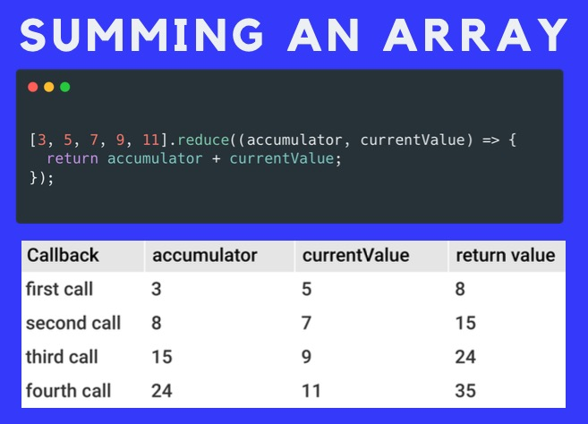

### 10. Reduce Intro

> Executes a reducer function on each element of the array, **resulting in a single value**. Read more about [reduce](https://developer.mozilla.org/en-US/docs/Web/JavaScript/Reference/Global_Objects/Array/reduce)
>

- Illustration

    

- Syntax

  ```jsx
  reduce(callbackFn)
  reduce(callbackFn, initialValue)
  ```

- Example:

    Given the array **nums**

    ```jsx
    const nums = [3, 4, 5, 6, 7]
    ```

    Write a program that will calculate the product of all elements in the array **nums** by multiplying the total value by the value of the current element

    ```jsx
    const product = nums.reduce((total, currentValue) => {
      return total * currentValue
    })
    ```

    Output

    ```jsx
    2520
    ```

    Explanation:

    | Callback | total | currentValue | return value |
    | --- | --- | --- | --- |
    | first call | 3 | 4 | 12 |
    | second call | 12 | 5 | 60 |
    | third call | 60 | 6 | 360 |
    | fourth call | 360 | 7 | 2520 |
