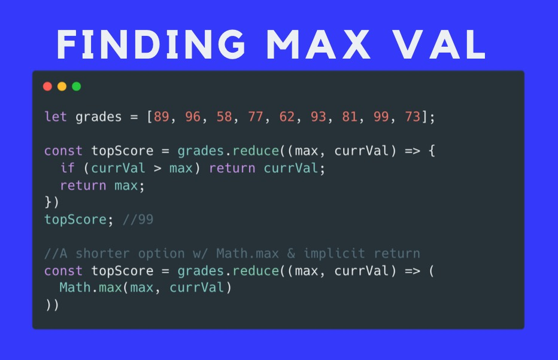
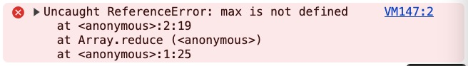

### 11. Reduce Pt. 2

- Illustration

    


- Example 1:

    Given the array **grades**

    ```jsx
    const grades = [87, 64, 96, 92, 88, 99, 73, 70, 64]
    ```

    - Find max grade
        - Using “reduce”

            Code

            ```jsx
            const maxGrade = grades.reduce((max, currVal) => {
                if (currVal > max) return currVal;
                return max;
            })
            ```

            Output:

            ```jsx
            99
            ```

            Explanation

            | Callback | max | currVal | return value |
            | --- | --- | --- | --- |
            | first call | 87 | 64 | 87 |
            | second call | 87 | 96 | 96 |
            | third call | 96 | 92 | 96 |
            | fourth call | 96 | 99 | 99 |
        - Using “reduce” and “[Math.max](https://developer.mozilla.org/en-US/docs/Web/JavaScript/Reference/Global_Objects/Math/max)”

            Syntax

            ```jsx
            Math.max()
            Math.max(value1)
            Math.max(value1, value2)
            Math.max(value1, value2, /* …, */ valueN)
            ```

            Code

            ```jsx
            const maxGrade = grades.reduce((max, currVal) => {
                return Math.max(max, currVal);
            })
            ```

            Output

            ```jsx
            99
            ```


    - Find min grade (using “reduce” and “[Math.min()](https://developer.mozilla.org/en-US/docs/Web/JavaScript/Reference/Global_Objects/Math/min)”)

        Syntax

        ```jsx
        Math.min()
        Math.min(value1)
        Math.min(value1, value2)
        Math.min(value1, value2, /* …, */ valueN)
        ```

        Code

        ```jsx
        const minGrade = grades.reduce((min, currVal) => {
            return Math.min(min, currVal);
        })
        ```

        Output:

        ```jsx
        64
        ```

    - Calculate the sum of all array elements using "reduce" and then assign it to a variable
        Code

        ```jsx
        const sum = [10, 20, 30, 40, 50].reduce((sum, currVal) => {
            return sum + currVal
        })
        ```

        Output

        ```jsx
        150
        ```

- Extra question
    - Use “reduce” to find the greatest value in the array

        ```jsx
        const num = [22, 11, 9, 30, 5, 01, 10, 055]
        ```

        Code

        ```jsx
        const greatestNum = num.reduce((greatest, currVal) => {
            if (greatest > currVal) return greatest
            return currVal
        })
        ```

        Output:

        ```jsx
        45
        ```

        Question: There is no value “45” in the array. Where did it come from?

        - Reason

            JavaScript interpreting certain values in your array as octal (base 8) numbers because of the leading zeros.

        - Explanation

            In JavaScript

            - Numbers starting with `0` are treated as **octal literals** if they do not contain `8` or `9`, as octal uses only digits `0-7`.
            - For example, `01` and `055` are interpreted in octal by JavaScript, translating to decimal `1` and `45`, respectively.

    - Use “reduce” and “Math.min()” to find the lowest grade

        Given

        ```jsx
        const grades = [87, 64, 96, 92, 88, 99, 73, 70, 64]
        ```

        Code

        ```jsx
        const minGrade = grades.reduce((min, currVal) => {
            return Math.min(max, currVal);
        })
        ```

        Output:

        

        Reason: “max” is not defined as a parameter
