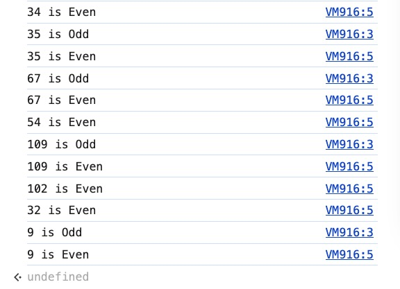

## CONTENT

### 01. Intro to Array Callback Methods

> Callbacks are central to JavaScript
>

- Intro:
    - Tons of built-in methods expect you to pass a callback function in and they all have to do with arrays.
    - There are also other types of callback methods in JavaScript yet this section is focused on array methods that expect you to pass in a callback.

- Goals:
    - Use the new arrow function syntax
    - Understand and use these methods
        - [forEarch](https://developer.mozilla.org/en-US/docs/Web/JavaScript/Reference/Global_Objects/Array/forEach)
        - [map](https://developer.mozilla.org/en-US/docs/Web/JavaScript/Reference/Global_Objects/Array/map)
        - [filter](https://developer.mozilla.org/en-US/docs/Web/JavaScript/Reference/Global_Objects/Array/filter)
        - [find](https://developer.mozilla.org/en-US/docs/Web/JavaScript/Reference/Global_Objects/Array/find)
        - [reduce](https://developer.mozilla.org/en-US/docs/Web/JavaScript/Reference/Global_Objects/Array/reduce)
        - [some](https://developer.mozilla.org/en-US/docs/Web/JavaScript/Reference/Global_Objects/Array/some)
        - [every](https://developer.mozilla.org/en-US/docs/Web/JavaScript/Reference/Global_Objects/Array/every)

### 02. forEach

> Calls the function once per element in the array
>

- Example 1: Using **forEach** for the array **numbers**
    - [**forEach**](https://developer.mozilla.org/en-US/docs/Web/JavaScript/Reference/Global_Objects/Array/forEach) (array method)

        ```jsx
        const numbers = [20, 21, 22, 23, 24, 25, 26, 27];

        numbers.forEach(function (num) {
          console.log(num)
        })
        ```

        

    - Same array **numbers** but with
        - [**for…..of**](https://developer.mozilla.org/en-US/docs/Web/JavaScript/Reference/Statements/for...of) loop (control flow statement)

            ```jsx
            for (const num of numbers) {
              console.log(num)
            }
            ```

        - regular [**for**](https://developer.mozilla.org/en-US/docs/Web/JavaScript/Reference/Statements/for) loop (control flow statement)

            ```jsx
            for (let i = 0; i <= numbers.length - 1; i++) {
              console.log(numbers[i])
            }
            ```

    - Double every elements in the array **numbers** using **forEach** loop

        ```jsx
        numbers.forEach(function (num) {
          console.log(num * 2)
        })
        ```

        

    - You could also have written the function ahead of time

        ```jsx
        function printTriple (n) {
          console.log(n * 3)
        }

        numbers.forEach(printTriple)
        ```

        

    - Print out the **id** and **value** for each element in the array **numbers**

        The array

        ```jsx
        const numbers = [20, 21, 22, 23, 24, 25, 26, 27];
        ```

        - Code

            ```jsx
            numbers.forEach(function (num, id) {
              console.log(id, num);
            })
            ```

            

        - **Note:** The **order** of arguments that you pass into the function and when printing them out is **reversed**.
            - The first argument is ALWAYS going to be the values of each array element.

            

            

            - It does NOT matter which order you pass the arguments into the function.

                The *first argument* is ALWAYS going to be the *value* of the element.

                The *second argument* is going to be the *indices* of the array elements.

                

                

            - Therefore, if you want to have **id** as the first value and the **num** as the second value to be printed out, you will need to reverse the two arguments when you print them out.

- Example 2: Using **forEach** with the array **books** of objects
    - Print out every **title** from this array of objects.

        ```jsx
        const books = [
          {
            title: 'Good Omens',
            author: ['Terry Pratchett', 'Neil Gaiman'],
            rating: 4.25
          },
          {
            title: 'Bone: The Complete Edition',
            author: ['Jeff Smith'],
            rating: 4.42
          },
          {
            title: 'American Gods',
            author: ['Neil Gaiman'],
            rating: 4.11
          },
          {
            title: 'A Gentleman in Moscow',
            author: ['Amor Towles'],
            rating: 4.36
          }
        ]
        ```

    - The approach:
        - Call each object **book** is an array element of the array **books**.
        - Print out each object **book** using **forEach** on the array **books.**
        - As you access each object, now you can access the **title** using “dot” operator
    - **forEach**

        ```jsx
        books.forEach(function (book) {
          console.log(book.title)
        })
        ```

    - Extra
        - Using **for…of** loop (control flow statement)

            ```jsx
            for (const book of books) {
              console.log(book.title)
            }
            ```

        - Using **for** loop (control flow statement)

            ```jsx
            for (let i = 0; i <= books.length - 1; i++) {
              console.log(books[i].title)
            }
            ```

    - Output

        


- Questions:
    - You can pass in whatever argument I want for the **printTriple()** function and **forEach** will still still give me the correct results. Why is that?

        ```jsx
        function printTriple (num) {
          console.log(num * 3)
        }
        ```

        or

        ```jsx
        function printTriple (numbers) {
          console.log(numbers * 3)
        }
        ```

        or

        ```jsx
        function printTriple (n) {
          console.log(n * 3)
        }
        ```

        Output:

        

        Reason:

        Here are what happens behind the scene

        Given the array

        ```jsx
        const numbers = [20, 21, 22, 23, 24, 25, 26, 27];
        ```

        Internally the **forEach** would call **printTriple(20)**, **printTriple(21)**, **printTriple(22)** and it does it until it hits the end of the array.

    - What is the difference between using an **anonymous** versus a **standalone** function with **forEach**?

        This is the use for an anonymous function

        ```jsx
        numbers.forEach(function (num) {
          console.log(num)
        })
        ```

        This is the use for a standalone function **printTriple**

        ```jsx
        function printTriple (n) {
          console.log(n * 3)
        }

        numbers.forEach(printTriple)
        ```

        Reason:

        Generally speaking, for **forEach** and most of the functions in this Section 10 then you will only need a function to run some codes in which you will not be using it again, therefore, what you will need is an anonymous function and it will not be necessary for the use of standalone functions.

    - Is there a way to print out the id and value for each array element of array **numbers** using **for…of** and regular **for** loops?
        - **for…of**

            You can print out the id and value for each array element using [**entries()**](https://developer.mozilla.org/en-US/docs/Web/JavaScript/Reference/Global_Objects/Array/entries)

            ```jsx
            for (const [id, value] of numbers.entries()) {
                console.log(id, value)
            }
            ```

            

        - regular **for**

            ```jsx
            for (let i = 0; i <= numbers.length - 1; i++) {
              console.log(i, numbers[i])
            }
            ```

            

### 03. map

> [**map**](https://developer.mozilla.org/en-US/docs/Web/JavaScript/Reference/Global_Objects/Array/map) creates a new array from an existing array
>

Output: Creates a new array with the results of calling a callback on every element in the array

- Uses:
    - Creates a new array from an existing array
    - Duplicate an array
    - Extract portions of an array
    - Transform an array into a new array
    - Double every number in the array
    - Reverse every string in the original array and make a new array with those reverse strings so it accepts a callback.

<aside>
💡

Similar to **forEach**, **map** calls that callback with every element in the array, but it builds a new array with those values.

</aside>

- Example: Given the 2 arrays

    ```jsx
    const numbers = [20, 21, 22, 23, 24, 25, 26, 27]
    const words = ['asap', 'byob', 'rsvp', 'diy']
    ```

    - Double every element in the array “numbers” using **map**

        ```jsx
        numbers.map(function (num) {
          return num * 2
        })
        ```

        Output:

        

        The original **numbers** array remains unchanged

        

        <aside>
        💡

        **map** does not mutate the original array!

        </aside>

        The **map** method in the **numbers** array maps the values to a new array so you need to capture that values.

        You can assign the **map** function to a variable (**double**) which has now become the new array

        ```jsx
        const double = [40, 42, 44, 46, 48, 50, 52, 54]
        ```

        The original array **numbers** remain unchanged

        ```jsx
        const numbers = [20, 21, 22, 23, 24, 25, 26, 27]
        ```

        

    - Deciding odd/even number
        - Format

            ```jsx
            [
              {
                num: 20,
                isEven: false
              }
            ]
            ```

        - Code

            ```jsx
            const numDetail = numbers.map(function (n) {
                return {
                    value: n,
                    isEven: n % 2 === 0
                }
            })
            ```

        - Screenshot

            


    - Make an array of **abbrevs** that contains strings from **words** IN CAPS

        ```jsx
        const words = ['asap', 'byob', 'rsvp', 'diy']
        ```

        - Expected output

            

        - Code

            ```jsx
            const apprevs = words.map(function (word) {
              return word.toUpperCase().split('').join('.')
            })
            ```


- Questions:
    - Why do you need to “return” for the **double** function?

        What if you don’t return anything for the **numbers** array?

        ```jsx
        numbers.map(function (num) {
          num * 2
        })
        ```

        **map** does not care what the “return” value is, it is going to take whatever is returned from your function and add it into a new array eight (8) times because it ran your function eight (8) times.

        ```jsx
        const numbers = [20, 21, 22, 23, 24, 25, 26, 27];
        ```

        

        There are eight (8) elements here and each time nothing is returned. When a function returns nothing, the value you get is *undefined*.

        So in order to receive the value from the **map** function, you will need to return the value for the function.

    - Why does **return** output “undefined” when using **map**?

        

    - **return** in a **for** loop shows error *Illegal return statement*
        - Problem:

            ```jsx
            const apprevs = []

            for (let i = 0; i < words.length - 1; i++) {
                return apprevs.push(words[i])
            }
            ```

            

        - Reason:
        In JavaScript, `return` can only be used within the context of a **function**.
        - Solutions:
            - With **return**: wrap the code in a function after the loop

                ```jsx
                function getApprevs(words) {
                    const apprevs = [];

                    for (let i = 0; i < words.length - 1; i++) {
                        apprevs.push(words[i]);
                    }

                    return apprevs;
                }
                ```

            - Without **return**

                ```jsx
                const apprevs = [];

                for (let i = 0; i < words.length - 1; i++) {
                    apprevs.push(words[i]);
                }
                ```

        - Output:

            


- Extra challenge:
    - Challenge: Create the array **apprevs** which is the copy of the array **words** following the requirements below
        - Array **apprevs** contains all the elements from the array **words**
        - All elements are in UPPER CASE
        - The characters of the elements are separated by the dot character.
        - Notes:
            - Create two functions, one adds the elements to the array with **push()**, the other uses **map()**
            - return the new values
    - Code: Using **push()**

        ```jsx
        const words = ['asap', 'byob', 'rsvp', 'diy']

        function getApprevs (word) {
          const apprevs = []

          for (const word of words) {
            const transformedWord = word.toUpperCase().split('').join('.')
            apprevs.push(transformedWord)
          }
          return apprevs;
        }
        ```

        

    - Code: using **map()**

        ```jsx
        const words = ['asap', 'byob', 'rsvp', 'diy'];

        function getApprevs(word) {
            const apprevs = words.map(function (word) {
                return word.toUpperCase().split('').join('.'); // Add return statement here
            });
            return apprevs;
        }
        ```

        

        - Question: Why do I have to **return** after **map** array **words** to **apprevs**?

            Without **returning**, the output will be an array of *undefined *****elements

            ```jsx
            const words = ['asap', 'byob', 'rsvp', 'diy']

            function getApprevs (word) {
              const apprevs = words.map(function (word) {
                word.toUpperCase().split('').join('.')
              })
              return apprevs;
            }
            ```

            

        - Reason:
            - The issue in your code arises because the function inside `map()` doesn't return anything explicitly.
            - In JavaScript, if a function does not have a `return` statement, it returns `undefined` by default.

### 04. Arrow Function Intro

> An alternative way of defining a function expression
>

- Example 1: Write function **square** that calculates the exponent of a number
    - Regular function expression

        ```jsx
        const square = function (x) {
          return x * x
        }
        ```

        

    - Arrow function

        ```jsx
        const square = (x) => {
          return x * x
        }
        ```

        

- Example 2: Write **isEven** function that checks for even number
    - Regular function expression

        ```jsx
        const isEven = function (num) {
          return num % 2 === 0
        }
        ```

        

    - Arrow function

        ```jsx
        const isEven = (num) => {
          return num % 2 === 0
        }
        ```

        

- Example 3: Write **multiply** function that does multiplication operation between numbers

    ```jsx
    const multiply = (x, y) => {
      return x * y
    }
    ```

    

- Notes:
    - If there is only one argument for the parameter, parenthesis are optional

        ```jsx
        const isEven = num => {
          return num % 2 === 0
        }
        ```

        

    - If the function requires no argument, you can use an empty parenthesis

        ```jsx
        const greeting = () => {
          console.log('HELLO!')
        }
        ```

        - Output

        

        - Question: Why does the code output *undefined* after every time it logs out "HELLO"?
        - Reason:
            - The arrow function does not return anything *explicitly*. In JavaScript, when a function does not have a `return` statement, it *implicitly* returns `undefined`. If you were to call `greeting()` in the developer console or from another `console.log` statement the function will first log `"HELLO!"` inside itself. Then, since it has *no return value*, the call to `console.log(greeting())` would print `undefined`.
            - So in your case, if you are directly calling `greeting()` in the console, after it logs `"HELLO!"`, the console automatically shows the return value of the function, which is `undefined`.
        - Solution:

            If you don’t want to see the *undefined*, you can call the **greeting()** from within a console.log

### 05. Arrow Functions: Implicit Returns

> Adding an implicit return to an arrow function means that you don’t have to write the return keyword, in some scenarios you can write a one liner arrow function.
>

- Example 1: Implicit returns
    - Arrow function using **curly braces**

        ```jsx
        const square = n => {
          return n * n;
        }
        ```

        

        This function expression returns an expression **n * n**

        The code could have been written using **implicit return**

        - Replace the *curly braces* with the *parenthesis*
        - Leave off the **return** keyword

    - Modified code
        - Using parenthesis

            ```jsx
            const square = n => (
              n * n
            )
            ```

            

        - Simplified more: One liner function

            ```jsx
            const square = n => n * n
            ```

            

            Notes:

            - You don’t need the parenthesis for the one liner functions.
            - However, you should not turn everything to a one liner functions because they are hard to read
            - Even though the parenthesis are not necessary for the one liner functions most of the times, yet there are times that the one liner is too long and you will need to add in the parenthesis

                ```jsx
                const square = n => ([ksjhfd,kajsdhf,haksdfj,lkjhjf])
                ```

                In this case, the parenthesis makes it clear that the whole thing **([ksjhfd,kajsdhf,haksdfj,lkjhjf])** is the expression.


- Example 2: Invalid implicit returns

    ```jsx
    const square = n => (
      if (n < 0) {
        return false;
      }
      n * n
    )
    ```

    - Output

        

    - Reason:
        - This function does not know what it is supposed to return because you have multiple expressions, multiple lines. You have statement **return false** and condition **if (n < 0)** and you have the expression **n * n** at the bottom.
        - JavaScript does not know what it is suppose to return for this function.
    - Summary: You cannot do this if you are trying to use an implicit return.

- Example 3: Create the new array **double** that contains the doubled values of all the elements from the array **nums**
    - Array **nums**

        ```jsx
        const nums = [1, 2, 3, 4, 5, 6, 7, 8]
        ```

    - Code
        - Function expression

            ```jsx
            const double = nums.map(function (n) {
              return n * 2
            })
            ```

        - Arrow function

            ```jsx
            const double = nums.map(n => {
              return n * 2
            })
            ```

        - Arrow function with implicit return

            ```jsx
            const double = nums.map(n => n * 2)
            ```

    - Output

        

- Example 4: Create an array **parityList** that determine odd/even value from the array **nums** in Example 3
    - Code
        - Function expression

            ```jsx
            const parityList = nums.map(function (n) {
              if (n % 2 === 0) return "even";
              return "odd"
            })
            ```

        - Arrow function

            ```jsx
            const parityList = nums.map(n => {
              if (n % 2 === 0) return "even";
              return "odd"
            })
            ```

        - Arrow function with implicit return: This is **invalid**!
        - Other option for a one liner function: Use ternary operator

            ```jsx
            const parityList = nums.map(n => n % 2 === 0 ? "even" : "odd")
            ```

    - Output:

        


- Question
    - *Uncaught SyntaxError: Unexpected token '=’* when using **function** instead of **const** for the function. Why?
        - Code

            ```jsx
            function square = n => {
              return n * n;
            }
            ```

        - Error

            

        - Reason:

            The error `Uncaught SyntaxError: Unexpected token '='` occurs because the syntax you are using mixes two different function declaration styles in JavaScript.

            - Use `function` without an `=` for traditional function declarations.
            - Use `const` or `let` with `=` for arrow function expressions.
        - Solutions:
            - Using **function** keyword

                ```jsx
                function square(n) {
                  return n * n;
                }
                ```

            - **Arrow** function

                ```jsx
                const square = (n) => {
                  return n * n;
                }
                ```

### 06. Array.find

> returns the value of the **first element** in the array that satisfies the provided testing function
>

- find
    - An array method that expects a callback.
    - It finds an element, it retrieves an element from an array based off of a function that we pass in.
    - returns true or false
    - each time **find** will call the function with one of the elements in the array, if the function returns true then it’s done.
    - ONLY return ONE matched value even if there are ten matches in the given array. It stops after it finds the very first one.

- Example 1

    Given the array of strings **movies**

    ```jsx
    let movies = [
        "The Fantastic Mr. Fox",
        "Mr. and Mrs. Smith",
        "Mrs. Doubtfire",
        "Mr. Deeds"
    ]
    ```

    Write a program that prints out the **first string** that includes “**Mrs.**”

    - Code (arrow function)

        ```jsx
        const movie = movies.find(movie => {
          return movie.includes("Mrs.")
        })
        ```

    - Code (function expression)

        ```jsx
        const movie = movies.find(function (movie) {
            return movie.includes("Mrs.")
        })
        ```


    - Output:

        ```jsx
        'Mr. and Mrs. Smith'
        ```


- Example 2:

    Write a program that prints out the string in which “**Mrs**.” starts at the **beginning** of the string

    - Code (arrow function)

        ```jsx
        const movie = movies.find(movie => {
          return movie.indexOf("Mrs.") === 0
        })
        ```


    - Code (function expression)

        ```jsx
        const movie = movies.find(function (movie) {
          return movie.indexOf("Mrs.") === 0
        })
        ```


    - Code (one-liner)

        ```jsx
        const movie = movies.find(m => m.indexOf("Mrs.") === 0)
        ```


    - Output

        ```jsx
        'Mrs. Doubtfire'
        ```


- Example 3:

    Given the array of objects

    ```jsx
    const books = [
      {
        title: 'Good Omens',
        author: ['Terry Pratchett', 'Neil Gaiman'],
        rating: 4.25
      },
      {
        title: 'Bone: The Complete Edition',
        author: ['Jeff Smith'],
        rating: 4.42
      },
      {
        title: 'American Gods',
        author: ['Neil Gaiman'],
        rating: 4.11
      },
      {
        title: 'A Gentleman in Moscow',
        author: ['Amor Towles'],
        rating: 4.36
      }
    ]
    ```

    Get all the titles for the books with rating greater than 4.3

    - Code (answer from the course)

        ```jsx
        const book = books.find(book => {
            return book.rating > 4.3
        })
        ```

        Output:

        


    - Code (one liner)

        ```jsx
        const book = books.find(b => b.rating > 4.3)
        ```


    - Code (my code)

        ```jsx
        const book = books.find(book => {
            if (book.rating > 4.3) {
                return book.title
            }
        })
        ```

        Output:


    

    - Code (function expression)

        ```jsx
        const book = books.find(function (book) {
            return book.rating > 4.3
        })
        ```


- Example 4:

    Get the book from author “**Neil Gaiman**”

    ```jsx
    const book = books.find(book => {
      return book.author.includes("Neil Gaiman")
    })
    ```

    


- Question
    - Why did the **if** conditional statement and **return** statement give the complete object and not just the title of the book with the range of rating?
        - Code

            ```jsx
            if (book.rating >= 4.3) {
              return book.title
            }
            ```

        - Output

        

        - Reasons:
            - `find()` method returns the entire object that matches the condition, not just a specific property from it.
            - The `find()` method returns the first book object where `book.rating > 4.3` evaluates to `true`.
            - The method doesn't return `book.title` directly; it returns the entire book object.
        - Solution:

            ```jsx
            const book = books.find(book => book.rating > 4.3);

            const title = book ? book.title : undefined;
            console.log(title); // This will output 'Bone: The Complete Edition'
            ```

            Using optional chaining

            ```jsx
            const title = books.find(book => book.rating > 4.3)?.title;
            console.log(title); // Outputs: 'Bone: The Complete Edition'
            ```

### 07. Filter

> The [**`filter()`**](https://developer.mozilla.org/en-US/docs/Web/JavaScript/Reference/Global_Objects/Array/filter) method of [`Array`](https://developer.mozilla.org/en-US/docs/Web/JavaScript/Reference/Global_Objects/Array) instances creates a [shallow copy](https://developer.mozilla.org/en-US/docs/Glossary/Shallow_copy) of a portion of a given array, filtered down to just the elements from the given array that pass the test implemented by the provided function.
>

- Example 1: Filter the odd numbers from array **nums**

    ```jsx
    const nums = [34, 35, 67, 54, 109, 102, 32, 9]
    ```

    - Arrow function

        ```jsx
        const num = nums.filter(num => {
          return num % 2 === 1;
        })
        ```

    - One liner

        ```jsx
        const odd = nums.filter(num => num % 2 === 1)
        ```


    Output:

    


- Example 2:

    Given array **books**

    ```jsx
    const books = [{
        title: 'Good Omens',
        authors: ['Terry Pratchett', 'Neil Gaiman'],
        rating: 4.25,
        genres: ['fiction', 'fantasy']
      },
      {
        title: 'Changing My Mind',
        authors: ['Zadie Smith'],
        rating: 3.83,
        genres: ['nonfiction', 'essays']
      },
      {
        title: 'Bone: The Complete Edition',
        authors: ['Jeff Smith'],
        rating: 4.42,
        genres: ['fiction', 'graphic novel', 'fantasy']
      },
      {
        title: 'American Gods',
        authors: ['Neil Gaiman'],
        rating: 4.11,
        genres: ['fiction', 'fantasy']
      },
      {
        title: 'A Gentleman in Moscow',
        authors: ['Amor Towles'],
        rating: 4.36,
        genres: ['fiction', 'historical fiction']
      },
      {
        title: 'The Name of the Wind',
        authors: ['Patrick Rothfuss'],
        rating: 4.54,
        genres: ['fiction', 'fantasy']
      },
      {
        title: 'The Overstory',
        authors: ['Richard Powers'],
        rating: 4.19,
        genres: ['fiction', 'short stories']
      },
      {
        title: 'The Way of Kings',
        authors: ['Brandon Sanderson'],
        rating: 4.65,
        genres: ['fantasy', 'epic']
      },
      {
        title: 'Lord of the flies',
        authors: ['William Golding'],
        rating: 3.67,
        genres: ['fiction']
      }
    ]
    ```

    - Filter out the the books which have the rating greater than 4.3

        ```jsx
        const goodBooks = books.filter(b => b.rating > 4.3)
        ```

        Output:

        


    - Filter out the books which are of genre “fantasy” or a mix of “fantasy” and a different genre

        ```jsx
        const fantasyBooks = books.filter(book => {
          return book.genres.includes("fantasy")
        })
        ```

        Output:

        


    - Filter out the books that are either of genre “short stories” or “essays” or a mix of each of those and a different genre.

        ```jsx
        const shortForm = books.filter(book => {
          return book.genres.includes("short stories") || book.genres.includes("essays")
        })
        ```

        Output:

        

    - Filter out the books that has string “**The**” in the title of the book regardless of the case sensitivity (both upper and lower case)

        ```jsx
        const query = "The"
        const results = books.filter(book => {
          const title = book.title.toLowerCase();
          return title.includes(query.toLowerCase())
        })
        ```

        - Output:

        

        - Explanations:
            1. Define the Search Query

                ```jsx
                const query = "The";
                ```

            2. Filter the array

                ```jsx
                const results = books.filter(book => {
                  const title = book.title.toLowerCase(); // Convert the book title to lowercase
                  return title.includes(query.toLowerCase()); // Check if the title contains the lowercase version of the query
                });
                ```

                - The code converts both the book title and the query to lowercase using `toLowerCase()`. This makes the search case-insensitive.
                - It then checks if the lowercase version of the title includes the lowercase version of the query.
                - If the condition is `true`, the book is included in the `results` array.
            3. Result

                The code will output an array containing all books whose titles include the word "The" (case-insensitively). For the given `books` array, the `results` array will contain:

                - "The Name of the Wind"
                - "The Overstory"
                - "The Way of Kings"
                - "Lord of the flies"
        - Without checking for case-sensitive, the program outputs 4 books

            Book title “Lord of the flies” is missing because the title has the lower case “the” so without checking for case-sensitive that book title will be skipped.

            


- Extra challenge
    - Use the same array **nums**, print out even and odd numbers using….
        - for loop

            ```jsx
            for (let i = 0; i <= nums.length - 1; i++) {
                if (nums[i] % 2 === 1) {
                    console.log(`${nums[i]} is Odd`)
                }
                console.log(`${nums[i]} is Even`)
            }
            ```

        - for….of

            ```jsx
            for (const num of nums) {
                if (num % 2 === 1) {
                    console.log(`${num} is Odd`)
                }
                console.log(`${num} is Even`)
            }
            ```


        Ouput:

        

### 08. Some & Every

- [Every](https://developer.mozilla.org/en-US/docs/Web/JavaScript/Reference/Global_Objects/Array/every)
    - Definition:
        - It tests whether all elements in the array pass the test implemented by the provided function.
        - It returns a Boolean value.

    - Example 1:

        Given the array **words**

        ```jsx
        const words = ['dog', 'dig', 'log', 'bag', 'wags'];
        ```

        Write a code to test whether each string has 3 characters

        ```jsx
        const all3Lets = words.every(word => word.length === 3)
        ```

        Output:

        ```jsx
        false
        ```

        Reason: “wags” has 4 characters

        By removing 1 random character from “wags”, the program now outputs “true”

        

    - Example 2:

        Given the array **words**

        ```jsx
        const words = ['dog', 'dig', 'log', 'bag', 'wag'];
        ```

        Write a program to check if the last character of those words is letter “g”

        ```jsx
        const allEndInG = words.every(word => {
          const last = word.length - 1;
          return word[last] === 'g';
        })
        ```

        Output:

        ```jsx
        true
        ```


    - Example 3:

        Given the same array

        ```jsx
        const words = ['dog', 'dig', 'log', 'bag', 'wag'];
        ```

        Write a program to check if all the string start with letter “d”

        ```jsx
        const allStartWithD = words.every(word => word[0] === 'd')
        ```

        Output:

        ```jsx
        false
        ```

        Reasons:

        - ‘dog’, ‘dig’ starts with ‘d’
        - ‘log’, ‘bag’, ‘wag’ do not start with ‘d’

    - Example 4:

        Given the array of objects **books**

        ```jsx
        const books = [{
            title: 'Good Omens',
            authors: ['Terry Pratchett', 'Neil Gaiman'],
            rating: 4.25,
            genres: ['fiction', 'fantasy']
          },
          {
            title: 'Changing My Mind',
            authors: ['Zadie Smith'],
            rating: 3.83,
            genres: ['nonfiction', 'essays']
          },
          {
            title: 'Bone: The Complete Edition',
            authors: ['Jeff Smith'],
            rating: 4.42,
            genres: ['fiction', 'graphic novel', 'fantasy']
          },
          {
            title: 'American Gods',
            authors: ['Neil Gaiman'],
            rating: 4.11,
            genres: ['fiction', 'fantasy']
          },
          {
            title: 'A Gentleman in Moscow',
            authors: ['Amor Towles'],
            rating: 4.36,
            genres: ['fiction', 'historical fiction']
          },
          {
            title: 'The Name of the Wind',
            authors: ['Patrick Rothfuss'],
            rating: 4.54,
            genres: ['fiction', 'fantasy']
          },
          {
            title: 'The Overstory',
            authors: ['Richard Powers'],
            rating: 4.19,
            genres: ['fiction', 'short stories']
          },
          {
            title: 'The Way of Kings',
            authors: ['Brandon Sanderson'],
            rating: 4.65,
            genres: ['fantasy', 'epic']
          },
          {
            title: 'Lord of the flies',
            authors: ['William Golding'],
            rating: 3.67,
            genres: ['fiction']
          }
        ]
        ```

        Write a program to check if all ratings of the books are greater than 4.5

        ```jsx
        const allGoodBooks = books.every(book => book.rating > 4.5)
        ```

        Output:

        ```jsx
        false
        ```


- [Some](https://developer.mozilla.org/en-US/docs/Web/JavaScript/Reference/Global_Objects/Array/some)
    - Definition:
        - It tests whether **at least one** element in the array passes the test implemented by the provided function.
        - It returns true if, in the array, it finds an element for which the provided function returns true; otherwise it returns false.
        - It doesn't modify the array.

    - Example 1:

        Given array **words**

        ```jsx
        const words = ['dog', 'dig', 'log', 'bag', 'wag'];
        ```

        Write a program to check whether any of the string starts with letter “d”

        ```jsx
        const someStartsWithD = words.some(word => word[0] === 'd')
        ```

        Output:

        ```jsx
        true
        ```


    - Example 2:

        Given the array **books**

        ```jsx
        const books = [{
            title: 'Good Omens',
            authors: ['Terry Pratchett', 'Neil Gaiman'],
            rating: 4.25,
            genres: ['fiction', 'fantasy']
          },
          {
            title: 'Changing My Mind',
            authors: ['Zadie Smith'],
            rating: 3.83,
            genres: ['nonfiction', 'essays']
          },
          {
            title: 'Bone: The Complete Edition',
            authors: ['Jeff Smith'],
            rating: 4.42,
            genres: ['fiction', 'graphic novel', 'fantasy']
          },
          {
            title: 'American Gods',
            authors: ['Neil Gaiman'],
            rating: 4.11,
            genres: ['fiction', 'fantasy']
          },
          {
            title: 'A Gentleman in Moscow',
            authors: ['Amor Towles'],
            rating: 4.36,
            genres: ['fiction', 'historical fiction']
          },
          {
            title: 'The Name of the Wind',
            authors: ['Patrick Rothfuss'],
            rating: 4.54,
            genres: ['fiction', 'fantasy']
          },
          {
            title: 'The Overstory',
            authors: ['Richard Powers'],
            rating: 4.19,
            genres: ['fiction', 'short stories']
          },
          {
            title: 'The Way of Kings',
            authors: ['Brandon Sanderson'],
            rating: 4.65,
            genres: ['fantasy', 'epic']
          },
          {
            title: 'Lord of the flies',
            authors: ['William Golding'],
            rating: 3.67,
            genres: ['fiction']
          }
        ]
        ```

        Write a program to check if there is any book that is written by 2 authors

        ```jsx
        const any2Authors = books.some(book => book.authors.length === 2)
        ```

        Output:

        ```jsx
        true
        ```

        Reason:

        ‘Good Omens’ is written by 'Terry Pratchett' and 'Neil Gaiman'