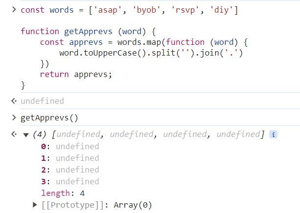

## CONTENT

### Intro to Array Callback Methods

> Callbacks are central to JavaScript
>

- Intro:
    - Tons of built-in methods expect you to pass a callback function in and they all have to do with arrays.
    - There are also other types of callback methods in JavaScript yet this section is focused on array methods that expect you to pass in a callback.

- Goals:
    - Use the new arrow function syntax
    - Understand and use these methods
        - [forEarch](https://developer.mozilla.org/en-US/docs/Web/JavaScript/Reference/Global_Objects/Array/forEach)
        - [map](https://developer.mozilla.org/en-US/docs/Web/JavaScript/Reference/Global_Objects/Array/map)
        - [filter](https://developer.mozilla.org/en-US/docs/Web/JavaScript/Reference/Global_Objects/Array/filter)
        - [find](https://developer.mozilla.org/en-US/docs/Web/JavaScript/Reference/Global_Objects/Array/find)
        - [reduce](https://developer.mozilla.org/en-US/docs/Web/JavaScript/Reference/Global_Objects/Array/reduce)
        - [some](https://developer.mozilla.org/en-US/docs/Web/JavaScript/Reference/Global_Objects/Array/some)
        - [every](https://developer.mozilla.org/en-US/docs/Web/JavaScript/Reference/Global_Objects/Array/every)

### forEach

> Calls the function once per element in the array
>

- Example 1: Using **forEach** for the array **numbers**
    - [**forEach**](https://developer.mozilla.org/en-US/docs/Web/JavaScript/Reference/Global_Objects/Array/forEach) (array method)

        ```jsx
        const numbers = [20, 21, 22, 23, 24, 25, 26, 27];

        numbers.forEach(function (num) {
          console.log(num)
        })
        ```

        

    - Same array **numbers** but with
        - [**for…..of**](https://developer.mozilla.org/en-US/docs/Web/JavaScript/Reference/Statements/for...of) loop (control flow statement)

            ```jsx
            for (const num of numbers) {
              console.log(num)
            }
            ```

        - regular [**for**](https://developer.mozilla.org/en-US/docs/Web/JavaScript/Reference/Statements/for) loop (control flow statement)

            ```jsx
            for (let i = 0; i <= numbers.length - 1; i++) {
              console.log(numbers[i])
            }
            ```

    - Double every elements in the array **numbers** using **forEach** loop

        ```jsx
        numbers.forEach(function (num) {
          console.log(num * 2)
        })
        ```

        

    - You could also have written the function ahead of time

        ```jsx
        function printTriple (n) {
          console.log(n * 3)
        }

        numbers.forEach(printTriple)
        ```

        

    - Print out the **id** and **value** for each element in the array **numbers**

        The array

        ```jsx
        const numbers = [20, 21, 22, 23, 24, 25, 26, 27];
        ```

        - Code

            ```jsx
            numbers.forEach(function (num, id) {
              console.log(id, num);
            })
            ```

            

        - **Note:** The **order** of arguments that you pass into the function and when printing them out is **reversed**.
            - The first argument is ALWAYS going to be the values of each array element.

            

            

            - It does NOT matter which order you pass the arguments into the function.

                The *first argument* is ALWAYS going to be the *value* of the element.

                The *second argument* is going to be the *indices* of the array elements.

                

                

            - Therefore, if you want to have **id** as the first value and the **num** as the second value to be printed out, you will need to reverse the two arguments when you print them out.

- Example 2: Using **forEach** with the array **books** of objects
    - Print out every **title** from this array of objects.

        ```jsx
        const books = [
          {
            title: 'Good Omens',
            author: ['Terry Pratchett', 'Neil Gaiman'],
            rating: 4.25
          },
          {
            title: 'Bone: The Complete Edition',
            author: ['Jeff Smith'],
            rating: 4.42
          },
          {
            title: 'American Gods',
            author: ['Neil Gaiman'],
            rating: 4.11
          },
          {
            title: 'A Gentleman in Moscow',
            author: ['Amor Towles'],
            rating: 4.36
          }
        ]
        ```

    - The approach:
        - Call each object **book** is an array element of the array **books**.
        - Print out each object **book** using **forEach** on the array **books.**
        - As you access each object, now you can access the **title** using “dot” operator
    - **forEach**

        ```jsx
        books.forEach(function (book) {
          console.log(book.title)
        })
        ```

    - Extra
        - Using **for…of** loop (control flow statement)

            ```jsx
            for (const book of books) {
              console.log(book.title)
            }
            ```

        - Using **for** loop (control flow statement)

            ```jsx
            for (let i = 0; i <= books.length - 1; i++) {
              console.log(books[i].title)
            }
            ```

    - Output

        


- Questions:
    - You can pass in whatever argument I want for the **printTriple()** function and **forEach** will still still give me the correct results. Why is that?

        ```jsx
        function printTriple (num) {
          console.log(num * 3)
        }
        ```

        or

        ```jsx
        function printTriple (numbers) {
          console.log(numbers * 3)
        }
        ```

        or

        ```jsx
        function printTriple (n) {
          console.log(n * 3)
        }
        ```

        Output:

        

        Reason:

        Here are what happens behind the scene

        Given the array

        ```jsx
        const numbers = [20, 21, 22, 23, 24, 25, 26, 27];
        ```

        Internally the **forEach** would call **printTriple(20)**, **printTriple(21)**, **printTriple(22)** and it does it until it hits the end of the array.

    - What is the difference between using an **anonymous** versus a **standalone** function with **forEach**?

        This is the use for an anonymous function

        ```jsx
        numbers.forEach(function (num) {
          console.log(num)
        })
        ```

        This is the use for a standalone function **printTriple**

        ```jsx
        function printTriple (n) {
          console.log(n * 3)
        }

        numbers.forEach(printTriple)
        ```

        Reason:

        Generally speaking, for **forEach** and most of the functions in this Section 10 then you will only need a function to run some codes in which you will not be using it again, therefore, what you will need is an anonymous function and it will not be necessary for the use of standalone functions.

    - Is there a way to print out the id and value for each array element of array **numbers** using **for…of** and regular **for** loops?
        - **for…of**

            You can print out the id and value for each array element using [**entries()**](https://developer.mozilla.org/en-US/docs/Web/JavaScript/Reference/Global_Objects/Array/entries)

            ```jsx
            for (const [id, value] of numbers.entries()) {
                console.log(id, value)
            }
            ```

            

        - regular **for**

            ```jsx
            for (let i = 0; i <= numbers.length - 1; i++) {
              console.log(i, numbers[i])
            }
            ```

            

### map

> [**map**](https://developer.mozilla.org/en-US/docs/Web/JavaScript/Reference/Global_Objects/Array/map) creates a new array from an existing array
>

Output: Creates a new array with the results of calling a callback on every element in the array

- Uses:
    - Creates a new array from an existing array
    - Duplicate an array
    - Extract portions of an array
    - Transform an array into a new array
    - Double every number in the array
    - Reverse every string in the original array and make a new array with those reverse strings so it accepts a callback.

<aside>
💡

Similar to **forEach**, **map** calls that callback with every element in the array, but it builds a new array with those values.

</aside>

- Example: Given the 2 arrays

    ```jsx
    const numbers = [20, 21, 22, 23, 24, 25, 26, 27]
    const words = ['asap', 'byob', 'rsvp', 'diy']
    ```

    - Double every element in the array “numbers” using **map**

        ```jsx
        numbers.map(function (num) {
          return num * 2
        })
        ```

        Output:

        

        The original **numbers** array remains unchanged

        

        <aside>
        💡

        **map** does not mutate the original array!

        </aside>

        The **map** method in the **numbers** array maps the values to a new array so you need to capture that values.

        You can assign the **map** function to a variable (**double**) which has now become the new array

        ```jsx
        const double = [40, 42, 44, 46, 48, 50, 52, 54]
        ```

        The original array **numbers** remain unchanged

        ```jsx
        const numbers = [20, 21, 22, 23, 24, 25, 26, 27]
        ```

        

    - Deciding odd/even number
        - Format

            ```jsx
            [
              {
                num: 20,
                isEven: false
              }
            ]
            ```

        - Code

            ```jsx
            const numDetail = numbers.map(function (n) {
                return {
                    value: n,
                    isEven: n % 2 === 0
                }
            })
            ```

        - Screenshot

            


    - Make an array of **abbrevs** that contains strings from **words** IN CAPS

        ```jsx
        const words = ['asap', 'byob', 'rsvp', 'diy']
        ```

        - Expected output

            

        - Code

            ```jsx
            const apprevs = words.map(function (word) {
              return word.toUpperCase().split('').join('.')
            })
            ```


- Questions:
    - Why do you need to “return” for the **double** function?

        What if you don’t return anything for the **numbers** array?

        ```jsx
        numbers.map(function (num) {
          num * 2
        })
        ```

        **map** does not care what the “return” value is, it is going to take whatever is returned from your function and add it into a new array eight (8) times because it ran your function eight (8) times.

        ```jsx
        const numbers = [20, 21, 22, 23, 24, 25, 26, 27];
        ```

        

        There are eight (8) elements here and each time nothing is returned. When a function returns nothing, the value you get is *undefined*.

        So in order to receive the value from the **map** function, you will need to return the value for the function.

    - Why does **return** output “undefined” when using **map**?

        

    - **return** in a **for** loop shows error *Illegal return statement*
        - Problem:

            ```jsx
            const apprevs = []

            for (let i = 0; i < words.length - 1; i++) {
                return apprevs.push(words[i])
            }
            ```

            

        - Reason:
        In JavaScript, `return` can only be used within the context of a **function**.
        - Solutions:
            - With **return**: wrap the code in a function after the loop

                ```jsx
                function getApprevs(words) {
                    const apprevs = [];

                    for (let i = 0; i < words.length - 1; i++) {
                        apprevs.push(words[i]);
                    }

                    return apprevs;
                }
                ```

            - Without **return**

                ```jsx
                const apprevs = [];

                for (let i = 0; i < words.length - 1; i++) {
                    apprevs.push(words[i]);
                }
                ```

        - Output:

            


- Extra challenge:
    - Challenge: Create the array **apprevs** which is the copy of the array **words** following the requirements below
        - Array **apprevs** contains all the elements from the array **words**
        - All elements are in UPPER CASE
        - The characters of the elements are separated by the dot character.
        - Notes:
            - Create two functions, one adds the elements to the array with **push()**, the other uses **map()**
            - return the new values
    - Code: Using **push()**

        ```jsx
        const words = ['asap', 'byob', 'rsvp', 'diy']

        function getApprevs (word) {
          const apprevs = []

          for (const word of words) {
            const transformedWord = word.toUpperCase().split('').join('.')
            apprevs.push(transformedWord)
          }
          return apprevs;
        }
        ```

        

    - Code: using **map()**

        ```jsx
        const words = ['asap', 'byob', 'rsvp', 'diy'];

        function getApprevs(word) {
            const apprevs = words.map(function (word) {
                return word.toUpperCase().split('').join('.'); // Add return statement here
            });
            return apprevs;
        }
        ```

        

        - Question: Why do I have to **return** after **map** array **words** to **apprevs**?

            Without **returning**, the output will be an array of *undefined *****elements

            ```jsx
            const words = ['asap', 'byob', 'rsvp', 'diy']

            function getApprevs (word) {
              const apprevs = words.map(function (word) {
                word.toUpperCase().split('').join('.')
              })
              return apprevs;
            }
            ```

            

        - Reason:
            - The issue in your code arises because the function inside `map()` doesn't return anything explicitly.
            - In JavaScript, if a function does not have a `return` statement, it returns `undefined` by default.