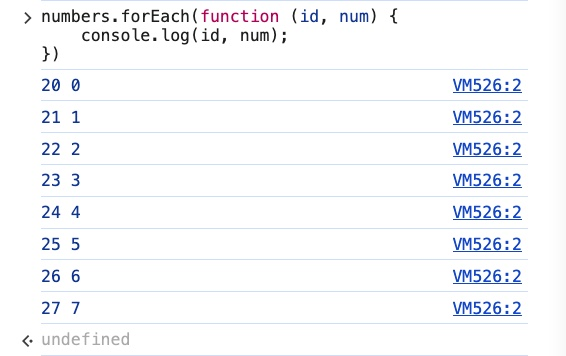
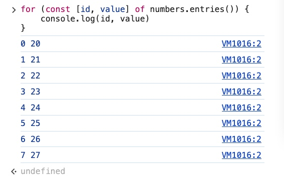
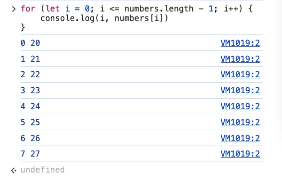

### forEach

> Calls the function once per element in the array
>

- Example 1: Using **forEach** for the array **numbers**
    - [**forEach**](https://developer.mozilla.org/en-US/docs/Web/JavaScript/Reference/Global_Objects/Array/forEach) (array method)

        ```jsx
        const numbers = [20, 21, 22, 23, 24, 25, 26, 27];

        numbers.forEach(function (num) {
          console.log(num)
        })
        ```

        

    - Same array **numbers** but with
        - [**for…..of**](https://developer.mozilla.org/en-US/docs/Web/JavaScript/Reference/Statements/for...of) loop (control flow statement)

            ```jsx
            for (const num of numbers) {
              console.log(num)
            }
            ```

        - regular [**for**](https://developer.mozilla.org/en-US/docs/Web/JavaScript/Reference/Statements/for) loop (control flow statement)

            ```jsx
            for (let i = 0; i <= numbers.length - 1; i++) {
              console.log(numbers[i])
            }
            ```

    - Double every elements in the array **numbers** using **forEach** loop

        ```jsx
        numbers.forEach(function (num) {
          console.log(num * 2)
        })
        ```

        

    - You could also have written the function ahead of time

        ```jsx
        function printTriple (n) {
          console.log(n * 3)
        }

        numbers.forEach(printTriple)
        ```

        

    - Print out the **id** and **value** for each element in the array **numbers**

        The array

        ```jsx
        const numbers = [20, 21, 22, 23, 24, 25, 26, 27];
        ```

        - Code

            ```jsx
            numbers.forEach(function (num, id) {
              console.log(id, num);
            })
            ```

            

        - **Note:** The **order** of arguments that you pass into the function and when printing them out is **reversed**.
            - The first argument is ALWAYS going to be the values of each array element.

            

            

            - It does NOT matter which order you pass the arguments into the function.

                The *first argument* is ALWAYS going to be the *value* of the element.

                The *second argument* is going to be the *indices* of the array elements.

                

                

            - Therefore, if you want to have **id** as the first value and the **num** as the second value to be printed out, you will need to reverse the two arguments when you print them out.

- Example 2: Using **forEach** with the array **books** of objects
    - Print out every **title** from this array of objects.

        ```jsx
        const books = [
          {
            title: 'Good Omens',
            author: ['Terry Pratchett', 'Neil Gaiman'],
            rating: 4.25
          },
          {
            title: 'Bone: The Complete Edition',
            author: ['Jeff Smith'],
            rating: 4.42
          },
          {
            title: 'American Gods',
            author: ['Neil Gaiman'],
            rating: 4.11
          },
          {
            title: 'A Gentleman in Moscow',
            author: ['Amor Towles'],
            rating: 4.36
          }
        ]
        ```

    - The approach:
        - Call each object **book** is an array element of the array **books**.
        - Print out each object **book** using **forEach** on the array **books.**
        - As you access each object, now you can access the **title** using “dot” operator
    - **forEach**

        ```jsx
        books.forEach(function (book) {
          console.log(book.title)
        })
        ```

    - Extra
        - Using **for…of** loop (control flow statement)

            ```jsx
            for (const book of books) {
              console.log(book.title)
            }
            ```

        - Using **for** loop (control flow statement)

            ```jsx
            for (let i = 0; i <= books.length - 1; i++) {
              console.log(books[i].title)
            }
            ```

    - Output

        


- Questions:
    - You can pass in whatever argument I want for the **printTriple()** function and **forEach** will still still give me the correct results. Why is that?

        ```jsx
        function printTriple (num) {
          console.log(num * 3)
        }
        ```

        or

        ```jsx
        function printTriple (numbers) {
          console.log(numbers * 3)
        }
        ```

        or

        ```jsx
        function printTriple (n) {
          console.log(n * 3)
        }
        ```

        Output:

        

        Reason:

        Here are what happens behind the scene

        Given the array

        ```jsx
        const numbers = [20, 21, 22, 23, 24, 25, 26, 27];
        ```

        Internally the **forEach** would call **printTriple(20)**, **printTriple(21)**, **printTriple(22)** and it does it until it hits the end of the array.

    - What is the difference between using an **anonymous** versus a **standalone** function with **forEach**?

        This is the use for an anonymous function

        ```jsx
        numbers.forEach(function (num) {
          console.log(num)
        })
        ```

        This is the use for a standalone function **printTriple**

        ```jsx
        function printTriple (n) {
          console.log(n * 3)
        }

        numbers.forEach(printTriple)
        ```

        Reason:

        Generally speaking, for **forEach** and most of the functions in this Section 10 then you will only need a function to run some codes in which you will not be using it again, therefore, what you will need is an anonymous function and it will not be necessary for the use of standalone functions.

    - Is there a way to print out the id and value for each array element of array **numbers** using **for…of** and regular **for** loops?
        - **for…of**

            You can print out the id and value for each array element using [**entries()**](https://developer.mozilla.org/en-US/docs/Web/JavaScript/Reference/Global_Objects/Array/entries)

            ```jsx
            for (const [id, value] of numbers.entries()) {
                console.log(id, value)
            }
            ```

            

        - regular **for**

            ```jsx
            for (let i = 0; i <= numbers.length - 1; i++) {
              console.log(i, numbers[i])
            }
            ```

            
