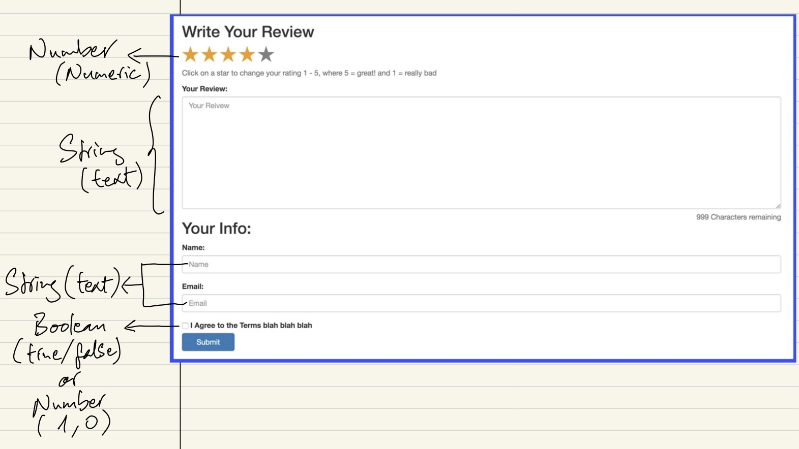
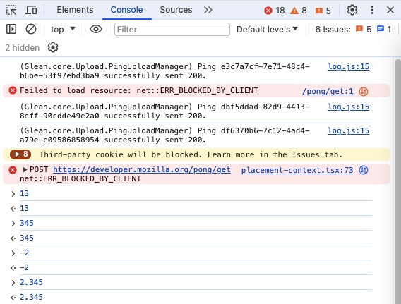
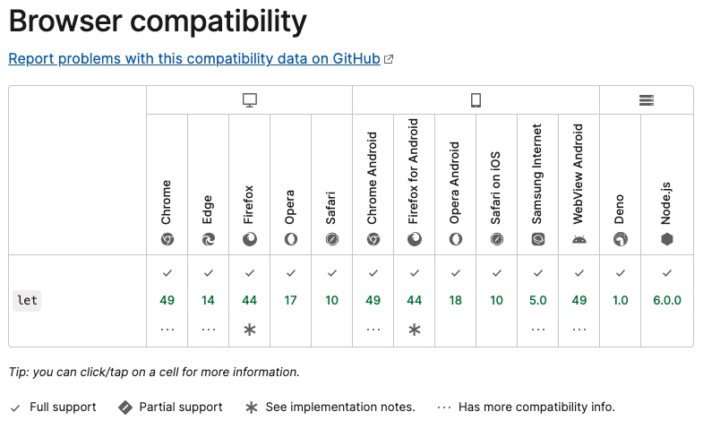

### Section 2: JS Values & Variables
#### 6. Goals & Primitives
#### 7. Running Code in the JS Console
#### 8. Introducing Numbers
#### 9. NaN & Infinity
#### 11. Variables & Let
#### 12. Unary Operators
#### 13. Introducing Const
#### 14. The Legacy of Var
#### 15. Variable Quiz

=================================

#### 6. Goals & Primitives
- Goals
    - Work with primitive types
    - Understand let & const
    - Use String Template Literals
    - Work with common operators/methods

- Primitive types
    - Number
    - String
    - Boolean
    - Null
    - Undefined

    **Note**: Technically there are two others: Symbol and BigInt.<br>
    

    <br>

    - "Review" form
        - Number: Star rating (Numeric)
        - String
            - Your review (text)
            - Name (text)
            - Email (text)
        - Boolean (true/false) OR number (1, 0): Checkbox ("I agree to the term....")


#### 7. Running Code in the JS Console
Run code in the console in whatever browser you use



#### 8. Introducing Numbers

- JavaScript has ONE Number type
    - Positive numbers!
    - Negative numbers!
    - Whole number (integers)!
    - Decimal numbers!

- Code sample
    ```
    > 13
    < 13
    > 345
    < 345
    > -2
    < -2
    > 2.345
    < 2.345
    > 1.0000000000000009
    < 1.0000000000000009
    ```

    **Note**: JavaScript does not store an infinitely precise number<br>
    Add in extra "0" (zero) and at some points we will lose that entire decimal portion.

    ```
    > 1.0000000000000009
    < 1
    ```

    Everything is presented in memory and there is a maximum size for those numbers.<br>
    Most of the time you don't need precision to this point, but it is important to be aware of.<br>

- Simple operations

    ```
    // addition
    > 3 + 4
    < 7

    // substraction
    > 90 - 1
    < 89

    // Multiplication
    > 11111 * 7
    < 77777

    // Division
    > 400 / 25
    < 16

    // Modulo!!
    > 27 % 2
    < 1
    ```

    **Explanation on "Modulo":**<br>
    Another name for "Modulo" is "Remainder" operator which will show the remaining as the output of an operation.<br>
    2 goes into 27 for 13 times (2 * 13 = 26) and the remainder is 1.<br>
    Therefore, 27 "mod" 2 is 1.

    Another example for "Modulo"

    ```
    > 25 % 5
    < 0
    ```

    **Explanation:** 5 goes 5 times into 25 (5 * 5 = 25) and the remainder is 0 (zero).

    **Notes:**
    - "//" is for creating comment which JS will ignore.
    - the space in between the numbers and the operators does not have any effects on the results. You can use the space to separate the numbers and the operators or not, it depends on you.

- Exponents

    ```
    > 2 ** 3
    < 8
    ```

    **Explanation:** 2 ** 3 means 2 "to the 3rd power" which is 8 (2 * 2 * 2)

- Order of operations
    - Multiplication/Division first

        ```
        > 3 - 9 * 2
        < -15
        ```

    - Parentheses is the highest

        ```
        > (3 - 9) * 2
        < -12
        ```

    - If there are both
        - multiplication and division

            ```
            > 4 / 2 * 3
            < 6
            ```
        - addition and substraction

            ```
            > 5 - 2 + 4
            < 7
            ```
        The operation runs from left to right. Which is same with how you would solve the problem back in school.
    **Note:** Different operators get precedence over others.

#### 9. NaN & Infinity
- "NaN" is a **numeric value** that represents something that is **not a number**

    ```
    0/0 // NaN
    1 + NaN // NaN
    NaN + 5 // NaN
    ```

    "NaN" means the value is not a number.<br>
    "NaN" does not mean that something went wrong, it is not an error.<br>
    "NaN" means something that is not a standard math.<br>
    "NaN" could be an expected possibility.

- "Infinity" represents a value of Infinity
    - Positive infinity

        ```
        > 1/0
        < Infinity
        ```

    - Negative infinity

        ```
        > -1/0
        < -Infinity
        ```

    There is no way to store that as an actual number that you could see.

- Furthermore
    - Zero

        ```
        > 0
        < 0
        ```

    - Negative zero

        ```
        > -0
        < -0
        ```

#### 11. Variables & Let
- Variables:<br>
    We can store a value and give it a name, so we can
    - recall it
    - use it

        ```
        let hens = 4;
        let roosters = 2;
        hens + roosters // 6
        ```

    - or change it later on
        - This **does not** change the value stored in hens

            ```
            let hens = 4;

            // A racoon killed a hen :(
            hens - 1; // 3

            hens; // Still 4
            ```

        - This **does change** the value stored in hens.

            ```
            hens = hens - 1;
            hens; // 3
            ```
    - **Notes:**
        - You **cannot** name a variable using the reserved words
            - Example 1:

                ```
                let let = 10;
                ```
                Output:
                ```
                Uncaught SyntaxError: let is disallowed as a lexically bound name
                ```
                Reason: "let" is a javascript keyword used for declaring variable in ES6

            - Example 2:

                ```
                let document = 15;
                ```
                Output:
                ```
                Uncaught SyntaxError: Identifier 'document' has already been declared
                ```
                Reason: "document" is a special object in JavaScript that gives access to and manipulates the currently loaded HTML document.
        - Tips for naming variables
            - Give your variable a name that makes sense<br>
            You don't want something that is like
                - Example 1:

                    ```
                    let x = 18; // not good
                    ```
                    In reality, "18" can be the value for age. Therefore, the variable could have been "age" instead.
                    ```
                    let age = 18; // good
                    ```
                - Example 2:
                    you don't want to do
                    ```
                    let z = 5; // not good
                    ```
                    While "5" can be the rating or score so a better variable name could be
                    ```
                    let rating = 5; // good
                    let score = 5; // good
                    ```
            - Naming conventions
                - Good: ```numofhens``` => ```numOfHens``` (Camel case)
                - Not good:
                    - avg_rating (Snake case)
                    - avg-rating (hyphen)
                    - avgrating (average rating are two separate words, combining them like this makes it hard to read).
        - **Important note:** You can now redeclare a variable in the Chrome Dev Console now.

            ```
            let avgRating = 10;
            avgRating; // 10;
            let avgRating = 0;
            avgRating; // 0;
            ```
            This was not possible by the initial release time of this course. The course has not been updated.

#### 12. Unary Operators
- Normal operator

    ```
    let score = 0;
    score = score + 10; // 10
    ```

- Unary operators:
    - Addition

        ```
        score; // 10
        score += 1; // 11
        ```

        ```score += 1;``` is same as ```score = score + 1;```

        Therefore:

        ```
        score += 10; // score = score + 10 = 11 + 10 = 21
        ```
    - Subtraction

        ```
        let avgRating = 100;
        avgRating -= 30; // 70
        ```

    - Multiplication

        ```
        let score = 150;
        let bonusMult = 3;
        score *= bonusMult; // 450
        ```

        Explanation:<br>

        ```score *= bonusMult``` -> ```score = score * bonusMult``` = 150 * 3 = 450

    - Division

        ```
        let score = 180;
        let bonusMult = 3;
        score /= bonusMult; // 60
        ```

        Explanation:<br>

        ```score /= bonusMult``` -> ```score = score / bonusMult``` = 180 / 3 = 60

    - For increment/decrement by 1<br>
    Normal operator has two sides.<br>
    E.g.: ```counter += 1``` or ```counter + 1``` (left side before the operator and right side after the operator)<br>
    "Unary" means just one side:
        - Increment by 1: ```counter++```
        - Decrement by 1: ```counter--```

#### 13. Introducing Const
- "const" works just like "let" except you **cannot change the value**.

    ```
    const hens = 4;
    hens = 20; // ERROR

    const age = 17;
    age = age + 1; // ERROR

    const year = 1995;
    year++; // ERROR
    ```
    Error:
    ```
    Uncaught TypeError: Assignment to constant variable.
    ```
- Why use "const"?<br>
Use "const" in scenarios where you just need a label for always constant value, a value that does not change.

    ```
    const pi = 3.14159;
    const daysInWeek = 7;
    const minHeightForRide = 60;
    ```
    - Notes: For more applications for "const"
        - Once we cover Arrays and Objects, we will see other situations where "const" makes sense over "let".
        - When we get to those data structures, more complicated types for values.
    - Compare the basic differences between "let" and "const"
        - "let" allows you to change the variable whenever you want, "const" does not.
        - You **cannot** use the **same** variable **name** for both "let" and "const", no matter which one you use first.

            ```
            let peopleCount = 5;
            const peopleCount = 15; // ERROR
            ```
            or
            ```
            const peopleCount = 15;
            let peopleCount = 5; // ERROR
            ```
            Error:
            ```
            Uncaught SyntaxError: Identifier 'peopleCount' has already been declared
            ```

#### 14. The Legacy of Var
"var" vs "let"
- Before "let" and "const", "var" was the only way of declaring variables. Now "let" is used much more than "var".
- There are significant differences between "var" and "let" once we talk more about "scoping".
- <a href="https://developer.mozilla.org/en-US/docs/Web/JavaScript/Reference/Statements/let">Browser compatibility</a>: In the past, "let" and "const" were not fully supported so there was a reason to use "var" but now they are widely supported in most main browsers already so there is not really a reason to use "var" anymore.<br>


#### 15. Variable Quiz
- What is the value of *eggCount*

    ```
    let eggCount = 42;
    eggCount + 2;
    ```
    - Answer: The value of *eggCount* is still 42
    - Explanation:
        - We initialize *eggCount* with 42.
        - We then reference it and add 2 to the value.
        - However, we are not resetting or updating *eggCount* at all. We add 2 to the value but we are not saving it anywhere.
        - Therefore, *eggCount* is still 42.

- What is the value of *rating*?

    ```
    const rating = 7.5;
    rating = 8; // ERROR
    ```
    Output:
    ```
    Uncaught TypeError: Assignment to constant variable.
    ```
    - Answer: The value of *rating* is still 7.5
    - Explanation: *rating* is set to 7.5 and since we are using "const" so *rating* will not and cannot change. Therefore, the value of *rating* is still 7.5

- What is the value of *wind_speed*?

    ```
    let wind_speed = 76;
    wind_speed += 5;
    wind_speed--;
    ```

    - Answer: The value of *wind_speed* is 80.
    - Explanation:
        - *wind_speed* was first initialized as 76.
        - *wind_speed* was then added by 5 so we have 76 + 5 = 81.
        - Finally, *wind_speed* was decremented by 1 which makes it 80.
    - What is the minor issue with this code?<br>
    The variable name is in "snake case" which does not follow the programming convention. It is just a stylistic issue, it does not break the code.
    - How to fix the issue?<br>
    Use "camel case" instead of "snake case" for the variable name. The correct name should be "windSpeed".