### Section 3: How to Model Data Efficiently
#### 1. Booleans Intro
#### 2. Strings
#### 3. String indices
#### 4. String Methods
#### 5. More String Methods - string.method(arg)
#### 6. Strings Quiz
#### 7. Strings Escape Characters
#### 8. String Template Literals

=============================

#### 1. Booleans Intro
- What are booleans values
    - True or False
    - Yes or No
    - 1 or 0

- Example:

    ```
    let isLoggedIn = true;
    let gameOver = false;
    let isWaterWet = true;
    ```

- **Notices:**
    - Boolean vs. String
        ```
        "true"
        ```
        
        This is the string "true" **not** boolean true.
    - JavaScript does **not** have any restriction on changing variable types.<br>
    E.g.:

        ```
        let numDonuts = 12; // Number
        numDonuts = false; // Boolean!
        numDonuts = 81i734265; // back to Number!
        ```
        You probably wouldn't change a Number to a Boolean, but you can!<br>
        In contrast with other languages, once you declare a variable and you make it a Number then it needs to stay as a Number!

#### 2. Strings

- Strings are pieces of text, or *strings* of characters. Strings are wrapped in quotes
    - Double quotes

        ```
        let firstName = "Ziggy";
        ```

    - Single quotes

        ```
        let animal = 'Dumbo Octopus';
        ```

    A string can also contain random and special characters<br>
    ```
    "alsdkfjoe2938475(*&*%#$"
    ```
    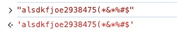
    <br>
    Whether you use single or double quotes, just make sure you are *consistent*!
    
    And this does NOT work
    
    ```
    let bad = "this is wrong'; // Inconsistence
    ```
    **Notice:** Avoid mixing between using single for some Strings and double quotes for other Strings. They will still work but they will confuse you and other developers.

- Nested quotes
    - Correct

        ```
        "he said, "haha""
        "he said, 'lol'"
        ```
        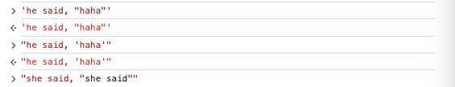

    - Incorrect

        ```
        "she said, "omg""
        ```
        Error:

        ```
        Uncaught SyntaxError: Unexpected identifier 'she'
        ```
        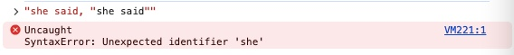

- Strings concatenation
    - Examples:

        ```
        let firstName = "Ziggy";
        let lastName = "Canarayface";
        firstName + lastName; // ZiggyCanarayface
        ```
    
        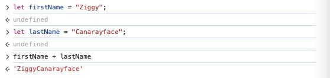

    - Add spaces and assign to a variable
    
        ```
        let fullName = firstName + " " + lastName
        fullName; // Ziggy Canarayface
        ```
    - Mixing type

        ```
        "hi" + 1; // "hi1"
        ```
        1 is going to be turned into a string.

    - For other operators than "+"<br>
    The result is going to be "NaN"

        ```
        "hi" - "h"; // NaN
        "hi" / "h"; // NaN
        ```

#### 3. String indices

Strings are indexed. Each character has a corresponding index (a positional number)


- length

    ```
    "hello".length; // 5
    ```
    Anything that is contained within the quotes are counted as characters, even spaces.
    ```
    ".          ".length; // 11
    ```
    
- Accessing individual characters using indices

    ```
    let mySong = "Surfin' USA";
    mySong[0]; // "S"
    mySong[1]; // "u"
    mySong[2]; // "r"
    mySong[3]; // "f"
    ```

- String characters
    - Get the number of characters in the string with "length"

        ```
        mySong.length; // 11
        ```
        There are 11 characters in this string
        
        Yet if you put that number of length in the square brackets, you will see "undefined"

        ```
        mySong[11]; // undefined
        ```
        "Undefined" means there is nothing there (null charater).<br>
        Same thing happens if you put "110" in the brackets

        ```
        mySong[110]; // undefined
        ```
        **Reason:** Neither of the indices exist in the string.<br>
        **Conclusion:** The length is always one greater than the last index.

    - Get the last character in the string<br>
        - With the number of characters.<br>
            Say if the string has 11 characters.<br>
            If you put 10 in the brackets, you will get the result of "A" which is the last character in the string.
    
            ```
            mySong[10]; // A
            ```

        - Without the number of characters<br>
        Say if you have this string

            ```
            let gibberish = 'alksd!jf%9&827$45   .('
            ```
            You can get the last character by substracting the string length by 1
    
            ```
            gibberish[gibberish.length - 1]; // "("
            ```
            
        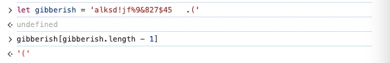
        <br>
        
    - Changing character using index
    
        ```
        mySong; // "Surfin' USA"
        mySong[4]; // i
        mySong[4] = L
        ```

        **Note**: Strings are immutable in JavaScript, therefore if you print out "mySong" then you will still get the old string "Surfin' USA".<br>
        The above code is an example for how you can change the character in the string using the index.
        
#### 4. String methods

- You can use the built-in methods, **actions**, that come with Strings to do things like
    - Searching within a string
    - Replacing parts of a string
    - Changing case (upper/lower case)
    
- Changing case - Syntax: <a href="https://developer.mozilla.org/en-US/docs/Web/JavaScript/Reference/Global_Objects/String">string.method()</a>
    
    - toUpperCase()

        ```
        msg = "You are so grounded Mr"
        msg.toUpperCase(); // YOU ARE SO GROUNDED MR
        ```

    - toLowerCase()<br>

        ```
        msg = "I aM tHe bOsS!"
        msg.toLowerCase(); // i am the boss!
        ```

    **Notice:** Remember that strings are immutable, we can't change any character manually.

    If you want to change a string, you will need to save that to a variable

    ```
    msg.toUpperCase(); // YOU ARE SO GROUNDED MR
    msg = msg.toUpperCase(); // 'YOU ARE SO GROUNDED MR'
    msg; // 'YOU ARE SO GROUNDED MR'
    ```

- <a href="https://developer.mozilla.org/en-US/docs/Web/JavaScript/Reference/Global_Objects/String/trim">Trim</a>
    - "trim" removes the leading and trailing whitespaces (at the beginning and end of the string)

        ```
        let greeting = '    leave me alone plz  ';
        greeting.trim(); // 'leave me alone plz'
        ```

    - however, "trim" does NOT remove whitespaces in the **middle** of the word

        ```
        '   alkdsjf   akljf alkdsjflk   .     '.trim(); // 'alkdsjf   akljf alkdsjflk   .'
        ```

#### 5. More String Methods - string.method(arg)

- indexOf()<br>
This tells you where in a given string occurs a substring
    - Syntax

        ```
        indexOf(searchString)
        indexOf(searchString, position)
        ```

    - Looking for a substring

        ```
        let tvShow = 'catdog';
        
        tvShow.indexOf('cat'); // 0
        tvShow.indexOf('dog'); // 3
        tvShow.indexOf('z'); // -1 (not found)
        ```
        Explanation:
        - ```indexOf('cat');``` gives "0"<br>
        "cat" comes at the very beginning of the string. It's looking for the string "cat" not just "c". The entire substring "cat" matches at index zero.
        - ```indexOf('dog');``` gives "3"<br>
        Same thing goes for "dog". The substring starts at index 3 (the fourth character).

    - Looking for a character

        ```
        'baseball'.indexOf('b'); // 0
        ```
        Explanation: There are two occurrance of 'b' within the string 'baseball'. If you go look for the indexOf('b') then it will give you the index of the first occurrance.
    - 'indexOf()' is case sensitive

        ```
        'Baseball'.indexOf('b'); // 4
        ```
        We have one uppercase 'B' and one lowercase 'b'. indexOf('b') will match with index 4, the lowercase 'b', which is the 5th character.
    - Non-existed result

        ```
        'Baseball'.indexOf('Entertainment'); // -1
        ```
        For anything that does not exist within the string, indexOf() will give '-1' as the representation of 'not found'.<br>
        People often use this in Conditional Logic to check for the existence of something that they are looking for. '0' means that what you are looking for is not there.

- <a href="https://developer.mozilla.org/en-US/docs/Web/JavaScript/Reference/Global_Objects/String/slice">Slice</a>
    - Syntax:

        ```
        slice(indexStart)
        slice(indexStart, indexEnd)
        ```

    - Description

        ```
                      indexStart        indexEnd
                          ↓               ↓
        | 0 | 1 | 2 | 3 | 4 | 5 | 6 | 7 | 8 | 9 |
        | T | h | e |   | m | i | r | r | o | r |
        
                          m   i   r   r
                         _______________
                              ↑
                            Result
        ```

    - Example 1:

        ```
        let str = 'supercalifragilisticexpialidocious'
        str.slice(5); // 'califragilisticexpialidocious'
        str.slice(0, 5); // 'super'
        ```
        Explanations:
        - For a single number ```str.slice(5)```: it is going to take a slice starting from that index all the way to the end.
        - If you pass in two numbers ```str.slice(0, 5)```: the first one is where to start the slice and the second one is where the slice should end **right before** it. So it will take the substring including the indices 0, 1, 2, 3, 4 and **not** 5.
        - If you pass in an index that does not exist in the string, the result will be an empty string.
    
            ```
            str.slice(40); // ""
            ```

    - Example 2:

        ```
        "superhero".slice(5, 7);
        ```
        Output: "he"<br>
        Explanations:
        - Starting at index 5 is the string "h".
        - Ending right before index 7 we have the string "e".
        - Therefore, ```superhero".slice(5, 7);``` will give us "he".

    - Example 3: More practical<br>
    Say if you want to remove the dollar sign "$" before the value, you can do that with "slice"

        ```
        "$45.96".slice(1);
        ```
        Output: "45.96"<br>
        Explanation: "slice(1)" will take the substring starting at index 1 all the way to the end.

- <a href="https://developer.mozilla.org/en-US/docs/Web/JavaScript/Reference/Global_Objects/String/replace">Replace</a><br>
The replace() method returns a new string with one, some, or all matches of a pattern replaced by a replacement.
    - Syntax

        ```
        replace(pattern, replacement)
        ```

    - Example 1:

        ```
        let annoyingLaugh = 'teehee so funny! teehee!';
        annoyingLaugh.replace('teehee', 'haha') // 'haha so funny! teehee'
        ```
        Explanation: You specify what you want to replace, what string and what you want to replace it with.<br>
        In the example, you want to replace 'teehee' with 'haha' so
        - the first argument is 'teehee'
        - the second argument is 'haha'.<br>
    
        **Notice:** It **only** replaces the **first** instance.

    - Example 2:

        ```
        'baseball is interesting'.replace('interesting', 'ok');
        ```
        Output:
        ```
        "baseball is ok"
        ```

    - Example 3:

        ```
        'ha ha ha'.replace('ha', 'hee');
        ```
        Output:
        ```
        "hee ha ha"
        ```
        **Notice:** Again! It **only** replaces the **first** instance.
        
    - Example 4:
    
        ```
        'ha ha ha'.replace('haaaaa', 'heee'); // "ha ha ha"
        ```
        If the instance that you want to replace is not found (does not exist) within the string, the old string remains unchanged, it does not give us any error either.

**Conclusion about string methods:**
 - Some method accept **arguments**, inside of the parentheses, that modify their behavior: indexOf(), slice(), replace()
 - Some methods don't require any arguments at all: toUpperCase(), toLowerCase(), trim()

#### 6. Strings Quiz

- 1 . What is the value of *age*?

    ```
    const age = "5" + "4";
    ```
    Output: "54" (string)

    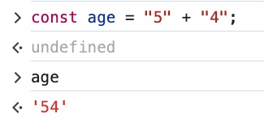

- 2 . What does this evaluate to?

    ```
    "pecan pie"[7];
    ```
    Output: "i"

    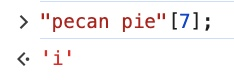

- 3 . What does this evaluate to?

    ```
    "PUP"[3];
    ```
    - Output: undefined
    - Reason: There is no value of index 3 (non-existed).

    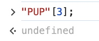

- 4 . What is the value of *song*?

    ```
    let song = "london calling";
    song.toUpperCase();
    ```
    Output:
    ```
    "LONDON CALLING"
    ```

    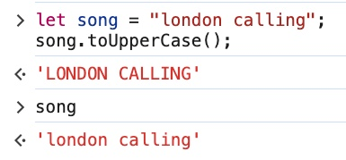

- 5 . What is the value of *cleanedInput*?

    ```
    let userInput = "   TODD@gmail.com";
    let cleanedInput = userInput.trim().toLowerCase();
    ```
    Output:
    ```
    "todd@gmail.com"
    ```
    **Notice:** The string value of "userInput" remains the same.

    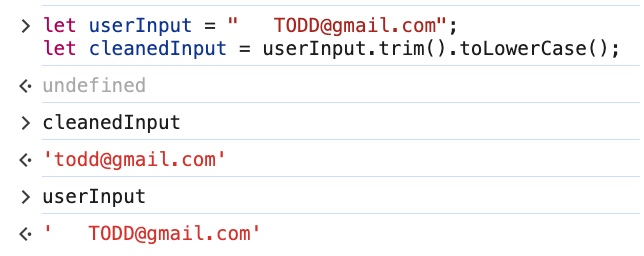

- 6 . What is the value of *index*?

    ```
    let park = "Yellowstone";
    const index = park.indexOf("Stone");
    ```
    Output:
    ```
    -1 // not found (non-existed)
    ```

    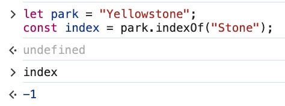

- 7 . What is the value of *index*?

    ```
    let yell = "GO AWAY!!";
    let index = yell.indexOf("!");
    ```
    Output:
    ```
    7 // The first occurrence of "!" in the string
    ```

    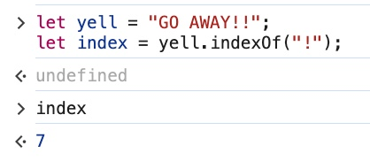

- 8 . What does this evaluate to?

    ```
    'GARBAGE!'.slice(2).replace("B", '');
    ```
    Output:
    ```
    "RAGE!"
    ```
    Reason: '' is an empty string but might be confusing with a space.

    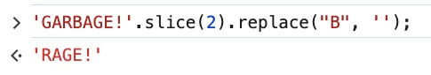

#### 7. Strings Escape Characters
These are not very commonly used but it is still useful to know them.

- There are four types
    - \\\ - backslash
    - \\\' - single quote
    - \\\" - double quote
    - \n - new line

- Examples
    - Backslash<br>
    The backslash itself has a special meaning. It tells JavaScript that this is about to be a special character coming after it.<br>
    In the console, if you just want to have a regular backslash then you need to interpret it with the console.log function. This is a special case.

        ```
        console.log("\\")
        ```
        Output:
        ```
        '\'
        ```

        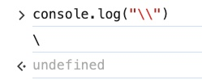

    - If you put a single backslash, regardless with or without the console.log function, it will throw an error.

        ```
        console.log("\")
        ```
        Error:
        ```
        Uncaught SyntaxError: Invalid or unexpected token
        ```

        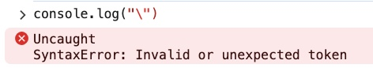

    - Single quotes

        ```
        'he said I ain\'t happy'
        ```
        Output:
        ```
        "he said I ain't happy"
        ```

        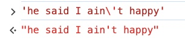

    - Double quotes

        ```
        "he said \"I ain\'t happy\""
        ```
        Output:
        ```
        `he said "I ain't happy"`
        ```
        Tip: You can escape the quotes with the backslash.

        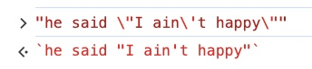

    - Additional examples (**Special cases**)
        - New line character:
    
            ```
            console.log("HELLO\nGOODBYE");
            ```
            Output:
            ```
            HELLO
            GOODBYE
            ```
    
            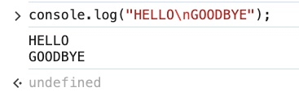
    
        - Tab character
    
            ```
            console.log("\t ha");
            ```
            Output:
            ```
            	 ha
            ```
    
            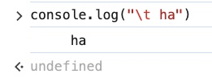

        <br>
    
        **Note:** the new line character "\n" is just a part of the string and won't automatically cause a new line in most environments without some form of output rendering. The console.log function interprets escape characters like \n and render them appropriately in the console. Same thing happened for the tab character.

#### 8. String <a href="https://developer.mozilla.org/en-US/docs/Web/JavaScript/Reference/Template_literals">Template Literals</a>
- Definition<br>
    Template literals are strings that allow *embedded expressions*, which will be evaluated and then turned into a resulting string.

    ```
    `I counted ${3 + 4} sheep`; // "I counted 7 sheep"
    ```

    **Notice:** We use back-ticks **not** single quotes.<br>
    
    In contrast, single (double) quotes simply will *not* allow embedded expressions
    ```
    'I counted ${3 + 4} sheep'; // "I counted ${3 + 4} sheep"
    ```

- Back-ticks and single (double) quotes<br>
    With the use of back-ticks, you can mix up single quotes and double quotes within them without any problems.

    ```
    `' "`
    ```
    Output:
    ```
    `' "`
    ```

    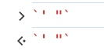

- Usage - What template literals are really used for
    - Basic demonstrations

        ```
        let userName = 'Ziggy31';
        `Welcome back, ${ userName }`; // "Welcome back, Ziggy31"
        
        `GAME OVER, ${ userName.toUpperCase() }`; // "GAME OVER, ZIGGY31"
        ```
        
        **Notice:** Template literals *can't* stand on its own
        
        Example:
    
        ```
        ${}
        ```
        Output:
        ```
        Uncaught SyntaxError: Unexpected token '{'
        ```

    - Example: Template Literals vs. String concatenation
        - Template Literals

            ```
            let animal = "pig";
            let sound = "oink";
            ${ animal } says ${ sound }
            ```
            Output:
            ```
            "pig says oink"
            ```

            Explanation:<br>
            For Template Literals, you can just *interpolate* data inside of a string.<br>
            For this code below, you are interpolating between a regular string, which is "says", and the variable "sound"
        
            ```
            ${ animal } says ${ sound }
            ```

        - String concatenation<br>
            This used to be an alternative back when Template Literals were not possible

            ```
            animal + " says " + sound
            ```
            Output:
            ```
            "pig says oink"
            ```

        - More complex example

            ```
            let item = 'cucumbers';
            let price = 1.99;
            let quantity = 4;
            
            `You bought ${ quantity } ${ item }, total price: $${ price * quantity }`;
            ```
            **Notice:**<br>
                - The first dollar sign "`$`" will be used for the currency of the price.<br>
                - The second dollar sign will be used for the interpolation of price * quantity<br><br>

            Output:
            ```
            'You bought 4 cucumbers, total price: $7.96'
            ```