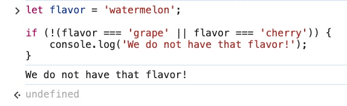
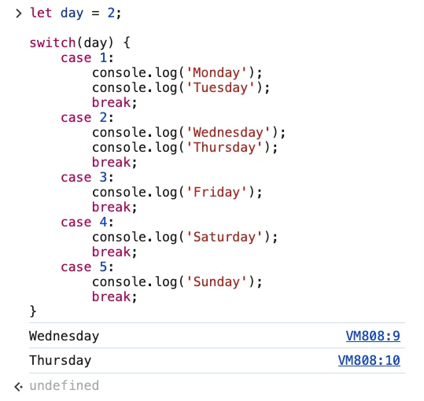

### Section 4: Controlling Program Logic and Flow
#### 1. Making Decisions in JS
#### 2. Comparison Operators
#### 3. Double Equals (==)
#### 4. Triple Equals (===)
#### Conclusion - Double Equals (==) versus Triple Equals (===)
#### 5. Running Code From a Script
#### 6. If Statements
#### 7. Else If
#### 8. Else
#### 9. Nesting Conditionals
#### 10. <a href="https://developer.mozilla.org/en-US/docs/Glossary/Truthy">Truthy</a> and <a href="https://developer.mozilla.org/en-US/docs/Glossary/Falsy">Falsy</a> Values
#### 11. LOGICAL AND (<a href="https://developer.mozilla.org/en-US/docs/Web/JavaScript/Reference/Operators/Logical_AND">&&</a>)
#### 12. LOGICAL OR (<a href="https://developer.mozilla.org/en-US/docs/Web/JavaScript/Reference/Operators/Logical_OR">||</a>)
#### 13. NOT Operator(<a href="https://developer.mozilla.org/en-US/docs/Web/JavaScript/Reference/Operators/Logical_NOT">!</a>)
#### 14. <a href="https://developer.mozilla.org/en-US/docs/Web/JavaScript/Reference/Operators/Operator_precedence">Operator Precedence</a>
#### 15. The <a href="https://developer.mozilla.org/en-US/docs/Web/JavaScript/Reference/Statements/switch">Switch</a> statement
#### 16. <a href="https://developer.mozilla.org/en-US/docs/Web/JavaScript/Reference/Operators/Conditional_operator">Conditional Ternary Operator</

=============================

#### 1. Making Decisions in JS
- Goals:
    - Understand Comparison Operators
    - Write Conditionals
    - Work with Boolean Operators

- Examples:
    - <a href="https://www.chess.com/play/computer">Chess</a>

        

    - <a href="https://www.netflix.com/vn-en/">Netflix Home page</a>
        - If the user is *signed in*, the page will show their main home page.
        - If the user is *not signed in* then the page will show advertisements and promotions.

        

    - <a href="https://www.chess.com/play/computer">Sign in form</a>

        

        If you try to submit the form without specifying any email or password, the logic that checks for email and password simply will not submit the form and so the form is not submitted.

#### 2. Comparison Operators

- Below are what we have for comparison operators

```
> // greater than
< // less than
>= // greater than or equal to
<= // less than or equal to
== // equality
!= // not equal
=== // strict equality
!== // strict non-equality
```

- Use operators to return Boolean

    ```
    10 > 1; // true
    0.2 < 0.3; // true
    -10 < 0; // true
    50.0 < 5; // false
    0.5 <= 0.5; // true
    99 >= 4; // true
    99 >= 99; // true
    'a' < 'b'; // true
    'A' > 'a'; // false
    ```

    **Notes:**
    - You can compare strings, even though it is not common. It is unpredictable when dealing with case (upper/lower), special characters, and accents!
    - All uppercase letters are less than any lowercase letters.

        

    - Further reading: How it works behind the scene is that every character in JavaScript, when it's in a string, has a <a href="https://en.wikipedia.org/wiki/List_of_Unicode_characters">Unicode</a> representation.

        Example:

        ```
        '#' < '$'; // true
        ```
        Reason:

        

#### 3. Double Equals (==)

- Equality usage
    - Checks for equality of **value**, but **not** equality of **type**.
    - It *coerces* (converts) both values to the same type and then *compares* them directly *as one type*.
    - Note: This can lead to some unexpected results!
    - Examples:
        - Normal cases

            ```
            4 == 4; // true
            'a' == 'a'; // true
            false == false; // true
            ```

        - Odd / Unexpected cases

            ```
            5 == 5; // true
            'b' == 'c'; // false
            7 == '7'; // true
            0 == ''; // true
            true == false; // false
            0 == false; // true
            null == undefined; // true
            ```

            **Note:**
            - ```7 == '7'``` are actually not equal.
            These are different values and they are completely different in terms of JavaScript, yet double equal (==) will convert them to the same type and decides that they have the same value.
            - Compare 0 (zero) to a string (to be explained more later)

                ```
                0 == ''; // true
                ```
                ```
                0 == 's'; // false
                ```

            - Compare 0 (zero) to a Boolean (to be explained more in section Triple Equals)

                ```
                0 == true; // false
                ```

                ```
                0 == false; // true
                ```

            - Compare primitives

                ```
                null == undefined; // true
                ```

                These are two distinct values, two separate primitives but they are considered equal when we use two equal signs.

#### 4. Triple Equals (===)

- Checks for equality of *values AND type*

    ```
    5 === 5; // true
    1 === 2; // false
    2 === '2'; // false
    false === 0; // false

    // Same applies for != and !==
    10 != '10'; // false
    10 !== '10'; // true
    ```
    Note: The triple equal signs are **not** going to coerce the values to be of same type.

- This is an example for an unexpected result caused by the difference between double and triple equals sign

    ```
    let isLoggedIn = false;
    isLoggedIn == false; // true
    isLoggedIn = 0; // 0
    isLoggedIn == false; // true
    isLoggedIn === false; // false
    ```
    This one is correct, "false" is equal to "false"

    ```
    let isLoggedIn = false;
    isLoggedIn == false; // true
    ```

    This one is not correct
    ```
    isLoggedIn = 0; // 0
    isLoggedIn == false; // true
    ```
    0 is supposed to be equal to the Boolean "true".<br>
    However, double equals sign shows that 0 is equal to "false".<br>
    Triple equals sign show that 0 is **not** equal to "false"

    ```
    isLoggedIn === false; // false
    ```
    So say if you have a user that is **not** logged in to the system but the use of double equals sign will tell you that the user **is** logged in to the system and vice versa.

- Conclusion:
    - Triple equals cares both about **value** and **type**.
    - Triple equals is **not** going to *coerce* the values to be of a common type.
        - zero and Boolean

            ```
            0 == false; // true
            0 === false; // false
            ```

        - Primitives

            ```
            undefined == null; // true
            undefined === null; // false
            ```

    - Triple equals is more precise and specific.
    - You should definitely use triple equals sign most of the time for equality comparison!

#### Conclusion - Double Equals (==) versus Triple Equals (===)
- Non-equality: Not recommended with "!="

    ```
    1 != '1'; // false
    ```

- Strict non-equality - RECOMMENDED

    ```
    1 !== '1'; // true
    ```

- Double (==) or Triple (===) signs

    It is best to always go with triple equals sign as it guarantee the best precision when comparing between values.

#### 5. Running Code From a Script

- The dev console is a REPL - Read, Evaluate, Print, Loop
    - It reads the JavaScript that you type into it, evaluates your code, prints out the result of your expression, and then loops back to the first step.
    - Example:
    <br>

        Explanation:
        - As soon as you type "REPL" in the console and hit enter, the console **reads** the input.
        - The console **evaluates** and sees that "REPL" is not a valid JavaScript code.
        - The console **prints** out the result which is an error.
        - The console then **loops** so you can type in something else (1 + 2)

- *console.log* prints arguments to the console.

    - You can type whatever you want in the file just like what you have been doing like

        ```
        3 + 4
        7 === 7
        ```

        JavaScript will read and evaluate them but nothing will be printed out in the console until you explicitly print it out with something like the method *console.log*.

    - Examples:
        - Single argument
            - app.js

                ```
                console.log(3 + 4);
                console.error('OH NOOOO!!');
                ```

            - Dev Console

            

        - Multiple arguments

            - app.js

                ```
                console.log(3 + 4, "hello", true);
                ```

            - Dev Console

            

            The console.log method prints the arguments out to the console and it separates them with a space.

### Conditionals
- Making decisions with codes
- There are three different pieces
    - If Statements

        Run code *if* a given condition is *true*

    - Else If
        - If not the first thing, maybe this other thing??
        - You can have mutiple *else ifs*

    - Else

        If nothing else was true, do this..."

#### 6. If Statements
- Run code *if* a given condition is *true*
- Example 1

    ```
    if (1 === 1) {
        console.log("This is true!");
    }
    ```
    Output:
    ```
    This is true!
    ```

- Example 2

    ```
    if (1 !== 1) {
        console.log("This is true!");
    }
    ```
    Output:
    ```

    ```
    There is no output for this *if* statement simply because 1 is equal to 1 (1 === 1).<br>
    The statement is false so the console.log does not run.

- Example 3

    ```
    let rating = 7;

    if (rating === 7) {
        console.log("You are a super star!");
    }
    ```

    Output:

    ```
    You are a super star!
    ```

- Example 4

    ```
    let rating = 3;

    if (rating < 7) {
        console.log("You are not a super star!");
    }
    ```

    Output:

    ```
    You are not a super star!
    ```

- Example 4: Practical use of the if statement

    Checking odd / even number

    ```
    let num = 37;

    if (num % 2 !== 0) {
        console.log("Odd number");
    }
    ```

    Output:

    ```
    Odd number
    ```
    Note: This code below will not log anything to the console

    ```
    let num = 37;

    if (num % 2 === 0) {
        console.log("Even number");
    }
    ```

    Reason: 37 will never be divided by 2 with a remainder of 0, this will not satisfy the condition and, therefore, nothing will be logged out to the console.

#### 7. Else If
- If not the first thing, maybe this other thing??
- You can have multiple *else ifs*
- Example:

    ```
    let rating3 = 2;

    if (rating3 === 3) {
        console.log("superstar");
    } else if (rating3 === 2) {
        console.log("meets expectations");
    } else if (rating3 === 1) {
        console.log("needs improvement");
    }
    ```

- Demonstration

    

#### 8. Else
If nothing else was true, do this..."

- Example 1:

    ```
    let rating4 = -99;

    if (rating3 === 3) {
        console.log("superstar");
    } else if (rating3 === 2) {
        console.log("meets expectations");
    } else if (rating3 === 1) {
        console.log("needs improvement");
    } else {
        console.log('Invalid rating!');
    }
    ```

- Demonstration

    

- Example 2:
  - Let's say in a game you already score some points

  - If your current score IS greater than or equal to the highScore then your score will become the highScore.

    ```
    let highScore = 1430;
    let userScore = 1200;

    if (userScore >= highScore) {
        console.log(`Congrats! You have the new high score of ${userScore}`);
        highScore = userScore;
    } else {
        console.log(`Good game! Your score ${userScore} did not beat the current high score of ${highScore}`);
    }
    ```

    - Demonstration

        

  - If your current score is NOT greater than or equal to the high score then log out "Good game! Your score [your-score] did not beat the current high score of [high-score]"

    ```
    let highScore = 1430;
    let userScore = 1200;

    if (userScore >= highScore) {
        console.log(`Congrats! You have the new high score of ${userScore}`);
        highScore = userScore;
    } else {
        console.log(`Good game! Your score ${userScore} did not beat the current high score of ${highScore}`);
    }
    ```

    - Demonstration

        

#### 9. Nesting Conditionals

- Code

    ```
    let password = "dog cat";

    if (password.length >= 6) {
        if (password.indexOf(' ') !== -1) {
            console.log("Password cannot include spaces");
        } else {
            console.log("Valid password!");
        }
    } else {
        console.log("Password MUST be of 6 characters");
    }
    ```

- Demonstration

    

- Q&A:
  - Question: Why the condition for checking space in the password has to be NOT equal to "-1"?
  - Answer: You are trying to check for the space in the string with <a href="https://developer.mozilla.org/en-US/docs/Web/JavaScript/Reference/Global_Objects/Array/indexOf">"indexOf()"</a>. There are two possibilities
    - If there is a space then the indexOf MUST be a non-negative value (string element can NOT have negative index).
    - Otherwise, if there is NO space in the string, the indexOf is going to return a negative value.
    - In conclusion, the use of !== in the original code is to check for the presence of spaces. If you switch to ===, the logic of the condition is **inverted**, but the overall validation still works correctly with appropriate changes to the console.log messages.
    - Furthermore, if you were to use === instead of !==, the logic would have been inverted to be

        ```
        let password = "dog cat";

        if (password.length >= 6) {
            if (password.indexOf(' ') === -1) {
                console.log("Valid password!");
            } else {
                console.log("Password cannot include spaces");
            }
        } else {
            console.log("Password MUST be of 6 characters");
        }
        ```

        

#### 10. Truthy and Falsy Values
- All values have an inherent truthy or falsy boolean values.
    - Falsy values
      - False
      - 0 (zero)
      - " " (empty string)
      - null
      - undefined
      - NaN
    - Everything else is truthy!

- Examples:
    - Example 1

        ```
        let mystery = 5;

        if (mystery) {
          console.log('TRUTHY');
        } else {
          console.log('FALSY');
        }
        ```

        - Output:

            ```
            TRUTHY
            ```

    - Example 2:

        ```
        let mystery = 0;

        if (mystery) {
          console.log('TRUTHY');
        } else {
          console.log('FALSY');
        }
        ```

        - Output:

            ```
            FALSY
            ```

    The same goes for "NaN".<br>
    In fact, every number that you could possibly choose except zero is true.<br>
    Anything that is not false in the list of truthy or falsy boolean values is true.

    - Example 3: Additional case for "null"

        ```
        let loggedInUser = null;

        if (loggedInUser) {
          console.log('YOU ARE LOGGED IN!');
        } else {
          console.log('PLEASE LOG IN!');
        }
        ```

        - Output:

            ```
            PLEASE LOG IN!
            ```

#### 11. LOGICAL AND (&&)

- Both sides MUST be true in order for the whole thing to be true!

    

    

- Sample: Modify the code for "password"
    - Original code

        ```
        let password = "dog cat";

        if (password.length >= 6) {
            if (password.indexOf(' ') !== -1) {
                console.log("Password cannot include spaces");
            } else {
                console.log("Valid password!");
            }
        } else {
            console.log("Password MUST be of 6 characters");
        }
        ```

    - Modified code using &&

        ```
        let password1 = "dog cat";
        if (password1.length >= 6 && password1.indexOf(" ") === -1) {
          console.log("Valid password!");
        } else {
          console.log("Invalid password!");
        }
        ```

    - The logical difference:
        - In the original code, you first check for if there IS a space in the string

            ```
            password.indexOf(' ') !== -1
            ```

            if there is to be a space in the string, indexOf(' ') will return a non-negative value.<br>
            and you log out

            ```
            console.log("Password cannot include spaces");
            ```

        - In the modified code, you check if the password is greater than or equal to 6 characters AND if there is NO space in the password

            ```
            if (password1.length >= 6 && password1.indexOf(" ") === -1)
            ```

            If both are TRUE, you log out

            ```
            console.log("Valid password!");
            ```

- Additional example

    ```
    let numGuess = 3;

    if (numGuess >= 1 && numGuess <= 10) {
      console.log("Number is between 1 and 10");
    } else {
      console.log("Please guess a different number!");
    }
    ```

    Output:

    ```
    Number is between 1 and 10
    ```

#### 12. LOGICAL OR (||)

- Definition: If one side is true, the whole thing is true.

    

- Example 1:

    

    - Explanations:

        ```
        1 !== 1 || 10 === 10 // true
        ```

        - 1 !== 1 is false because 1 === 1
        - 10 === 10 is true
        <br>
        => false || true => true

        <br>

        ```
        10 / 2 === 5 || null // true
        ```

        - 10 / 2 === 5 is true
        - null is false
        <br>
        => true || false => true

        <br>

        ```
        0 || undefined // false
        ```

        - 0 is false
        - undefined is false
        <br>
        => false || false => false

- Example 2:

    - Code

        ```
        let age = 76;

        if (age < 6 || age >= 65) {
            console.log("You get in for free!");
        } else {
            console.log("That will be $10 please");
        }
        ```

        Demonstration:

        

    - Additional

        ```
        let age = 7;

        if (age < 6 || age >= 65) {
            console.log("You get in for free!");
        } else {
            console.log("That will be $10 please");
        }
        ```

        Demonstration:

        

- Example 3:

    - Code

        ```
        let color = "lilac";

        if (color === "purple" || color === "lilac" || color === "violet") {
            console.log("GREAT CHOICE!!");
        }
        ```

        Output:

        ```
        GREAT CHOICE!!
        ```

#### 13. NOT Operator(!)

- Definition: **!expression** return true if the expression is false

    ```
    !null // true
    !(0 === 0) // false
    !(3 <= 4) // false
    ```

    

- Example 1: Checking whether or not a user is logged in.

    Usually this is what you would do the old way

    ```
    let loggedInUser;

    if (loggedInUser) {
        console.log('There is a logged in user');
    } else {
        console.log('There is no logged in user');
    }
    ```

    However, this code is for when you have the "otherwise" part.<br>
    If you only want to check whether or not there is a logged in user and there is no otherwise part, you can use the "!expression" for the condition.

    ```
    let loggedInUser;

    if (!loggedInUser) {
        console.log('There is a logged in user');
    }
    ```

    Everything is automatically evaluated to be "true" in the "if" condition.<br>

    ```
    if (loggedInUser)
    ```

    this means if "loggedInUser" is true.<br>
    therefore, "if (!loggedInUser)" means that if "loggedInUser" is NOT true.<br>
    and so you will not need the "else" or "otherwise" part for it.

- Example 2: Negate the conditio using "!expression" with "||" instead of "&&" to check for False condition.<br>
Same logic, same outcome just different way of writing thing.

    - Using "&&"

        ```
        let flavor = 'watermelon';

        if (flavour !== 'grape' && flavour !== 'cherry') {
            console.log('We do not have that flavor!');
        }
        ```

    - Using "||"

        ```
        let flavor = 'watermelon';

        if (!(flavor === 'grape' || flavor === 'cherry')) {
            console.log('We do not have that flavor!');
        }
        ```

        Explanations:
        - if flavor is 'grape' and flavor is NOT 'cherry'.
        - flavor is 'grape' is True, flavor is NOT 'cherry' is False
        - True || False => True
        - !True is False

- Demonstration

    If the result is False, you are going to log out "We do not have that flavor!", otherwise you are not logging out anything (because this code is only to do something for the False case).

    - False condition

        
    - True condition

        

#### 14. <a href="https://developer.mozilla.org/en-US/docs/Web/JavaScript/Reference/Operators/Operator_precedence">Operator Precedence</a>

- Definition:

    NOT (!) has higher precedence than && and ||<br>
    && has higher precedence than ||

    

- Examples:

    - Example 1:

        ```
        let x = 7;
        x == 7 || x === 3 && x > 10
        ```
        - Output: true
        - Explanation:
            - x == 7 -> true
            - x === 3 -> false
            - x > 10 -> false
            <br>

            true || false || false -> true || false -> true

            <br>

            

    - Example 2:

        ```
        let x = 7;
        x == 7 || (x === 3 && x > 10)
        ```
        - Output: true
        - Explanation:
            - x == 7 -> true
            - x === 3 -> false
            - x > 10 -> false
            <br>

            true || (false && false) -> true || false -> true

            <br>

            

    - Example 3:

        ```
        let x = 7;
        (x == 7 || x === 3) && x > 10
        ```
        - Output: false
        - Explanation:
            - x == 7 -> true
            - x === 3 -> false
            - x > 10 -> false
            <br>

            (true || false) && false -> true && false -> false

            <br>

            

#### 15. The <a href="https://developer.mozilla.org/en-US/docs/Web/JavaScript/Reference/Statements/switch">Switch</a> statement

- Example: Print the correct day name for the number of day in the week

    - Using "if else" statement (Old way)

        ```
        let day = 2;

        if (day === 1) {
            console.log('Monday');
        } else if (day === 2) {
            console.log('Tuesday');
        } else if (day === 3) {
            console.log('Wednesday');
        } else if (day === 4) {
            console.log('Thursday');
        } else if (day === 5) {
            console.log('Friday');
        } else if (day === 6) {
            console.log('Saturday');
        } else if (day === 7) {
            console.log('Sunday');
        } else {
            console.log('Invalid day!');
        }
        ```

        Output: Tuesday

    - Using "switch" statement

        ```
        let day = 2;

        switch(day) {
            case 1:
                console.log('Monday');
            case 2:
                console.log('Tuesday');
            case 3:
                console.log('Wednesday');
            case 4:
                console.log('Thursday');
            case 5:
                console.log('Friday');
            case 6:
                console.log('Saturday');
            case 7:
                console.log('Sunday');
        }
        ```

        - Output:

            ```
            Tuesday
            Wednesday
            Thursday
            Friday
            Saturday
            Sunday
            ```

        - Demonstration

        

        - Problem: You have the "day" initialized with the value of 2, you only want to print out the day name in respective to that number 2 which is "Tuesday", but not only that it also prints out the other days that come after "Tuesday". What is wrong with this?
        - Solution: If you only want one of those to run, you will need to add "break".

            ```
            let day = 2;

            switch(day) {
                case 1:
                    console.log('Monday');
                    break;
                case 2:
                    console.log('Tuesday');
                    break;
                case 3:
                    console.log('Wednesday');
                    break;
                case 4:
                    console.log('Thursday');
                    break;
                case 5:
                    console.log('Friday');
                    break;
                case 6:
                    console.log('Saturday');
                    break;
                case 7:
                    console.log('Sunday');
                    break;
            }
            ```

            Output:

            ```
            Tuesday
            ```

        - Demonstration

        

      - In conclusion: You need to <a href="https://developer.mozilla.org/en-US/docs/Web/JavaScript/Reference/Statements/break">break</a> in the "switch" statement, otherwise the program will print/execute anything as the result from the matching case and beyond.

- Example 2: Multiple results for the same case

    ```
    let day = 2;

    switch(day) {
        case 1:
            console.log('Monday');
            console.log('Tuesday');
            break;
        case 2:
            console.log('Wednesday');
            console.log('Thursday');
            break;
        case 3:
            console.log('Friday');
            break;
        case 4:
            console.log('Saturday');
            break;
        case 5:
            console.log('Sunday');
            break;
    }
    ```

    - Output:

        ```
        Wednesday
        Thursday
        ```

    - Demonstrations

    

    

- In summary, you need to "break" in your "switch" statement, otherwise the program is going to run from the matching case until end of the "switch" statement.

#### 16. <a href="https://developer.mozilla.org/en-US/docs/Web/JavaScript/Reference/Operators/Conditional_operator">Conditional Ternary Operator</a>

- Definition:
    - It is a one-liner of the "if else" statement.
    - It is called "ternary" because there are three pieces instead of binary.

- Syntax

    ```
    condition ? exprIfTrue : exprIfFalse
    ```

    - ```condition```: An expression whose value is used as a condition.
    - ```exprIfTrue```: An expression which is executed if the condition evaluates to a truthy value (one which equals or can be converted to true).
    - ```exprIfFalse```: An expression which is executed if the condition is falsy (that is, has a value which can be converted to false).

- Example 1:
    - "if else" statement

        ```
        let num = 7;

        if (num === 7) {
            console.log('Lucky');
        } else {
            console.log('Bad');
        }
        ```

        Output: Lucky

    - Ternary operator

        ```
        num === 7 ? console.log('Lucky') : console.log('Bad')
        ```

        Output: Lucky

- Example 2:
    - "if else" statement

        ```
        let status = 'offline';

        let color;
        if (status = 'offline') {
            color = 'red';
        } else {
            color = 'green';
        }
        ```

        - Output: ```'red'```
        - Demonstration

        

    - Ternary operator

        ```
        let status = 'offline';

        let color = status === 'offline' ? 'red' : 'green';
        ```
        ```
        color
        ```

        - Output: ```'red'```

        - Explanations
            - Step 1: You have a variable called **status** with a value of *offline*

                ```
                let status = offline
                ```

            - Step 2: You have a variable called **color**, the value of the variable color will *depend* on the value of the variable **status**
                - if status === offline => the value of color will be 'red'.
                - if status === online => the value of color will be 'green'.

        - Demonstration:

        

        