### CONTENT
#### 1. Creating Arrays
#### 2. Array Indices
#### 3. Modifying Arrays
#### 4. <a href="https://developer.mozilla.org/en-US/docs/Web/JavaScript/Reference/Global_Objects/Array/push">Push</a> and <a href="https://developer.mozilla.org/en-US/docs/Web/JavaScript/Reference/Global_Objects/Array/pop">Pop</a>
#### 5. <a href="https://developer.mozilla.org/en-US/docs/Web/JavaScript/Reference/Global_Objects/Array/shift">Shift</a> and <a href="https://developer.mozilla.org/en-US/docs/Web/JavaScript/Reference/Global_Objects/Array/unshift">Unshift</a>
#### 6. <a href="https://developer.mozilla.org/en-US/docs/Web/JavaScript/Reference/Global_Objects/Array/concat">Concat</a>
#### 7. <a href="https://developer.mozilla.org/en-US/docs/Web/JavaScript/Reference/Global_Objects/Array/includes">Includes</a> and <a href="https://developer.mozilla.org/en-US/docs/Web/JavaScript/Reference/Global_Objects/Array/indexOf">IndexOf</a>
#### 8. <a href="https://developer.mozilla.org/en-US/docs/Web/JavaScript/Reference/Global_Objects/Array/reverse">Reverse</a> and <a href="https://developer.mozilla.org/en-US/docs/Web/JavaScript/Reference/Global_Objects/Array/join">Join</a>
#### 9. <a href="https://developer.mozilla.org/en-US/docs/Web/JavaScript/Reference/Global_Objects/Array/slice">Slice</a>
#### 10. <a href="https://developer.mozilla.org/en-US/docs/Web/JavaScript/Reference/Global_Objects/Array/splice">Splice</a>
#### 11. Sorting (Part 1)
#### 12. Intro to Reference Types
#### 13. Using Const with Arrays
#### 14. Working with Nested Arrays

===============================================

#### 1. Creating Arrays

- Goals:
  - Work with Arrays
  - Write Object Literals
  - Understand Reference Types
  - Use common Array/Object methods

- Definition:
  Arrays are **ordered** collections of values
  - List of comments on IG post.
  - Collection of levels in a game.
  - Songs in a playlist

- Creating an array
    - Creating an empty array
        - Solution 1: Just square brackets

            ```
            []
            ```

        - Solution 2:

            ```
            new Array();
            ```

        - Similarity

            ```
            [1, 2, 3, 4, 5];
            new Array(1, 2, 3, 4, 5);
            ```

            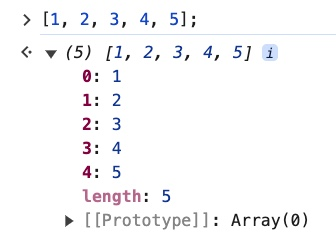

            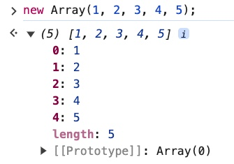

    - Array of strings

        ```
        let shoppingList = ['cereal', 'cheees', 'ice'];
        ```

        There are two ways to show this list in the console
        - console.log(shoppingList);
        - input 'shoppingList' in the console

            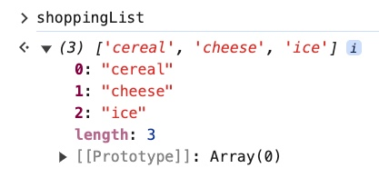

    - Array of numbers

        ```
        let lottoNums = [5,7,43,30,23];
        ```

        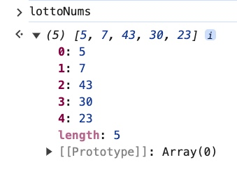

    - Array of a collection of many types

        ```
        let myCollection = [28, 'cool', null, true, NaN];
        ```

        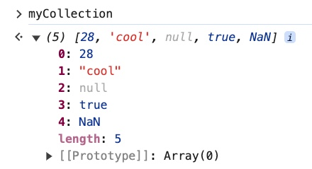

        Notes:
        - Usually the data within the array is relatively cohesive, the array of different data types above is for the demonstration purpose.
        - JavaScript allows a mix-up of different data types in the array which some other programming languages don't allow.

#### 2. Array Indices

- Arrays are indexed

    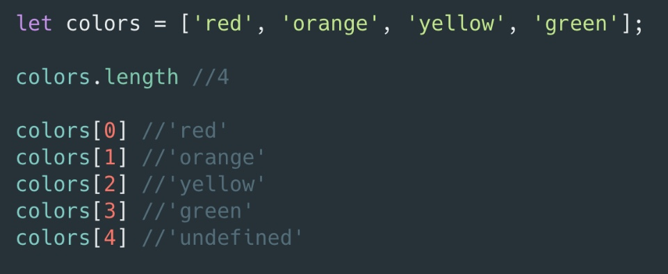

- Example:

    ```
    let colors = ['red', 'orange', 'yellow', 'green', 'blue', 'indigo', 'violet'];
    ```

    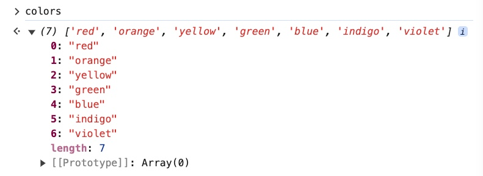

    ```
    colors[0]; // 'red' - 1st element
    colors[1]; // 'orange' - 2nd element
    colors[3]; // 'green' - 4th element
    colors[6]; // 'violet' - last element
    ```

    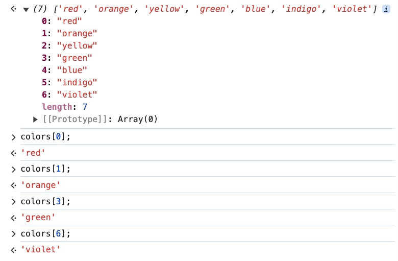

- Print the value of the last element in the array
    - Solution 1: Using the index

        The length of the array is 7

        ```
        colors.length; // 7
        ```

        This means there are 7 elements in the array.<br>
        However, if you want to print out the value of the 7th element (last element) you will have to print out the value of the 6th index.

        ```
        colors[6]; // violet
        ```

        Reason: The array starts at index 0, the first element of the array is at index 0, therefore if there are 7 elements in the array then the last element is at index 6.<br>

    - Solution 2: Using the array length

        As you already know, the length of the array is 7.<br>
        If you subtract that number by 1 then you will have the index of the last element in the array

        ```
        colors[colors.length - 1]; // violet
        ```

        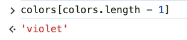

    - Note: If you try to access any non-existed element with a non-existed index in the array, the returned value is going to be "undefined".

        ```
        colors[7]; // undefined
        colors[123]; // undefined
        ```

        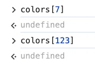

- Strings

    Similar to arrays, strings are also indexed.<br>
    If you try to print out the value of a non-existed element, the returned value will be "undefined".

    ```
    'string'.length; // 6
    'string'[0]; // 's'
    'string'[5]; // 'g'
    'string'[6]; // undefined
    'string'[123]; // undefined
    ```

    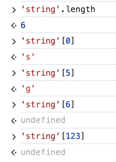