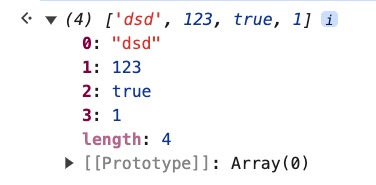
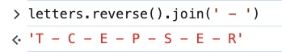

### CONTENT
#### 1. Creating Arrays
#### 2. Array Indices
#### 3. Modifying Arrays
#### 4. <a href="https://developer.mozilla.org/en-US/docs/Web/JavaScript/Reference/Global_Objects/Array/push">Push</a> and <a href="https://developer.mozilla.org/en-US/docs/Web/JavaScript/Reference/Global_Objects/Array/pop">Pop</a>
#### 5. <a href="https://developer.mozilla.org/en-US/docs/Web/JavaScript/Reference/Global_Objects/Array/shift">Shift</a> and <a href="https://developer.mozilla.org/en-US/docs/Web/JavaScript/Reference/Global_Objects/Array/unshift">Unshift</a>
#### 6. <a href="https://developer.mozilla.org/en-US/docs/Web/JavaScript/Reference/Global_Objects/Array/concat">Concat</a>
#### 7. <a href="https://developer.mozilla.org/en-US/docs/Web/JavaScript/Reference/Global_Objects/Array/includes">Includes</a> and <a href="https://developer.mozilla.org/en-US/docs/Web/JavaScript/Reference/Global_Objects/Array/indexOf">IndexOf</a>
#### 8. <a href="https://developer.mozilla.org/en-US/docs/Web/JavaScript/Reference/Global_Objects/Array/reverse">Reverse</a> and <a href="https://developer.mozilla.org/en-US/docs/Web/JavaScript/Reference/Global_Objects/Array/join">Join</a>
#### 9. <a href="https://developer.mozilla.org/en-US/docs/Web/JavaScript/Reference/Global_Objects/Array/slice">Slice</a>
#### 10. <a href="https://developer.mozilla.org/en-US/docs/Web/JavaScript/Reference/Global_Objects/Array/splice">Splice</a>
#### 11. Sorting (Part 1)
#### 12. Intro to Reference Types
#### 13. Using Const with Arrays
#### 14. Working with Nested Arrays

===============================================

#### 1. Creating Arrays

- Goals:
  - Work with Arrays
  - Write Object Literals
  - Understand Reference Types
  - Use common Array/Object methods

- Definition:
  Arrays are **ordered** collections of values
  - List of comments on IG post.
  - Collection of levels in a game.
  - Songs in a playlist

- Creating an array
    - Creating an empty array
        - Solution 1: Just square brackets

            ```
            []
            ```

        - Solution 2:

            ```
            new Array();
            ```

        - Similarity

            ```
            [1, 2, 3, 4, 5];
            new Array(1, 2, 3, 4, 5);
            ```

            

            

    - Array of strings

        ```
        let shoppingList = ['cereal', 'cheees', 'ice'];
        ```

        There are two ways to show this list in the console
        - console.log(shoppingList);
        - input 'shoppingList' in the console

            

    - Array of numbers

        ```
        let lottoNums = [5,7,43,30,23];
        ```

        

    - Array of a collection of many types

        ```
        let myCollection = [28, 'cool', null, true, NaN];
        ```

        

        Notes:
        - Usually the data within the array is relatively cohesive, the array of different data types above is for the demonstration purpose.
        - JavaScript allows a mix-up of different data types in the array which some other programming languages don't allow.

#### 2. Array Indices

- Arrays are indexed

    

- Example:

    ```
    let colors = ['red', 'orange', 'yellow', 'green', 'blue', 'indigo', 'violet'];
    ```

    

    ```
    colors[0]; // 'red' - 1st element
    colors[1]; // 'orange' - 2nd element
    colors[3]; // 'green' - 4th element
    colors[6]; // 'violet' - last element
    ```

    

- Print the value of the last element in the array
    - Solution 1: Using the index

        The length of the array is 7

        ```
        colors.length; // 7
        ```

        This means there are 7 elements in the array.<br>
        However, if you want to print out the value of the 7th element (last element) you will have to print out the value of the 6th index.

        ```
        colors[6]; // violet
        ```

        Reason: The array starts at index 0, the first element of the array is at index 0, therefore if there are 7 elements in the array then the last element is at index 6.<br>

    - Solution 2: Using the array length

        As you already know, the length of the array is 7.<br>
        If you subtract that number by 1 then you will have the index of the last element in the array

        ```
        colors[colors.length - 1]; // violet
        ```

        

    - Note: If you try to access any non-existed element with a non-existed index in the array, the returned value is going to be "undefined".

        ```
        colors[7]; // undefined
        colors[123]; // undefined
        ```

        

- Strings

    Similar to arrays, strings are also indexed.<br>
    If you try to print out the value of a non-existed element, the returned value will be "undefined".

    ```
    'string'.length; // 6
    'string'[0]; // 's'
    'string'[5]; // 'g'
    'string'[6]; // undefined
    'string'[123]; // undefined
    ```

    

#### 3. Modifying Arrays


- **Strings** are **immutable**

    

- **Arrays** are **mutable**

    - Example:
    Given the array:

        ```
        let shoppingList = ['Cheddar Cheese', '2% Milk'];
        ```

        

      **Note:** The array name 'shoppingList' in the screenshot and the array name 'shoppingList1' for the examples in this lesson are the same thing. Since 'shoppingList' was already declared in the examples in the last lessons, the code above, so you will need a different name for the array in this lesson.

    - Change '2% Milk' to 'Whole Milk'

        ```
        shoppingList[1] = 'Whole Milk'
        ```

        

    - Adding element to the end of the array
        - Using index
            - The current length of the array is 2, the last index is 1.
            - You can add more element to the array using index 2.

                ```
                shoppingList[2] = 'Ice Cream';
                ```

                

                Note: This is only applicable if you know the number of elements in the array, therefore it might be inconvenient at times.<br>
                In case if you have no idea how many elements are there in the array, you will need to add the element using the length of the array.

          - Using array length

              For example you want to add 'tomatoes' to the end of the array 'shoppingList' but you don't know how many elements there are in the array:

              ```
              shoppingList[shoppingList.length] = 'tomatoes';
              ```

              

#### 4. Push and Pop

- push and pop are for adding and removing array elements.

- Given the array

    ```
    let topSongs = ['First Time Ever I Saw Your Face', 'God Only Knows', 'A Day In The Life', 'Life On Mars'];
    ```

    This is the array of 4 elements.

    You can also check for the length of the array with "length"

    ```
    topSongs.length;
    ```


- Push: Add the element to the end of the array.

    ```
    topSongs.push('Fortunate Son');
    ```

    - After adding 'Fortunate Son' to the array you can see that the console logs a number below the "push" method

    

    - That number is the new length of the array after you added the new elements to it.

    

    **Review:** Arrays are mutable which means it CAN be changed.

    - The number is called the "return value", the "return value" and "return function" will be talked more in the future lessons.
    - **Notice:**
        - You can add multiple elements to the array all at once.
        - The orders of the array elements (fork, knife) will be exactly the same with the orders you added them.

        

- Pop: Remove the element at the end of the array.

    This is the array you are having, the current length of the array is 5

    

    "Pop" will remove the last element in the array (the element at the end of the array).

    ```
    topSongs.pop();
    ```

    The element to be removed will be shown on the line below ```topSongs.pop();``` and when you input the array name you will see the current length and elements in the array

    

- The differences between "push" and "pop"
    - **push** is for *adding*, **pop** is for *removing* an element at the **end of the array**.
    - You will have to *specify* the element you want to **push** into the array (obviously!) while you can just pop an element out of the array without specifying the element. As you pop all the elements out of the array, you are left with "undefined" value.

    

#### 5. Unshift and Shift

- Similar to push and pop, **unshift** and **shift** are for adding and removing elements to the array
    - **unshift** is for **adding** element(s) to the *beginning* of the array. You will need to specify what you want to add to the array (same with push).
    - **shift** is for **removing** element(s) from the *beginning* of the array. You will NOT need to specify what you want to remove from the array (same with pop), shift will always start from the first element in the array.

- Unshift
    - Adding single element to the array: Notice that the element will be added to the BEGINNING of the array.

        ```
        let dishesToDo = ['big platter'];
        dishesToDo.unshift('large plate');
        dishesToDo.unshift('small platter');
        dishesToDo; // ['small plate', 'large plate', 'big platter'];
        ```

        

    - Similar to "push", you can add *multiple elements* to the array with **unshift**
        Pay attention that because 'unshift' will ONLY add element to the BEGINNING of the array, therefore the order when you add single versus multiple elements to the array will be backward with how the elements are added to the array.

        

        

- Shift

    - Similar to "pop", **shift** is for removing element BUT at the BEGINNING of the array.
    - When you remove all the elements in the array you will be left with "undefined" values.

    

#### 6. Concat

- Concat:
  - merges two or more arrays.
  - creates a new array by combining the small arrays.
  - does NOT mutate or update the original arrays.

- Syntax

    ```
    concat()
    concat(value1)
    concat(value1, value2)
    concat(value1, value2, /* …, */ valueN)
    ```

- Example 1:

    ```
    let fruits = ['apple', 'banana'];
    let veggies = ['asparagus', 'brussel sprouts'];
    console.log(fruits.concat(veggies));
    ```

    

- Example 2:

    ```
    let fruits = ['apple', 'banana'];
    let veggies = ['asparagus', 'brussel sprouts'];
    console.log(veggies.concat(fruits));
    ```

    

- Example 3:

    ```
    let fruits = ['apple', 'banana'];
    let veggies = ['asparagus', 'brussel sprouts'];
    let meats = ['steak', 'chicken breast'];

    let allFood = fruits.concat(veggies, meats);
    ```

    

- The original arrays are NOT mutated / updated

    ```
    console.log(fruits);
    console.log(veggies);
    console.log(meats);
    ```

    

#### 7. Includes and IndexOf

- Includes
    - Definition:
        - Known as a boolean method (true/false)
        - It takes a value and tells you if the array includes that value or not.

    - Example 1:

        - Syntax:

            ```
            includes(searchElement)
            ```

        - Code

            ```
            let ingredients = ['water', 'corn starch', 'flour', 'cheese', 'brown sugar', 'shrimp', 'eel', 'butter'];
            ```

            ```
            ingredients.includes('fish');
            ingredients.includes('shrimp');
            ingredients.includes('corn');
            ```

            

        - Reasons:
            - Neither 'fish' nor 'corn' exist in the array.
            - 'shrimp' DOES exist in the array.
        - Note: There is 'corn starch' in the array yet 'corn' and 'corn starch' are NOT the same thing.

    - Example 2:

        - Syntax:

            ```
            includes(searchElement, fromIndex)
            ```
            'fromIndex'specifies at which index to start searching from in the array.

        - Code

            ```
            ingredients.includes('water', 3); // false
            ingredients.includes('water'); // true
            ingredients.includes('water', 0); // true
            ```

            

            - Reasons: This is the array ['water', 'corn starch', 'flour', 'cheese', 'brown sugar', 'shrimp', 'eel', 'butter']
                - ```ingredients.includes('water', 3)``` starts to look for 'water' from the 3rd index, however there is NO value of 'water' from the 3rd index to the end of the array. Therefore, this returns 'false'.
                - ```ingredients.includes('water')```, the value 'water' IS included within the 'ingredients' array, therefore this returns 'true'.
                - ```ingredients.includes('water', 0)```, starting from index 0 in the array, the value 'water' is also at index 0, therefore this returns 'true'.

    - Example 3:

        ```
        if (ingredients.includes('flour')) { // true
          console.log('I AM GLUTEN FREE, I CANNOT EAT THAT!');
        }
        ```

        

- IndexOf
    - Definition:
        - Similar to 'indexOf' method for Strings.
        - This returns the index of the array element if the element does exist, otherwise it returns '-1'.
    - Example 1:
        - Syntax:

            ```
            indexOf(searchElement)
            ```

        - Code

            ```
            ingredients.indexOf('eel'); // 6
            ingredients.indexOf('Maple Syrup'); // -1
            ```

            

            - Element 'eel' exists in the array at index '6'.
            - Element 'Maple Syrup' does NOT exist in the array, therefore index '-1'

    - Example 2:
        - Syntax:

            ```
            indexOf(searchElement, fromIndex)
            ```
            'fromIndex'specifies at which index to start searching from in the array.

        - Code

            ```
            ingredients.indexOf('cheese', 5); // -1
            ingredients.indexOf('cheese', 2); // 3
            ```

            

- In summary, if you only need to check whether an element exists or not in the array without the specific location then you can just use 'includes'.

#### 8. Reverse and Join

- Reverse
    - Definition:
        - Reverses an array *in place* which means it mutates the original array.
        - The array can be of different types.

    - Examples:

        ```
        let letters = ['T', 'C', 'E', 'P', 'S', 'E', 'R'];
        letters.reverse();
        ```

        

        ```
        [1, true, 123, 'dsd'].reverse();
        ```

        

- Join
    - Definition:
        - creates and returns a new string by concatenating all of the elements in this array.
        - separated by commas by default (or to be specified).

    - Examples:

        ```
        letters.join();
        ```

        

        ```
        letters.join(' & ');
        ```

        

        ```
        letters.reverse().join(' . ');
        ```

        

        ```
        letters.reverse().join(' - ');
        ```

        

        ```
        [12.3, 60, false].join();
        ```

        

        ```
        [12.3, 60, false].join(' # -> ');
        ```

        

#### 9. Slice

- Array.prototype.slice()
    - Similar to Strings slice method
    - takes a portion of an array and makes a new array with it
    - it does NOT impact the original array

- Example:
    - Given the array

        ```
        let animals = ['shark', 'salmon', 'whale', 'bear', 'lizard', 'tortoise'];
        ```

    - Positive value slice forward

        ```
        let swimmers = animals.slice(0, 3);
        ```

        starts from 0, ends BEFORE 3 (ends at 2)

        

        ```
        let mammals = animals.slice(2, 4);
        ```

        starts from 2, ends BEFORE 4 (ends at 3)

        

        ```
        let reptiles = animals.slice(4, 6);
        ```

        starts from 4, ends BEFORE 6 (ends at 5)
        **Notes:**
        - Even though the highest index is 5, you can use index 6 for the end point because slice is not going to take the ending index.
        - slice(4, 10); will also give the same results even though there is no index 10 in the array.

        

        ```
        let reptiles = animals.slice(4);
        ```

        This slice will take all elements starting from index 4 to end of the array.

        

    - Negative value slice backward

        ```
        let quadruped = animals.slice(-3);
        ```

        

        ```
        let quadruped = animals.slice(-3, -1);
        ```

        

- Trick for making a copy of an array

    ```
    animals.slice();
    ```

    This does NOT impact the original array, it just makes a new array

    ```
    let copy = animals.slice();
    ```

    Now you have two versions of the array, 'copy' and 'animals'

    