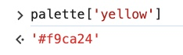

# Section 6: Objects - The Core of JavaScript

## CONTENT

### Intro

Objects are collections of properties


Suppose these are the information you need to store for Lucy


- Example for Array
    - Can you store these information in an array?

        It is possible, but it will not be easy, you will need some arbitrary rules for the data.

        And actually, arrays would be best for ordered information rather than these.


    ```jsx
    // Storing Lucy's information in an array
    const lucyFitbitData = [
      308727, // lucyTotalSteps
      1826, // lucyTotalFloors
      211 // lucyTotalMiles
    ]
    ```

    Notice:

    - The information is not clear
    - Even if you are the one who codes the info, you can not even tell which information is which if you don’t have the comments for the info.

    You can also specify each information

    ```jsx
    let lucyTotalSteps = 308727
    ```

    Notice:

    - There are lots of information to be specified
    - Even if you can specify all the information, they are not grouped together although they all belong to Lucy.

- Example for Object

    ```jsx
    const fitBitData = {
      totalSteps: 308727,
      totalFloors: 1826,
      totalMiles: 211.70,
      avgCalorieBurn: 5755,
      workoutsThisWeek: '5 of 7',
      avgGoodSleep: '2:13'
    }
    ```

    Everything is much CLEARER!!

    Each property is a KEY + VALUE pair

    ```jsx
    totalSteps -> 308727
    workoutsThisWeek -> '5 of 7'
    ```

### Creating Object Literals

- Fundamental

    

    Given this object

    ```jsx
    const fitBitData = {
      totalSteps: 308727,
      totalFloors: 1826,
      totalMiles: 211.70,
      avgCalorieBurn: 5755,
      workoutsThisWeek: '5 of 7',
      avgGoodSleep: '2:13',
      45: 'fourty-five'
    }
    ```

    

    - All the properties inside are key-value pairs
    - All keys are converted to strings **except** for Symbols

        (this happens behind the scene, you will NOT be able to see it)

        ```jsx
        totalSteps
        totalFloors
        totalMiles
        avgCalorieBurn
        workoutsThisWeek
        avgGoodSleep
        45
        ```

        All those keys above are automatically converted to *strings*.

        The key “45” looks like it is a number but it is also actually a *string* of the property inside the object **fitBitData**.

        Even if you might not be able to access the key “45”, it is still actually a *string*.

        

        

    - All the keys are alphabetized

- Comma
    - When comma is optional

        When you have only **one** property in the object, the comma is **not necessary**

        ```jsx
        let data = { a: 1 }
        ```

    - When comma is necessary

        

        - When you have **more than one** properties in the object, the comma now is **compulsory** because it lets JavaScript knows where the end of a property is.

            ```jsx
            let data = { a: 1, b: 2, c: 3 }
            ```

        - You can have the trailing comma after the last property, it is fine and it is up to you.

            ```jsx
            let data = { a: 1, b: 2, c: 3, }
            ```

### Accessing Object Properties

- Fixed data
    - Key that starts with number

        ```jsx
        const numbers = {
          100: 'One hundred',
          16: 'sixteen'
        }
        ```

        

        ```jsx
        numbers[100]
        ```

        Explanation:

        - When you put “100” inside of the bracket, JavaScript converts “100” to a string and tries to find if there is a matching key of the property in the object.
        - And if there is a matching key, JavaScript will give the matching value for that key of the object property.
        - The way to verify if JavaScript tries to look for the matching string of the key in the object property is that if you make the key inside the brackets to be a string, you will get the same result.

            ```jsx
            numbers['100']
            ```

            


        <aside>
        💡 You canNOT have variable that starts with numbers
        But you CAN have key that starts with numbers

        </aside>

        - Variable that starts with number

            

            The error means that the variable has an invalid name.

        - Key that starts with number

            ```jsx
            const numbers = {
              100: 'One hundred',
              16: 'sixteen'
              '76trombones': 'songs'
            }
            ```

            

            Accessing key that starts with number

            ```jsx
            numbers['76trombones']
            ```

            

    - Key that contains space

        ```jsx
        const numbers = {
          100: 'One hundred',
          16: 'sixteen'
          '76 trombones': 'songs'
        }
        ```

        

        Accessing the key with square brackets

        ```jsx
        numbers['76 trombones']
        ```

        


- Dynamic data

    ```jsx
    const palette = {
      red: '#eb4d4b',
      yellow: '#f9ca24',
      blue: '#30336b'
    }
    ```

    - Using dot notation

        ```jsx
        palette.blue // '#30336b'
        palette.yellow // '#f9ca24'
        ```

        


    - Using square brackets

        ```jsx
        palette['yellow']
        ```

        

        Without the quotes, JavaScript will NOT recognize the key

        

        You can also do concatenate the letters for the key inside the square brackets

        ```jsx
        palette['bl' + 'ue']
        ```

        


<aside>
💡 **Notice:** You will ALWAYS need to put the key that starts with number and / or contains space in quotes when you create it as an object property and when you want to access it with the square brackets.

</aside>

- Variable assigned key

    If you already assign the key to a variable, you can access that key through the variable without the quotes in square brackets

    ```jsx
    let mysteryColor = 'blue'
    palette[mysteryColor] // '#30336b'
    ```

    

### Adding and Updating Properties

Given an empty Object

```jsx
const userReviews = {}
```


- Add the property:
    - Using **dot notation** for ‘mrSmith78’ → 3.5
    - Using **square brackets** for ‘queenBee49’ → 4.5

    Code

    - ‘mrSmith78’ → 3.5

        ```jsx
        userReviews.mrSmith78 = 3.5
        ```

        


    - ‘queenBee49’ → 4.5

        ```jsx
        userReviews['queenBee49'] = 4.5
        ```

        


    <aside>
    💡 For adding a property, all you need to do is to access it. Give it a “key” and assign a “value” to it.

    </aside>

    If the property does not exist, you will get “undefined”

    ```jsx
    userReviews.bach // undefined
    ```

    


- Updating the property

    Beside updating the value of the property manually by assigning a different value to it, you can also use operations to update the value of the property

    - Manually

        Assuming you already have the property with “key” **bach** and “value” **5**

        Now you want to update the “value” by **10**

        ```jsx
        userReviews['bach'] = 10
        ```

        

    - Using “**+=**”

    

    - Using “**-=**”

    

    - Using “**++**”

    

### Nested Arrays & Objects

- Given the Object

    ```jsx
    const student = {
        firstName: 'David',
        lastName: 'Johns',
        strengths: ['Music', 'Art'],
        exams: {
            midterm: 92,
            final: 88
        }
    }
    ```

    Get the average score of **midterm** and **final**

    ```jsx
    const avg = (student.exams.midterm + student.exams.final) / 2
    avg // 90
    ```


- Sample array of objects of a shopping cart

    ```jsx
    const shoppingCart = [
    	{
    		product: 'Jenga Classic',
    		price: 6.88,
    		quantity: 1,
    	},
    	{
    		product: 'Echo Dot',
    		price: 29.99,
    		quantity: 3,
    	},
    	{
    		product: 'Fire Stick',
    		price: 39.99,
    		quantity: 2,
    	},
    ]
    ```


- Sample array of objects of a tic-tac-toe game
    - Basic board array

        ```jsx
        [
        	['O', null, 'X'],
        	['X', 'O', 'X'],
        	[null, 'O', 'X']
        ]
        ```

    - More details

        ```jsx
        const game = [
        	player1: {
        		username: 'Blue',
        		playingAs: 'X'
        	},
        	player2: {
        		username: 'Muffins',
        		playingAs: 'O'
        	},
        	board: [
        		['O', null, 'X'],
        		['X', 'O', 'X'],
        		[null, 'O', 'X']
        	]
        ];
        ```