## Intro

- Loops are for
    - Repeated things
        - Print “Hello” 10 times
        - Sum numbers in an array
    - Different types of loops
        - for
        - while
        - for.…of
        - for….in

- Example 1: Reddit posts
    - User interface

        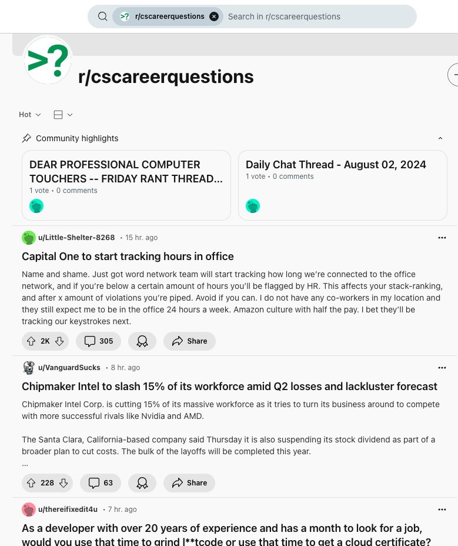


    - The data structure of the array of posts behind it is simplified to be something like this

        ```jsx
        const posts = [
          {
            title: 'cool video',
            link: 'http://www.blah.com',
            username: 'sillyGoose98'
          },
          {
            title: 'cool video',
            link: 'http://www.blah.com',
            username: 'sillyGoose98'
          },
          {
            title: 'cool video',
            link: 'http://www.blah.com',
            username: 'sillyGoose98'
          },
          {
            title: 'cool video',
            link: 'http://www.blah.com',
            username: 'sillyGoose98'
          },
        ]
        ```


- Example 2: The game [2048](https://play2048.co/)
    - User interface


        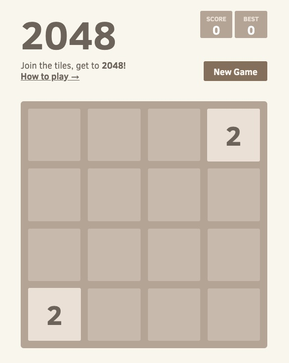


    - The logic of the loop:
        - If there are still playable moves, if the board is not jammed up and locked then let the user keeps playing.
        - The loop keeps running some logic until a condition is met (when there is no more of available moved).


## for loop

Reference: [https://developer.mozilla.org/en-US/docs/Web/JavaScript/Reference/Statements/for](https://developer.mozilla.org/en-US/docs/Web/JavaScript/Reference/Statements/for)

- Syntax:

    ```jsx
    for (initialization; condition; afterthought)
      statement
    ```


- Examples:
    - Example 1:
        - Start from 1
        - Print 10 times
        - Increment (loop) by 1 number at a time

        ```jsx
        for (let i = 1; i <= 10; i++)
        ```

        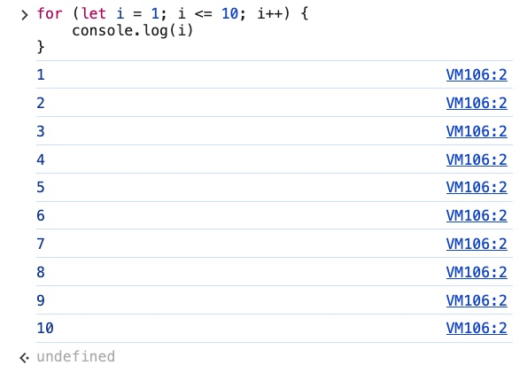

    - Example 2:
        - Start from 1
        - Print 10 times
        - Increment (loop) by 3 numbers at a time

        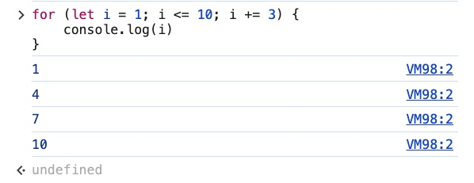


    - Example 3: Print “HELLO WORLD” 10 times

        ```jsx
        for (let i = 1; i <= 10; i++) {
            console.log("HELLO WORLD:", i)
        }
        ```

        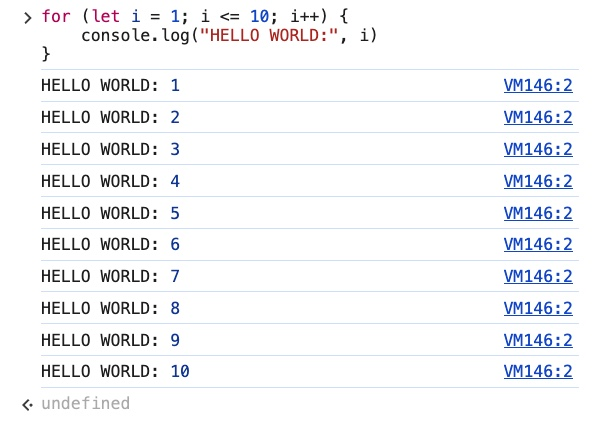


- Practices:
    - Practice 1:

        Generate **the first 20** perfect squares

        - Sample:

            ```jsx
            // 1 = 1 * 1
            // 4 = 2 * 2
            // 9 = 3 * 3
            // 16 = 4 * 4
            // 25 = 5 * 5
            // 36 = 6 * 6
            // 49 = 7 * 7
            // 64 = 8 * 8
            // 81 = 9 * 9
            ```


        - Code

            ```jsx
            for (let num = 1; num <= 20; num++) {
              console.log(`${num} x ${num} = ${num * num} `);
            }
            ```


        - Output:

            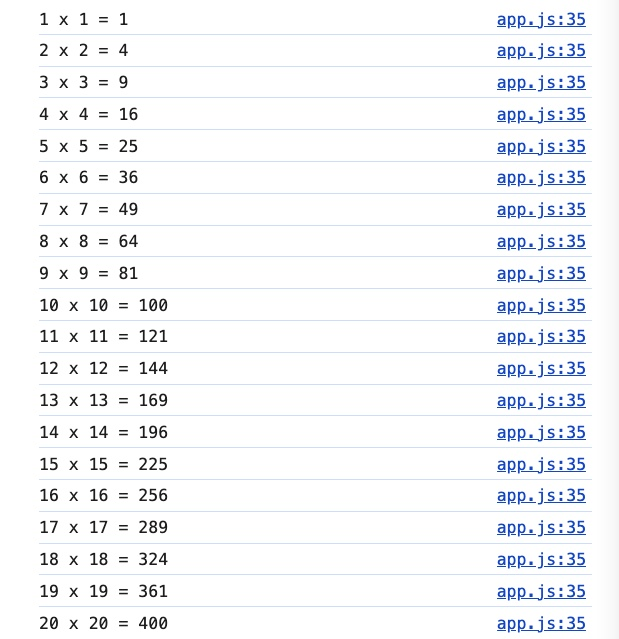


    - Practice 2:

        Start i at 50

        Subtract 10 each iteration

        Keep going as long as i ≥ 0

        - Code

            ```jsx
            for (let i = 50; i >= 0; i -= 10) {
              console.log(i);
            }
            ```


        - Output

        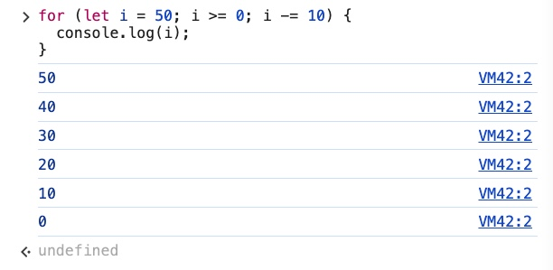


- Questions
    - Why this loop
    for (let i = 1; i <= 9; i++) {
      console.log( i *= i );
    }
    gives 1, 4, 25.
        - Reason: `i++`  is intended to increment `i` by 1, but it is overridden by `i *= i`.
        - Explanations:
            - First iteration:
                - **i** is 1
                - 1 <= 9 is **true**
                - `i *= i`  is 1 x 1 = 1 ⇒ console.log outputs **1**
                - After logging, `i` is incremented by 1 due to `i++`, so `i` becomes 2.
            - Second iteration:
                - **i** is 2
                - 2 <= 9 is **true**
                - `i *= i`  is 2 x 2 = 4 ⇒ console.log outputs **4**
                - After logging, `i` is incremented by 1 due to `i++`, so `i` becomes 5.
            - Third iteration:
                - **i** is 5
                - 5 <= 9 is **true**
                - `i *= i`  is 5 x 5 = 25 ⇒ console.log outputs **25**
                - After logging, `i` is incremented by 1 due to `i++`, so `i` becomes 26.
            - Fourth iteration:
                - **i** is 26
                - 26 <= 9 is **false**
                - Loop exits
        - Outputs: 1, 4, 25
    - Why this loop runs infinitely?
    for (let i = 50; i >= 0; i - 10) {
      console.log(i);
    }
        - Reason: The expression `i - 10`  is not actually modifying `i`. Instead, it simply evaluates to `i - 10`  without assigning the result back to `i` . Since `i`  will forever remains as 50 without being updated, this makes the condition  `i >= 0`  always true so the loop runs infinitely.
        - Solution: You need `i -= 10`  to update `i`  correctly

## For Loops & Arrays

- Example 1:

    *Print out number of iterations and the scores of examScores*

    *examScores = [98, 77, 84, 91, 57, 66]*

    - *Sample*

        ```jsx
        // 0 98
        // 1 77
        // 2 84
        // 3 91
        // 4 57
        // 5 66
        ```

    - Code

        ```jsx
        const examScores = [98, 77, 84, 91, 57, 66];

        for (let i = 0; i < examScores.length; i++) {
          console.log(i, examScores[i]);
        }
        ```

    - Output:

        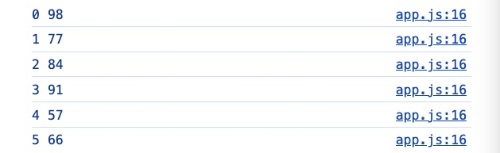


    - Question
        - How about the condition `let i = 0; i <= examScores.length; i++`  ?


            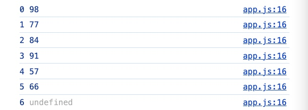

            - Reason:
                - **i** starts from 0
                - **i** will stop when **i** reaches **index 6**
                - There are only 6 elements in the array (last **index** is **5**)
            - Result: The last output will be `6  undefined` , there is no 6th index in the array *examScores.*

- Example 2:
    - Given array object

        ```jsx
        const myStudents = [
          {
            firstName: 'Zeus',
            grade: 86
          },
          {
            firstName: 'Artemis',
            grade: 97
          },
          {
            firstName: 'Hera',
            grade: 72
          },
          {
            firstName: 'Apollo',
            grade: 90
          },
        ]
        ```

    - *Sample output*

        ```jsx
        // Zeus    86
        // Artemis    97
        // Hera    72
        // Apollo    90
        ```

    - Code

        ```jsx
        for (let i = 0; i < myStudents.length; i++) {
            let student = myStudents[i];
            console.log(`${student.firstName} scored ${student.grade}`);
        }
        ```

    - Output:

        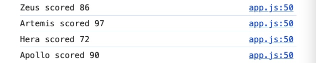

    - Question
        - How to print out the full array object?
            - Output sample:


                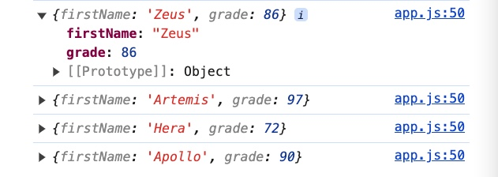

            - Code:

                ```jsx
                for (let i = 0; i < myStudents.length; i++) {
                    let student = myStudents[i];
                    console.log(student);
                }
                ```


- Example 3:

    *Print out every letter of this string in the backward orders*

    *In other word, print a reversed string*

    - Given the string

        ```jsx
        const word = 'stressed';
        ```

    - *Sample output*

        ```jsx
        desserts
        ```

    - Code

        ```jsx
        let reversedWord = '';
        for (let i = word.length - 1; i >= 0; i--) {
            reversedWord += word[i];
        }
        console.log(reversedWord);
        ```

    - Output:

        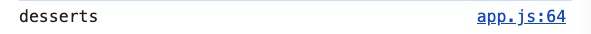


    - Question
        - What if the condition starts by the length of the “word” with `let i = word.length`  ?

            The length of the string “stressed” is 8. The value of **word.length** is 8.

            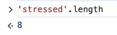

            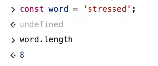

            The string starts at index 0, there are 8 characters, and stops at 7. The last index is 7.

            Therefore, the index for the last character is **word.length - 1** = 8 - 1 = 7

            **word.length** will tell the loop to start at index 8 instead of 7 which is incorrect.

            There is no value at index 8 so the program will output *undefined*

            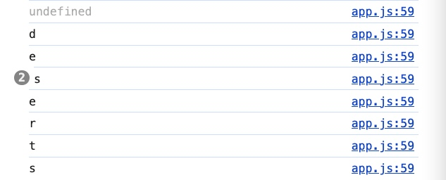

            In order to remove the *undefined* value, you will need to start from index 7

            So the correct condition is

            ```jsx
            let i = word.length - 1
            ```

            The correct index for the last character of the string of 8 characters should be 7

            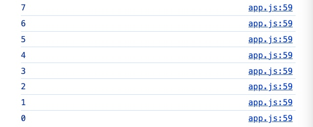

        - Calculating *total* outputs *NaN* in Example 2

            This code outputs “NaN”. Why?

            ```jsx
            let total = 0;

            for (let i = 0; i < myStudents.length; i++) {
              let student = myStudents.grade;
              total += student
            }
            console.log(total);
            ```

            Reason: *myStudents* is an array of objects NOT an array of elements.

            ```jsx
            const myStudents = [
              {
                firstName: 'Zeus',
                grade: 86
              },
              {
                firstName: 'Artemis',
                grade: 97
              },
              {
                firstName: 'Hera',
                grade: 72
              },
              {
                firstName: 'Apollo',
                grade: 90
              },
            ]
            ```

            Solution: If you want to get the *property* “firstName” or “grade”. You will need the counter *i* for the array *myStudents*.

            `let student = myStudents[i].grade;`

## Nested For Loops

- Example 1:
    - Output sample

        ```jsx
        // Print this structure
        // OUTER LOOP: 1 -> 10
        // INNER LOOP: 10, 8, 6, 4, 2, 0
        ```


    - Code

        ```jsx
        for (let i = 1; i <= 10; i++) {
          console.log('OUTER LOOP: ', i);
          for (let j = 10; j >= 0; j -= 2) {
            console.log('   INNER LOOP: ', j);
          }
        }
        ```


    - Output:

        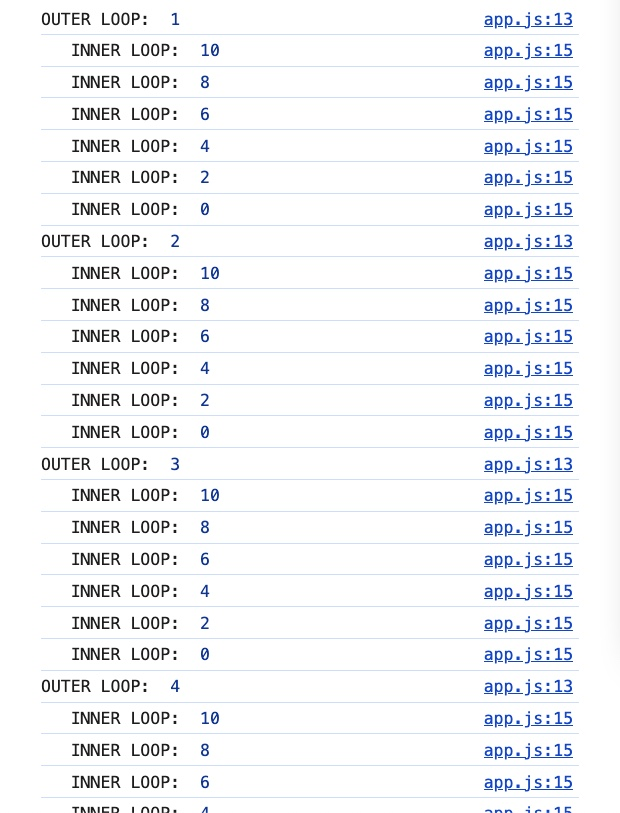

- Example 2:
    - Output sample:

        ```jsx
        // OUTER: 0
        //    INNER: LOL
        // OUTER: 1
        //    INNER: LOL
        // OUTER: 2
        //    INNER: LOL
        // OUTER: 3
        //    INNER: LOL
        // OUTER: 4
        //    INNER: LOL
        ```


    - Code

        ```jsx
        let str = 'LOL';

        for (let i = 0; i <= 4; i++) {
          console.log('OUTER:', i);
          for (let j = 0; j < 1; j++) {
            console.log('   INNER:', str);
          }
        }
        ```


    - Output:

    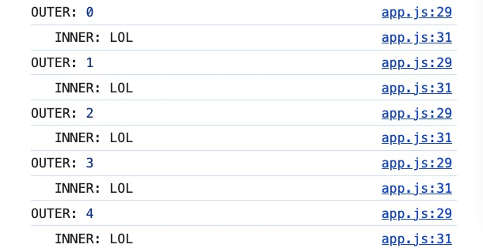

    - Question
        - What is the condition `j < 1`  for?

            That condition is to make sure that the inner loop runs exactly once for each iteration of the outer loop.

            The inner loop maybe unnecessary, you can rewrite the code without the inner loop

            ```jsx
            for (let m = 0; m <= 4; m++) {
              console.log('Outer:', m);
              console.log('  Inner:', str);
            }
            ```

            The output will be exactly the same.


- Example 3:

    *Calculate and print out the total of all the elements in the arrays*

    Given the array

    ```jsx
    const gameBoard = [
      [4, 32, 8, 4],
      [64, 8, 32, 2],
      [8, 32, 16, 4],
      [2, 8, 4, 2],
    ]
    ```

    - Output sample:

        ```jsx
        //Total score is 230.
        ```


    - Code

        ```jsx
        let totalScore = 0;

        for (let i = 0; i <= gameBoard.length - 1; i++) {
          let row = gameBoard[i]
          // Print out the nested arrays (4)
          console.log(row);
          for (let j = 0; j <= row.length - 1; j++) {
            // Print out all the elements in each array
            console.log(row[j]);
            totalScore += row[j];
          }
        }

        console.log(`Total score is ${totalScore}.`); // Total score is 230
        ```


    - Output:

        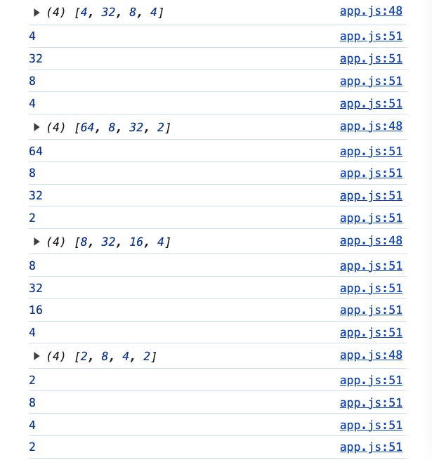

        


    - Question
        - What is the purpose of variable ‘*row*’*?*

            The variable ‘*row*’ is used for running over the elements inside the nested loops.

            As you are able to loop through the elements in side the nested loops, you can print them out and also accessing the values for the calculation of the total score or just anything else.

## while

Example:

*Print numbers from 0 to 5*

- Code
    - For loop

        ```jsx
        for (let i = 0; i <= 5; i++) {
          console.log(i);
        }
        ```

    - While loop

        ```jsx
        let j = 0;
        while (j <= 5) {
          console.log(j);
          j++;
        }
        ```

        - Explanations of *while* loop:
            - **j** starts from 0
            - the loop will keep running as long as the condition `j ≤ 5`  is **true**.
            - console logs **j**.
            - **j** increments by 1
            - when **j** reaches 6, the condition becomes **false** and the loop finishes.

- Output:

    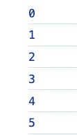


- Conclusion: While both loop output the same result, “for” loop is still preferred because it is still a better practice to NOT create a variable outside of a loop.

    Further reading: [Scope](https://developer.mozilla.org/en-US/docs/Glossary/Scope)

## more while

> The purpose of *while* loop, it really excels, is when you don’t know exactly how many times it is going to run
>

A specific example is the game [2048](https://play2048.co/) where you have the logic loops until there is a game over which might sometimes be hundreds or thousands of turns, you never know.

Examples:

- Example 1:

    *Create a guess number game that includes the target number and a random-generating number*

    *We will see how many time it will take for the program to guess the exact number as the target number.*

    - Code

        ```jsx
        // Target number
        const target = Math.floor(Math.random() * 10);

        // Number generating

        let guess = Math.floor(Math.random() * 10);

        while (guess !== target) {
          console.log(guess);
          guess = Math.floor(Math.random() * 10);
        }

        console.log(`Target: ${target} Guess: ${guess}`);
        ```


    - Output

        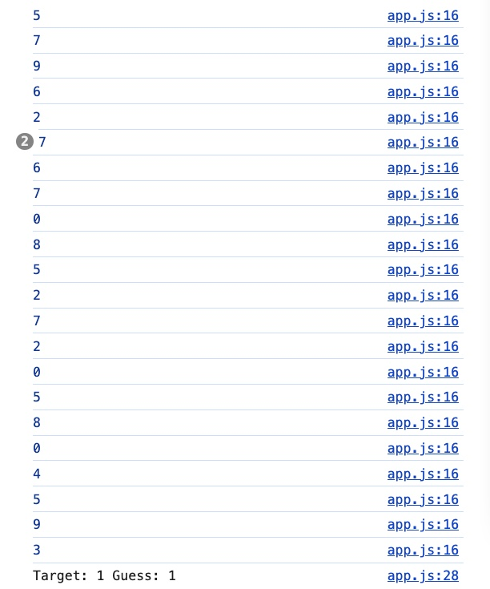


- Example 2:

    Same with Example 1 but with an extra requirement

    *Show the number of time it takes to guess the correct target number*

    - Sample output

        ```jsx
        // Target: 0
        // Guess: 0
        // Number of guess: 3,4,5,6,2,1,1,8
        // Total guesses: 8
        ```

    - Code

        ```jsx
        // Target number
        const target = Math.floor(Math.random() * 10);

        // Number generating

        let guess = Math.floor(Math.random() * 10);

        // Extra - Show the number of time it takes to guess the correct target number
        let numGuess = [];
        let totalGuess

        while (guess !== target) {
          console.log(`Guess is ${guess}`);
          guess = Math.floor(Math.random() * 10);
          // Show the number of time it takes to guess the correct target number
          numGuess.push(guess)
          totalGuess = numGuess.length
        }

        console.log(`Target: ${target} \n Guess: ${guess} \n Number of guesses: ${numGuess} \n Total guesses: ${totalGuess}`);
        ```


    - Output:

        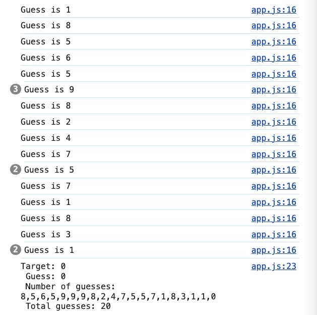


- Question
    - If I duplicate the code of Example 2
    `Number of guesses: ${numGuess}` outputs blank result
    `Total guesses: ${totalGuess}` outputs *undefined*
    What is the reason?
        - Output for the second code in line 37

        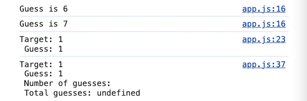

        - Code

            ```jsx
            // Target number
            const target = Math.floor(Math.random() * 10);

            // Number generating

            let guess = Math.floor(Math.random() * 10);

            while (guess !== target) {
              console.log(`Guess is ${guess}`);
              guess = Math.floor(Math.random() * 10);
            }

            console.log(`Target: ${target} \n Guess: ${guess}`);

            // Extra - Show the number of time it takes to guess the correct target number
            let numGuess = [];
            let totalGuess

            while (guess !== target) {
              console.log(`Guess is ${guess}`);
              guess = Math.floor(Math.random() * 10);
              // Show the number of time it takes to guess the correct target number
              numGuess.push(guess)
              totalGuess = numGuess.length
            }

            console.log(`Target: ${target} \n Guess: ${guess} \n Number of guesses: ${numGuess} \n Total guesses: ${totalGuess}`);
            ```

            - Reason: Incorrect placement and initialization of the variables `numGuess` and `totalGuess`

            - Explanations
                - **First `while` Loop**:
                    - The first `while` loop continues to generate guesses until `guess` equals `target`.
                    - After this loop completes, `guess` is guaranteed to be equal to `target`.
                - **Variable Initialization**:
                    - After the first loop, `numGuess` and `totalGuess` are declared.
                    - Since `guess` is already equal to `target` from the first loop, the second `while` loop never executes.
                - **Second `while` Loop**:
                    - The second `while` loop condition (`guess !== target`) is false immediately because `guess` already equals `target`.
                    - As a result, the code inside the second `while` loop that updates `numGuess` and `totalGuess` never runs.
                - **Final Output**:
                    - `Number of guesses: ${numGuess}` outputs a blank because `numGuess` is still an empty array.
                    - `Total guesses: ${totalGuess}` outputs `undefined` because `totalGuess` is declared but never assigned a value.

        - Solution: combine the logic of guessing and counting into a single loop
            - Correct code

                ```jsx
                // Target number
                const target = Math.floor(Math.random() * 10);

                // Number generating
                let guess = Math.floor(Math.random() * 10);

                // Extra - Show the number of times it takes to guess the correct target number
                let numGuess = [];
                let totalGuess = 0;

                while (guess !== target) {
                  console.log(`Guess is ${guess}`);
                  numGuess.push(guess);
                  guess = Math.floor(Math.random() * 10);
                  totalGuess = numGuess.length;
                }

                console.log(`Target: ${target} \nGuess: ${guess} \nNumber of guesses: ${numGuess.join(', ')} \nTotal guesses: ${totalGuess}`);
                ```

            - Explanations
                - **Single `while` Loop**:
                    - The guessing and counting logic are combined into one `while` loop.
                    - This ensures that every guess is tracked and counted.
                - **Logging**:
                    - Inside the loop, log each guess, push it to the `numGuess` array, and update `totalGuess`.
                    - After the loop, print out the target, the final guess, the list of guesses, and the total number of guesses.

## break keyword

Same code used in “more-while-loops”

```jsx
// Target number
const target = Math.floor(Math.random() * 10);

// Number generating

let guess = Math.floor(Math.random() * 10);

while (guess !== target) {
  console.log(`Target: ${target} \n Guess: ${guess}`);
  guess = Math.floor(Math.random() * 10);
}

console.log(`Target number: ${target} \nGuessed number: ${guess}`);
console.log(`CONGRATS YOU WIN!!`);
```

You can use **if** statement for the condition `guess !== target`  following with a **break** keyword in the **while** loop.

```jsx
while (true) {
  if (guess === target) break;
  console.log(`Target: ${target} \n Guess: ${guess}`);
  guess = Math.floor(Math.random() * 10);
}
console.log(`Target number: ${target} \nGuessed number: ${guess}`);
console.log(`CONGRATS YOU WIN!!`);
```

- Explanations:
    - The loop will keep running as long as the condition is still **true**
    - The loop will **break** when `guess === target`
    - After the loop breaks, the programming will print out

        `console.log(`Target number: ${target} \nGuessed number: ${guess}`);`
        `console.log(`CONGRATS YOU WIN!!`);`


- Output:

    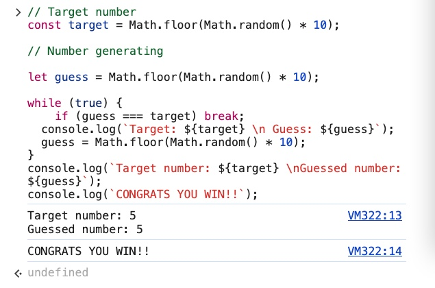


- Notes:
    - This is only an example for where to use the **break** keyword with the **while** loop.
    - It can be easily ended up being an infinite loop ⇒ Not a good practice!
    - Not informational or explanatory (main reason)

        A better approach is

        `while (!gameOver)`

## for….of

> A way of iterating over arrays or other iterable objects
>

- Example 1:

    Print out every element in the array using [**for**](https://developer.mozilla.org/en-US/docs/Web/JavaScript/Reference/Statements/for) and [**for….of**](https://developer.mozilla.org/en-US/docs/Web/JavaScript/Reference/Statements/for...of)

    - for

        ```jsx
        let subreddits = ['soccer', 'popheads', 'cringe', 'books']

        for (let i = 0; i <= subreddits.length - 1; i++) {
          console.log(subreddits[i])
        }
        ```


    - for….of

        ```jsx
        let subreddits = ['soccer', 'popheads', 'cringe', 'books']

        for (let sub of subreddits) {
          console.log(sub)
        }
        ```


    - The two will output the same result


        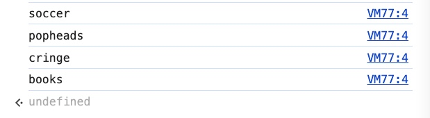


- Example 2:

    Print out all character in a string in upper case

    - Code

        ```jsx
        for (let char of 'cockadoodledoo') {
          console.log(char.toUpperCase())
        }
        ```


    - Output

        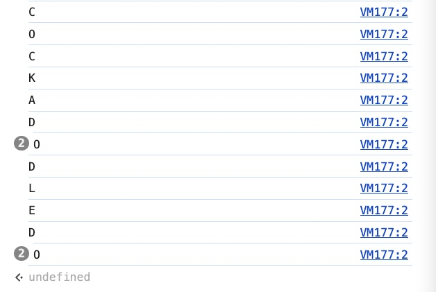

## for and for….of

- Example 1
    - Sample output

        ```jsx
        // 2, 7, 6 summed to 15
        // 9, 5, 1 summed to 15
        // 4, 3, 8 summed to 15
        ```

    - for loop
        - Code:

            ```jsx
            const magicSquare = [[2, 7, 6], [9, 5, 1], [4, 3, 8]]

            for (let i = 0; i < magicSquare.length; i++) {
              // console.log(magicSquare[i]);
              let row = magicSquare[i];
              let sum = 0;
              console.log(row);
              for (let j = 0; j < row.length; j++) {
                // console.log(row[j]);
                sum += row[j]
                console.log(sum);
              }
              console.log(`${row} summed to ${sum}`);
            }
            ```

        - Output

            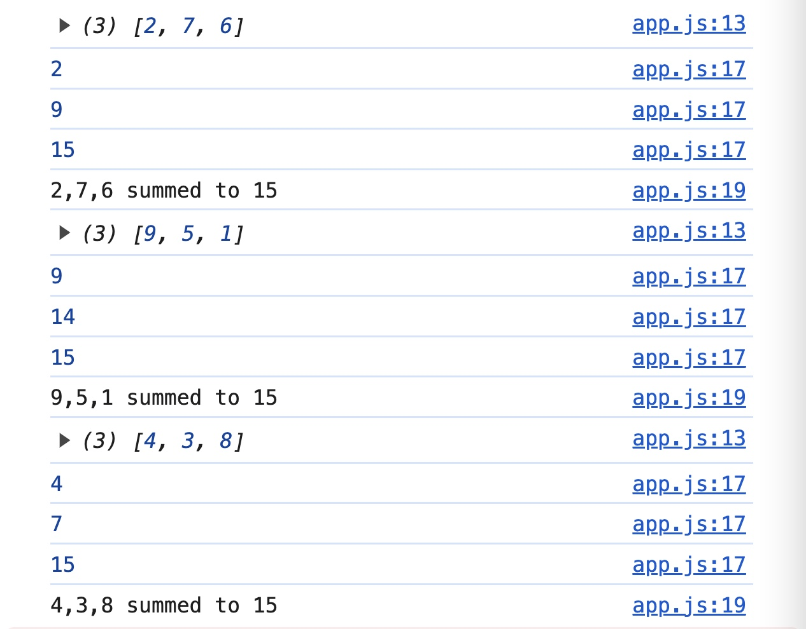


    - for…of
        - Code

            ```jsx
            for (let row of magicSquare) {
              console.log(row);
              let sum = 0
              for (let num of row) {
                sum += num
                console.log(sum);
              }
              console.log(`${row} summed to ${sum}`);
            }
            ```


        - Output

            


    - Conclusion: For the same result, the **for…of** loop is going to be cleaner and easier to understand than the **for** loop.

- Example 2:
    - Given 2 arrays

        ```jsx
        const words1 = ['mail', 'meal', 'bath', 'black']
        const words2 = ['box', 'shake', 'tub', 'berry']
        ```


    - Sample output

        ```jsx
        mailbox
        milkshake
        bathtub
        blackberry
        ```


    - Code

        ```jsx
        for (let i = 0; i < words1.length; i++) {
          console.log(`${words1[i]}${words2[i]}`);
        }
        ```


    - Output

        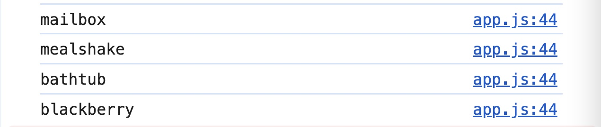


    - Explanations
    - Conclusion: If you need to care about the index of the array element, traditional **for** loop is going to be a better solution than **for…of** loop.

- Question
    - If I were to move `let sum = 0`  out of the *for* loop
    The output is going to be different.
    What is the reason?
        - Given array

            ```jsx
            const magicSquare = [[2, 7, 6], [9, 5, 1], [4, 3, 8]]
            ```


        - Code

            ```jsx
            let sum = 0;

            for (let i = 0; i < magicSquare.length; i++) {
              // console.log(magicSquare[i]);
              let row = magicSquare[i];
              console.log(row);
              for (let j = 0; j < row.length; j++) {
                // console.log(row[j]);
                sum += row[j]
                console.log(sum);
              }
              console.log(`${row} summed to ${sum}`);
            }
            ```

            - Explanations
                1. **Initialization**:

                    ```jsx
                    let sum = 0;
                    ```

                    A variable `sum` is initialized to `0`. This will keep track of the cumulative sum of all the elements in the `magicSquare` array.

                2. **Outer Loop**:

                    ```jsx
                    for (let i = 0; i < magicSquare.length; i++) {
                    ```

                    - This `for` loop iterates over each row of the `magicSquare` array.
                    - `magicSquare.length` is `3`, so `i` will take values `0`, `1`, and `2`.
                3. **Accessing Each Row**:

                    ```jsx
                    let row = magicSquare[i];
                    console.log(row);
                    ```

                    - In each iteration, the `i-th` row is accessed and stored in the variable `row`.
                    - The row is then logged to the console.
                4. **Inner Loop**:

                    ```jsx
                    for (let j = 0; j < row.length; j++) {
                    ```

                    - This `for` loop iterates over each element of the current `row`.
                    - `row.length` is `3`, so `j` will take values `0`, `1`, and `2`.
                5. **Summing Elements**:

                    ```jsx
                    sum += row[j];
                    console.log(sum);
                    ```

                    - For each element in the row, `row[j]` retrieves the `j-th` element.
                    - This element is added to `sum`.
                    - The current value of `sum` is logged to the console after each addition.
                6. **Logging Row Sum**:

                    ```jsx
                    console.log(`${row} summed to ${sum}`);
                    ```

                    After the inner loop completes for the current row, the entire row and the cumulative sum (`sum`) are logged to the console in a formatted string.


            [Detailed Walkthrough](https://www.notion.so/Detailed-Walkthrough-32a46983d8b347baa3fb3f2d2fefc145?pvs=21)


        - Output

            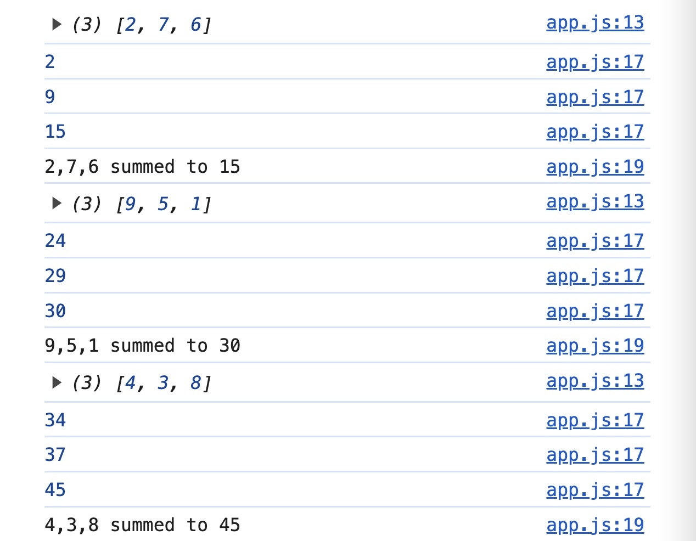


    - This code
    for (let i = 0; i < words1.length; i++) {
      for (let j = 0; j < words2.length; j++) {
        console.log(`${words1[i]}${words2[j]}`);
      }
    }

    will give this result
    mailbox
    mailshake
    mailtub
    mailberry
    mealbox
    mealshake
    mealtub
    .
    .
    .
    (same with ‘bath’ and ‘black’).
    What is the reason?

        **Detailed Walkthrough**

        1. **First Iteration of Outer Loop (`i = 0`)**:

            `words1[i]` is `words1[0]` which is `"mail"`.

        2. **First Iteration of Inner Loop (`j = 0`)**:

            `words2[j]` is `words2[0]` which is `"box"`.

            Concatenation: `"mail" + "box"` results in `"mailbox"`.

            Logs: `mailbox`

        3. **Second Iteration of Inner Loop (`j = 1`)**:

            `words2[j]` is `words2[1]` which is `"shake"`.

            Concatenation: `"mail" + "shake"` results in `"mailshake"`.

            Logs: `mailshake`

        4. **Third Iteration of Inner Loop (`j = 2`)**:

            `words2[j]` is `words2[2]` which is `"tub"`.

            Concatenation: `"mail" + "tub"` results in `"mailtub"`.

            Logs: `mailtub`

        5. **Fourth Iteration of Inner Loop (`j = 3`)**:

            `words2[j]` is `words2[3]` which is `"berry"`.

            Concatenation: `"mail" + "berry"` results in `"mailberry"`.

            Logs: `mailberry`

        6. **Second Iteration of Outer Loop (`i = 1`)**:

            `words1[i]` is `words1[1]` which is `"meal"`.

        7. **First Iteration of Inner Loop (`j = 0`)**:

            `words2[j]` is `words2[0]` which is `"box"`.

            Concatenation: `"meal" + "box"` results in `"mealbox"`.

            Logs: `mealbox`

        8. **Second Iteration of Inner Loop (`j = 1`)**:

            `words2[j]` is `words2[1]` which is `"shake"`.

            Concatenation: `"meal" + "shake"` results in `"mealshake"`.

            Logs: `mealshake`

        9. **Third Iteration of Inner Loop (`j = 2`)**:

            `words2[j]` is `words2[2]` which is `"tub"`.

            Concatenation: `"meal" + "tub"` results in `"mealtub"`.

            Logs: `mealtub`

        10. **Fourth Iteration of Inner Loop (`j = 3`)**:

            `words2[j]` is `words2[3]` which is `"berry"`.

            Concatenation: `"meal" + "berry"` results in `"mealberry"`.

            Logs: `mealberry`

        11. **Third Iteration of Outer Loop (`i = 2`)**:

            `words1[i]` is `words1[2]` which is `"bath"`.

        12. **First Iteration of Inner Loop (`j = 0`)**:

            `words2[j]` is `words2[0]` which is `"box"`.

            Concatenation: `"bath" + "box"` results in `"bathbox"`.

            Logs: `bathbox`

        13. **Second Iteration of Inner Loop (`j = 1`)**:

            `words2[j]` is `words2[1]` which is `"shake"`.

            Concatenation: `"bath" + "shake"` results in `"bathshake"`.

            Logs: `bathshake`

        14. **Third Iteration of Inner Loop (`j = 2`)**:

            `words2[j]` is `words2[2]` which is `"tub"`.

            Concatenation: `"bath" + "tub"` results in `"bathtub"`.

            Logs: `bathtub`

        15. **Fourth Iteration of Inner Loop (`j = 3`)**:

            `words2[j]` is `words2[3]` which is `"berry"`.

            Concatenation: `"bath" + "berry"` results in `"bathberry"`.

            Logs: `bathberry`

        16. **Fourth Iteration of Outer Loop (`i = 3`)**:

            `words1[i]` is `words1[3]` which is `"black"`.

        17. **First Iteration of Inner Loop (`j = 0`)**:

            `words2[j]` is `words2[0]` which is `"box"`.

            Concatenation: `"black" + "box"` results in `"blackbox"`.

            Logs: `blackbox`

        18. **Second Iteration of Inner Loop (`j = 1`)**:

            `words2[j]` is `words2[1]` which is `"shake"`.

            Concatenation: `"black" + "shake"` results in `"blackshake"`.

            Logs: `blackshake`

        19. **Third Iteration of Inner Loop (`j = 2`)**:

            `words2[j]` is `words2[2]` which is `"tub"`.

            Concatenation: `"black" + "tub"` results in `"blacktub"`.

            Logs: `blacktub`

        20. **Fourth Iteration of Inner Loop (`j = 3`)**:

            `words2[j]` is `words2[3]` which is `"berry"`.

            Concatenation: `"black" + "berry"` results in `"blackberry"`.

            Logs: `blackberry`


- Given two arrays

const words1 = ['mail', 'meal', 'bath', 'black'];
const words2 = ['box', 'shake', 'tub', 'berry'];

What is the difference between these two codes?

for (let i = 0; i < words1.length; i++) {
  for (let j = 0; j < words2.length; j++) {
    console.log(${words1[i]}${words2[j]})
  }
}

and

for (let i = 0; i < words1.length; i++) {
  console.log(${words1[i]}${words2[i]});
}
    - First code

        ```jsx
        for (let i = 0; i < words1.length; i++) {
          for (let j = 0; j < words2.length; j++) {
            console.log(`${words1[i]}${words2[j]}`);
          }
        }
        ```

        - Explanation:
            - **Nested Loop:** There is an outer loop iterating over each element in `words1`, and for each iteration of the outer loop, the inner loop iterates over each element in `words2`.
            - **Combinations:** This results in every element of `words1` being combined with every element of `words2`.
        - Output:

            This code will generate 16 outputs (4 elements from `words1` × 4 elements from `words2`):

            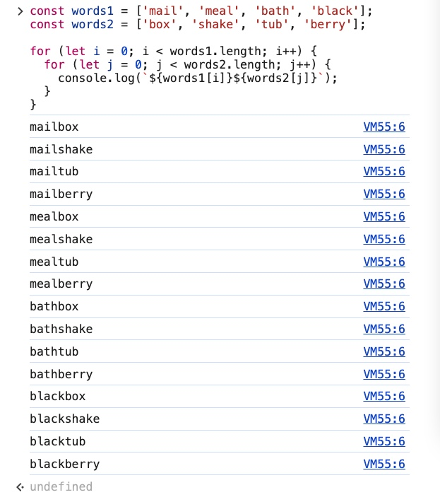


    - Second code

        ```jsx
        for (let i = 0; i < words1.length; i++) {
          console.log(`${words1[i]}${words2[i]}`);
        }
        ```

        - Explanation:
            - **Single Loop:** There is only one loop iterating over the elements of `words1` (and by implication, `words2`).
            - **Index-Based Combination:** For each iteration, it combines the `i`th element of `words1` with the `i`th element of `words2`.
        - Output:

            This code will generate 4 outputs (each index of `words1` combined with the same index of `words2`)

            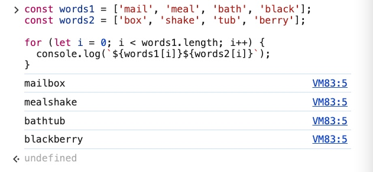