## Section 8: Writing Usable Code with Functions
### Dice Roll function

app.js

```jsx
function rollDice() {
  let roll = Math.floor(Math.random() * 6) + 1;
  console.log(`Rolled ${roll}`);
}
```

Goal: Generating numbers from 1 to 6

Methods:

- [Math.random()](https://developer.mozilla.org/en-US/docs/Web/JavaScript/Reference/Global_Objects/Math/random)
    - returns a floating-point, pseudo-random number that's **greater than or equal to** 0 and less than 1
    - you can then scale to your desired range

    Math.random() * 6

    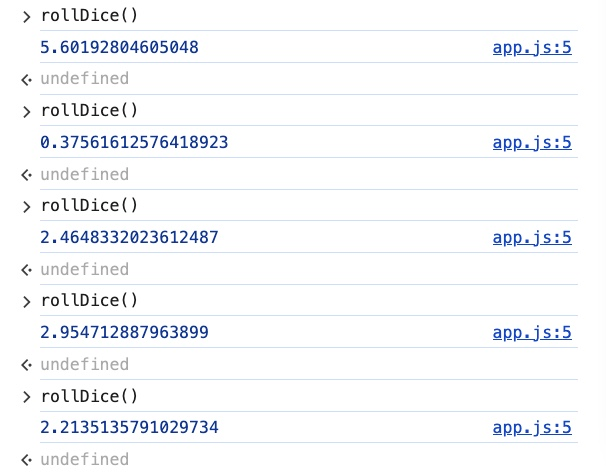

- [Math.floor()](https://developer.mozilla.org/en-US/docs/Web/JavaScript/Reference/Global_Objects/Math/floor)
    - rounds down and returns the largest integer less than or equal to a given number ⇒ remove the decimal part.
    - Math.floor(Math.random() * 6)

        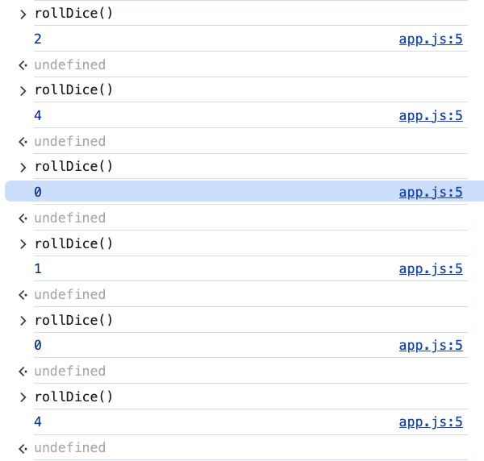

    - Math.floor(Math.random() * 6) + 1 ⇒ Why adding 1?

        Add “1” into “Math.floor()” because you want the values from 1 to 6 (there is no zero value in the dice)


    

### Arguments (inputs)

*Zero argument - the code runs the same every time*

```jsx
function rollDice() {
  let roll = Math.floor(Math.random() * 6) + 1;
  console.log(`Rolled ${roll}`);
}
rollDice(); // the code runs once
```

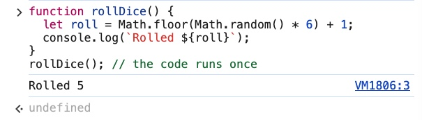

*Calling "rollDice" multiple times by repeating the function*

```jsx
function throwDice () { // zero argument
  // call "rollDice" 6 times
  rollDice();
  rollDice();
  rollDice();
  rollDice();
  rollDice();
  rollDice();
}
// throwDice(); // the code runs 6 times
```

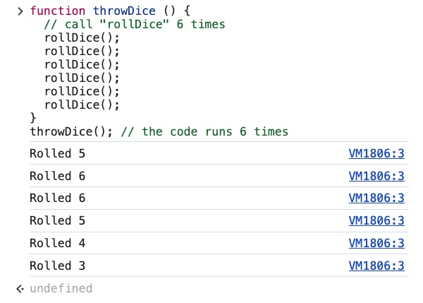

Calling "rollDice" multiple times by using argument

```jsx
function throwDice (numbOfRoll) { // 1 argument
  // call "rollDice" 6 times
  for (let i = 0; i < numbOfRoll; i++) {
    rollDice();
  }
}
throwDice(6); // the code runs 6 times
```

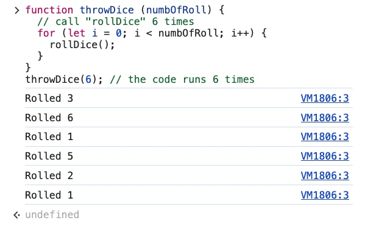

### Return Statement

> [return](https://developer.mozilla.org/en-US/docs/Web/JavaScript/Reference/Statements/return) statement ends function execution and return the values when you call them
>

- “console.log” prints out the value from the function but does NOT store those values

```jsx
function add (x, y) {
  console.log(x + y);
}

const sum = add (10, 16); // 26
sum; // undefined
```

- When you call “sum”, it prints out “undefined” instead of a value. Why?

    The result of function “add” is evaluated but it is NOT stored anywhere, therefore you canNOT call it later.


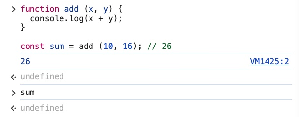

- “return” will store the value of the function after being evaluated, therefore you can call it after that.

```jsx
function add (x, y) {
  **return** x + y;
}

const sum = add (10, 16); // 26
sum; // 26
```

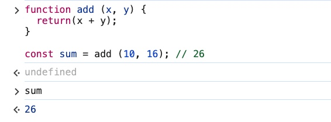

### Function Challenge 1: passwordValidator

- isValidPassword function
    - accepts 2 **arguments**: username and password
    - Password requirements
        - at least 8 characters
        - NO spaces
        - CanNOT contain the username
    - returns true if all requirements are met, otherwise return false

- Examples
    - isValidPassword(’89Fjj1nms’, ‘dogLuvr’); // true
    - isValidPassword(’dogLuvr123!’, ‘dogLuvr’); // false
    - isValidPassword(’hello1’, ‘dogLuvr’); // false

```jsx
function isPasswordValid(password, username) {
	if (password < 8) {
		return false;
	}
	if (password.indexOf(' ') !== -1) {
		return false;
	}
	if (password.indexOf(username) !== -1) {
		return false;
	}
	return true;
}
isPasswordValid('emmalin123', 'emmalin') // false
isPasswordValid('emmalin123', 'isCool') // true
```

- isPasswordValid('emmalin123', 'emmalin') // false

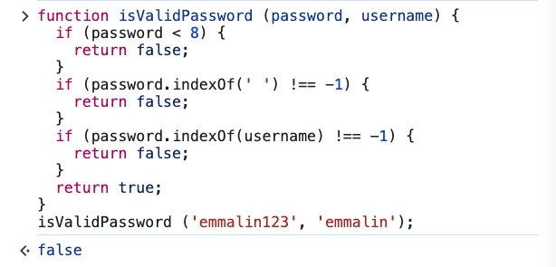

- isPasswordValid('emmalin123', 'isCool') // true

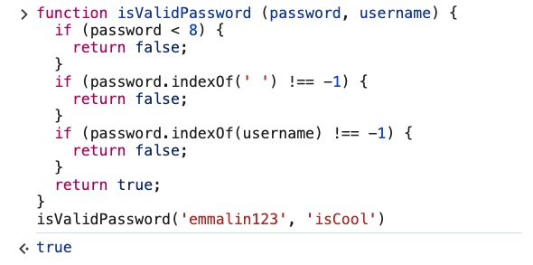

Explanation: Condition for “password” with “indexOf()”

- if (password.indexOf(' ') !== -1) ⇒ returns false. Why?

    If there is a space in the password ⇒ return false

- if (password.indexOf(username) !== -1) ⇒ return false. Why?

    if the password contains the username ⇒ return false


“indexOf()” is available for both [array](https://developer.mozilla.org/en-US/docs/Web/JavaScript/Reference/Global_Objects/Array/indexOf) and [string](https://developer.mozilla.org/en-US/docs/Web/JavaScript/Reference/Global_Objects/String/indexOf)

if the indexOf() of an element is something other than -1, the element exists in the array (or string).

Condition variation 2

```jsx
function isPasswordValid(password, username) {
	if (password < 8 || password.indexOf(' ') !== -1 || password.indexOf(username) !== -1) {
    return false;
  }
  return true;
}
// isValidPassword('coolYeah123', 'coolYeah'); // false
// isValidPassword('coolYeah123', 'haha'); // true
```

Condition variation 3

```jsx
function isValidPassword (password, username) {
  const tooShort = password < 8;
  const hasSpace = password.indexOf(' ') !== -1;
  const tooSimilar = password.indexOf(username) !== -1;

  if ( tooShort || hasSpace || tooSimilar ) {
    return false;
  }
  return true;
}
// isValidPassword('hoyota123', 'hoyota') // false
// isValidPassword('hoyota123', 'hotayako') // true
```

Condition variation 4 - inverted condition

```jsx
function isValidPassword (password, username) {
  const tooShort = password < 8;
  const hasSpace = password.indexOf(' ') !== -1;
  const tooSimilar = password.indexOf(username) !== -1;

  if ( !tooShort && !hasSpace && !tooSimilar ) {
    return true;
  }
  return false;
}
// isValidPassword('ahyahta123', 'ahyahta') // false
// isValidPassword('ahyahta123', 'kosapa') // true
```

Condition variation 5

```jsx
function isValidPassword (password, username) {
  const tooShort = password < 8;
  const hasSpace = password.indexOf(' ') !== -1;
  const tooSimilar = password.indexOf(username) !== -1;

  return !tooShort && !hasSpace && !tooSimilar;
}
isValidPassword('yamaha123', 'yamaha') // false
isValidPassword('yamaha123', 'kobiyama') // true
```

### Function Challenge 2: Average

- Write a function to find the average value in an array of numbers. What is the approach?
    - loop over each num
    - add them together
    - divide by number of nums

Examples:

- avg([0, 50]) // 25
- avg([75, 76, 80, 95, 100]) // 85.2

```jsx
function avg (arr) {
  let total = 0;
  // loop over each num
  for (let num of arr) {
    // add them together
    total += num;
  }
  // divide by number of nums
  return res = total / arr.length
}
avg([0, 50]) // 25
avg([75, 76, 80, 95, 100]) // 85.2
```

Notes:

- The argument is “arr”. Why not “num”?
    - You are trying to find the average value in an **array**
    - You are looping over the elements in an **array**
- Declare variable “total” and initialize it with “0”. Why do you need this variable?
    - the calculation for the average value is average = (sum of all numbers) / total elements in the array

        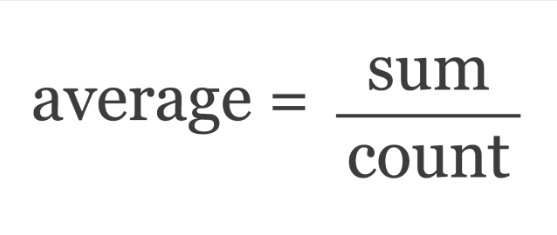

    - You need a variable to store and to update the addition of the numbers in the array (**total**) so that later on you can divide that sum number by the number of elements in the array (**arr.length**) for the average value.
- If I were to declare then return “res”. What would the code have been?

    ```jsx
    const res = total / arr.length;
    return res;
    ```

### Function Challenge 3: Pangram

> A Pangram is a sentence that contains every letter of the alphabet
>

Example: “The quick brown fox jumps over the lazy dog”

- Write a function called isPangram. What should it check for?
    - Check if a given sentence contains every letter of the alphabet
    - Ignore string casing (turn all cases to lower case)

- What are the validations?
    - True: “The five boxing wizards jump quickly”. Why? This sentence contains all the letters in the alphabet
    - False: “The five boxing wizards jump quick”. Why? Two letters “l” and “y” are missing!

```jsx
function isPangram (sentence) {
	// string casing
	let lowerCased = sentence.toLowerCase();

	// loop over the letters in the sentence
	for (let char of 'abcdefghijklmnopqrstuvwxyz') {
		// check whether a sentence is a Pangram
		if (lowerCased.indexOf(char === -1)) {
			return false;
		}
	}
	return true;
}
isPangram(“The quick brown fox jumps over the lazy dog”); // true
```

Notes:

- Loop over the letters in the sentence
    - Use loop “for…of…”
    - The way to loop over the elements in a long string

    ```jsx
    for (let char of 'abcdefghijklmnopqrstuvwxyz')
    ```

- String casing. Why do you need it?
    - You are looping over a string of LOWER case alphabet letters, even if there is only one letter in your sentence is UPPER case (letter “G” in the image), “isPangram” will return false in spite of the fact that your sentence contains all the alphabetical letters.

    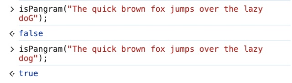

    - It is very important to equalize all the string case for the correct checking result

    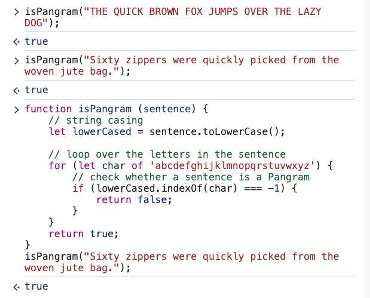

- If you were to use “[**includes**](https://developer.mozilla.org/en-US/docs/Web/JavaScript/Reference/Global_Objects/String/includes)” for the condition. What would be the changes in the code?

    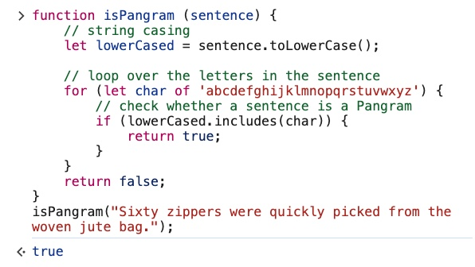

    - You would not need to check “indexOf” with “-1”
    - The “return” statements would be inverted.

### Function Challenge 4: Get Playing Card

Write a “getCard” function which returns a random playing card object.

Example:

```jsx
{
  value: "K",
  suit: "clubs"
}
```

Instructions:

- Pick a random value

    1,2,3,4,5,6,7,8,9,10,J,Q,K,A

- Pick a random suit

    hearts, diamonds, spaces, clubs

- Return both in an object

    ```jsx
    {
      value: "K",
      suit: "clubs"
    }
    ```


- This program is divided into two functions
    - pick() - pick a random card.
    - getCard() - where the cards can be accessed by reusing function pick()

    ```jsx
    function pick (arr) {
      const idx = Math.floor(Math.random() * arr.length);
      return arr[idx];
    }
    ```

    ```jsx
    function getCard () {

      // The values
      const values = ["1","2","3","4","5","6","7","8","9","10","J","Q","K","A"];

      const value = pick (values); // Reuse function pick

      // The suites
      const suites = ["hearts", "diamonds", "spaces", "clubs"];

      const suite = pick(suites); // Reuse function pick

      return { value: value, suite: suite};
    }
    ```

    - One step further is to reuse “pick” right where you return “value” and “suite”

        From

        ```jsx
        return { value: value, suite: suite};
        ```

        to

        ```jsx
        return { value: pick (values), suite: pick(suites)};
        ```

        What “pick” function does is to generate a random number

        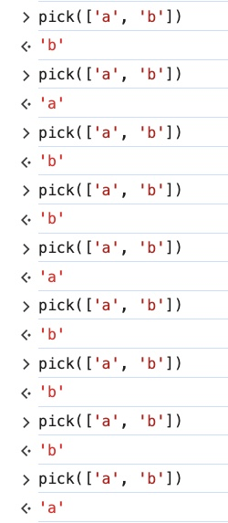

        So the function “getCard” can be shortened

        To differentiate the code before and after “return” using “pick” function for , we will call this function “getCard1”

        ```jsx
        function getCard1 () {

          // The values
          const values = ["1","2","3","4","5","6","7","8","9","10","J","Q","K","A"];

          // The suites
          const suites = ["hearts", "diamonds", "spaces", "clubs"];

          return { value: pick (values), suite: pick(suites)};
        }
        ```

        Both “getCard” and “getCard1” functions return the same results

        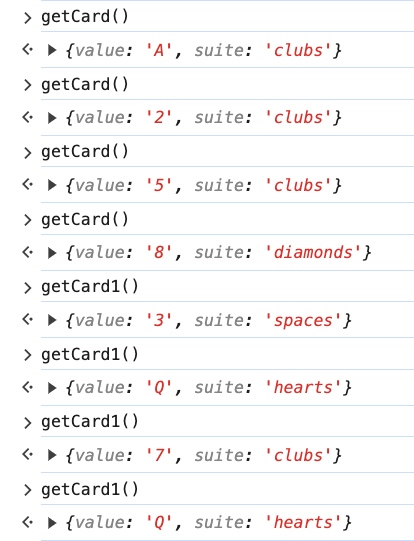


Notes:

- The highest number for “valIdx” is only 13 but there are 14 elements in the array. Why?

    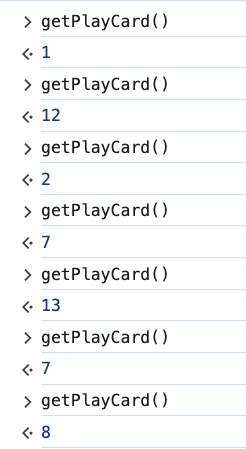

    - There are 14 elements in the array “value”, “valIdx” will go from 0 to 13.
    - “valIdx” is for accessing random indices in the array “values”.

    E.g. say “valIdx = 3”, that means “values[3]” which is the value 4 in the array “values”.

- The highest number for “suitesIdx” is only 3 but there are 4 elements in the array. Why?
    - There are 4 elements in the array “suites”, “suitesIdx” will go from 0 to 3.
    - “suitesIdx” is for accessing random indices in the array “suites”.

        E.g. say “suitesIdx = 1”, that means “suites[1]” which is the value “diamonds” in the array “suites”.

- How about looping through the array “values” instead of using Math.floor(Math.random())?
- You can only “return” once, if you return twice then all the codes after the first “return” will be unreachable. Why?

    The [**return**](https://developer.mozilla.org/en-US/docs/Web/JavaScript/Reference/Statements/return) statement ends function execution.

    Read more at [**Warning: unreachable code after return statement**](https://developer.mozilla.org/en-US/docs/Web/JavaScript/Reference/Errors/Stmt_after_return)

- You changed “idx” to “valueIdx” for Math.floor(Math.random() * values.length). What is the reason?

    From

    ```jsx
    const idx = Math.floor(Math.random() * values.length)
    ```

    to

    ```jsx
    const valIdx = Math.floor(Math.random() * values.length)
    ```

    The reason was simply to name the counter different for the arrays “values” and “suites” as they use the same piece of code for generating random numbers

    ```jsx
    // The values
    const values = ["1","2","3","4","5","6","7","8","9","10","J","Q","K","A"];

    const valIdx = Math.floor(Math.random() * values.length); // --- same
    const value = values[valIdx];

    // The suites
    const suites = ["hearts", "diamonds", "spaces", "clubs"];

    const suitesIdx = Math.floor(Math.random() * suites.length); // --- same
    const suite = suites[suitesIdx];
    ```


You can also combine the two functions into one big function

```jsx
function getPlayingCard () {

  // The values
  const values = ["1","2","3","4","5","6","7","8","9","10","J","Q","K","A"];

  const valIdx = Math.floor(Math.random() * values.length);
  const value = values[valIdx];

  // The suites
  const suites = ["hearts", "diamonds", "spaces", "clubs"];

  const suitesIdx = Math.floor(Math.random() * suites.length);
  const suite = suites[suitesIdx];

  return { value: value, suite: suite};
}
```

- However, the codes for “values” and “suites” are quite identical and can be replaced by the same function (which is “pick” function as seen above).


    values

    ```jsx
    const valIdx = Math.floor(Math.random() * values.length);
    const value = values[valIdx];
    ```

    suites

    ```jsx
    const suitesIdx = Math.floor(Math.random() * suites.length);
    const suite = suites[suitesIdx];
    ```

### “break” keyword vs. “return” statement (self notes)

#### [return](https://developer.mozilla.org/en-US/docs/Web/JavaScript/Reference/Statements/return) Statement

- **Purpose:** The `return` statement is used to end the execution of a function and optionally return a value from that function.
- **Usage Context:** It is used within a function body.
- **Effect:** It stops the execution of the function and returns control back to the calling context. If a value is provided, it returns that value to the caller.

```jsx
function sum(a, b) {
  return a + b; // Ends the function execution and returns the sum of a and b
  console.log("This will not be executed"); // This line will never be reached
}

console.log(sum(2, 3)); // Outputs: 5
```

#### [break](https://developer.mozilla.org/en-US/docs/Web/JavaScript/Reference/Statements/break) Keyword

- **Purpose:** The `break` keyword is used to terminate the execution of a loop or switch statement.
- **Usage Context:** It is used within loops (`for`, `while`, `do...while`) and `switch` statements.
- **Effect:** It immediately exits the loop or switch statement, transferring control to the code immediately following the loop or switch.

```jsx
for (let i = 0; i < 10; i++) {
  if (i === 3) {
    break; // Exits the loop when i is 3
  }
  console.log(i); // Outputs: 0, 1, 2
}
```

#### Comparison and Usage

- **Ending Function Execution:** Only the `return` statement can end the execution of a function.
- **Exiting Loops and Switch Statements:** Only the `break` keyword can be used to exit loops and switch statements.

#### Difference Illustration

```jsx
function findNumber(arr, target) {
  for (let i = 0; i < arr.length; i++) {
    if (arr[i] === target) {
      return i; // Ends the function execution and returns the index
    }
  }
  return -1; // Ends the function execution if the target is not found
}

console.log(findNumber([1, 2, 3, 4, 5], 3)); // Outputs: 2

for (let i = 0; i < 5; i++) {
  if (i === 2) {
    break; // Exits the loop when i is 2
  }
  console.log(i); // Outputs: 0, 1
}
```

#### Conclusion

- Use `return` to end function execution and optionally return a value.
- Use `break` to exit loops and switch statements.