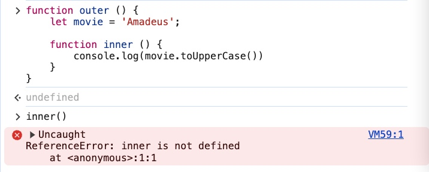
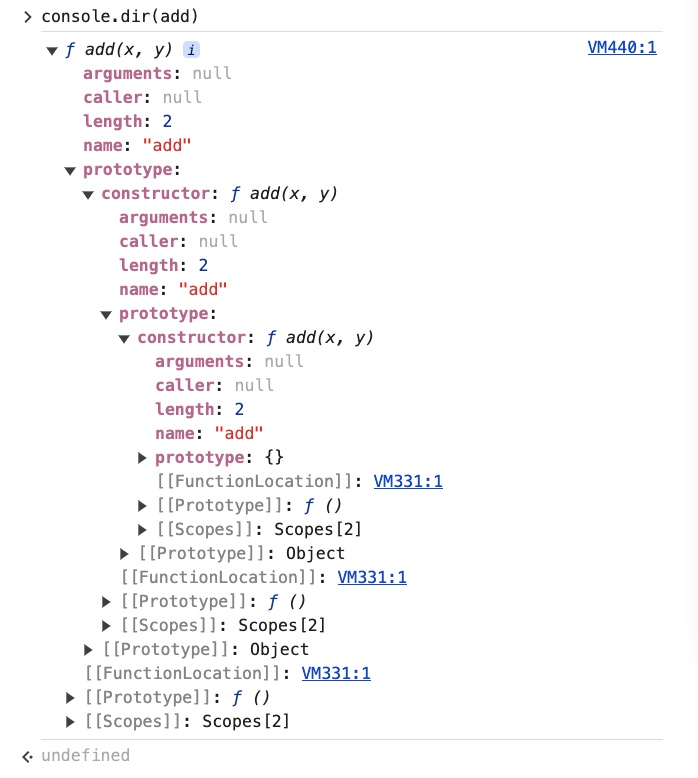
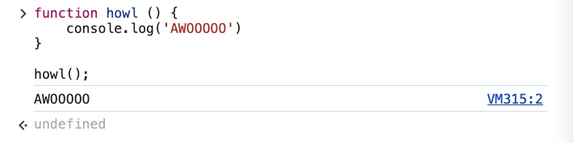

## CONTENT

### Function Scope

- Example 1

    ```jsx
    function lol () {
      let person = 'Tom';
      const age = 45;
      var color = 'teal';
    }
    console.log(person)
    ```

    - Output

        


    - Reason: “person” is defined inside the function “lol” and canNOT be accessed from outside the function.

- Example 2:

    ```jsx
    function lol () {
      let person = 'Tom';
      const age = 45;
      var color = 'teal';
      console.log(age)
    }

    function changeColor() {
      let color = 'purple';
      const age = 19;
      console.log(age);
    }

    lol(); // 45
    changeColor(); // 19
    ```

    - Output

        


    - Explanation
        - `const age = 45` and `const age = 19`  are the variables that you declared inside the functions and they are scoped to their functions which mean they are ONLY visible to the function where they are declared in.
        - You can call the functions but you can NOT access or manipulate those variables from anywhere outside the function.

- Example 3:

    ```jsx
    let bird = 'mandarin duck'

    function birdWatch() {
      let bird = 'golden pleasant';
      console.log(bird)
    }

    birdWatch() // golden pleasant
    console.log(bird) // mandarin duck
    ```

    - Output

    

    - Reason:
        - `let bird = ‘golden pleasant’` is declared within the function scope of *birdWatch()*, you can call the function but you can NOT manipulate the variable from outside the scope.
        - `let bird = ‘mandarin duck’` is declared outside the function scope, therefore, it can be accessed from anywhere outside the function.

    - Illustration

        

### Block Scope

#### Illustration


- Examples
    - Example 1:

        ```jsx
        if (true) {
          let animal = 'eel';
        }
        console.log(animal);
        ```

        

        - Reason:
            - “animal” is scoped inside the condition “if”
            - “animal” is scoped inside the block of code

                ```jsx
                if (true) {
                  // code
                }
                ```


        > **Note**: *Object literal* is very different from a *block* of code even though they are both scoped inside the curly braces

        - object literal
        {
            a: 1;
            b: 2
        }

        - block of code
        if (true) {
            // code
        }
        while, for, for…of are also blocks
        >

    - Example 2:

        ```jsx
        if (true) {
          const animal = 'eel';
        }
        console.log(animal);
        ```

        

        - Reason:

            Same with in Example 1, “animal” is declared inside the conditional and ONLY visible inside the block. You don’t have access to it outside the block.


    - Example 3:

        ```jsx
        if (true) {
          var animal = 'eel';
          console.log(animal)
        }
        console.log(animal);
        ```

        

        “var” is declared inside the conditional but it is NOT scoped only to that block.


    <aside>
    💡 “var” has different scoping rules than “let” and “const”, there is NO block scope for “var”.

    </aside>

    - Example 4:

        ```jsx
        let animals = ['grizzly bear', 'panda bear', 'spectacled bear'];
        for (var i = 0; i < animals.length; i++) {
          console.log(i, animals[i])
        }
        console.log(i)
        ```

        

        Even after the loop finishes with printing **i** out from `console.log(i, animals[i])` , the **i** outside the loop is printed, this means that you have the access to **i** even outside of the block of code.


    - Example 5:

        ```jsx
        let animals = ['grizzly bear', 'panda bear', 'spectacled bear'];
        var i = 10;
        for (var i = 0; i < animals.length; i++) {
          console.log(i, animals[i])
        }
        console.log(i)
        ```

        


    Question:

    - Why “var i = 10” is not printed out?

        The `var` keyword has *function* scope, **not** block scope which means that the variable `i` declared with `var` inside the `for` loop is the same variable as the `i` declared outside the loop.

        **for** loop explanation:

        ```jsx
        let animals = ['grizzly bear', 'panda bear', 'spectacled bear'];
        var i = 10;
        for (var i = 0; i < animals.length; i++) {
          console.log(i, animals[i])
        }
        console.log(i)
        ```

        - Inside the `for` loop, `var i = 0` re-declares the same `i` variable. The `var` keyword doesn't create a new variable scoped to the loop; it reuses the same `i` variable declared earlier.
        - The `var i = 0` inside the `for` loop overwrites the initial `i = 10`, and since `i` is the same variable, the **original** value of `10` is **lost** when the loop starts. After the loop finishes, `i` has the value from the last iteration of the loop, which is `3` .

        If you want to keep “**i = 10**” you could

        - use a different variable name for the loop counter
        - use `let` or `const` for block-scoped variables

        ```jsx
        let animals = ['grizzly bear', 'panda bear', 'spectacled bear'];
        var i = 10;
        for (var i = 0; i < animals.length; i++) {
          console.log(i, animals[i])
        }
        console.log(i)
        ```

        

        - Question: 10 is now printed out. Why is that?
        - Reason: The **i** that you declared with **let** is scoped to the **for** loop block so it does NOT exist in the `console.log(i)`  at the bottom.

    - Example 6: Same with Example 5 but you declare both **i** with **let**

        ```jsx
        let animals = ['grizzly bear', 'panda bear', 'spectacled bear'];
        let i = 10;
        for (let i = 0; i < animals.length; i++) {
          console.log(i, animals[i])
        }
        console.log(i)
        ```

        


    - There is the first variable **i** outside the loop and then the second variable **i** inside the loop yet the code does NOT break nor is the value overwritten, why is that?
        - Even though there are two of the same variable **i** yet they exist in different scopes.
        - The value of the first variable **i** is not overwritten like in Example 5 when the variable **i** is declared with **var** because **let** is block scoped but **var** is function scoped.

    - Example 7:

        ```jsx
        let animals = ['grizzly bear', 'panda bear', 'spectacled bear'];

        for (let i = 0; i < animals.length; i++) {
          console.log(i, animals[i]); // Will print 0, 1, 2 and corresponding animals
        }

        console.log(i); // ReferenceError: i is not defined
        ```

        

        - What is the reason for error “*i is not defined*” for the `console.log(i)`  at the bottom?

            **i** is declared with **let** inside the **for** loop so it is ONLY scoped to that block code and it does NOT exist for the `console.log(i)`  at the bottom.


    - Example 8:

        ```jsx
        let animals = ['grizzly bear', 'panda bear', 'spectacled bear'];

        for (const i = 0; i < animals.length; i++) {
          console.log(i, animals[i]);
        }

        console.log(i);
        ```

        

        Question:

        - Why does the code break?

            In JavaScript, you cannot reassign a new value to a variable declared with `const`.

            In the code above, you declare **i** as a **const** variable in the loop and you initialize it with 0, then you increment it by 1 with **i++** and so it prints out “0   ‘grizzly bear’” then it breaks.


    - Example 9

        Write a function that doubles every value of another array that is passed in.

        Note: Do NOT update the original array

        - Sample

            ```jsx
            Original array: [1, 3, 5]
            Doubled array: [2, 6, 10]
            ```


        - Code
            - Lesson Solution (correct)

                ```jsx
                function doubleArray (arr) {
                  const result = []
                  for (let i of arr) {
                    let num = i * 2
                    result.push(num)
                  }
                  return result
                }
                doubleArray ([1, 3, 5]) // [2, 4, 6]
                ```

                - Code

                    


            - Personal solution (need improvement)

                ```jsx
                const array = [1, 3, 5];

                function doubleArray() {
                  for (let i of array) {
                    console.log(i)
                    const doubled = []
                    doubled.push(i * 2)
                    console.log(doubled)
                  }
                }
                doubleArray()
                ```

                - Code

                    


        - Question 1
        This code

            ```jsx
            function doubleArray (arr) {
                const result = [];

                let num;
                for (let i of arr) {
                    console.log(i)
                    num = i * 2
                }
                return result.push(num)
            }
            ```

            prints out the following. Why is that?

            

            - Reason:
                - **`console.log(i)`**:

                    This line prints each element of the array `[1, 2, 3]`, so you get `1, 2, 3` in the console.

                - **`return result.push(num)`**:

                    Pushes the last value of 'num' into 'result' and returns the length of the array

                    - After the loop, `num` contains the last value calculated, which is `3 * 2 = 6`.
                    - The `result.push(num)` line adds `6` to the `result` array and returns the length of the array, which is `1` (since `push()` returns the new length of the array).
                    - The function returns this length, which is why `1` is the final output.
            - Issues:
                - **Only Last Element is Added**:
                    - You are only pushing the last calculated `num` into the `result` array, which means only the last element of the array is doubled and added.
                - **Incorrect Return Value**:
                    - The function returns the length of the array (`1` in this case), not the array itself.

        - Question 2:

            For this code

            ```jsx
            function doubleArray (arr) {
              const result = []
              for (let i of arr) {
                let num = i * 2
                result.push(num)
              }
              return result
            }
            doubleArray ([1, 3, 5])
            ```

            If you were to console.log(num) outside of the **for** loop, what would happen?

            Modified code

            ```jsx
            function doubleArray (arr) {
              const result = []
              for (let i of arr) {
                let num = i * 2
                result.push(num)
              }
              console.log(num)
              return result
            }
            doubleArray ([1, 3, 5])
            ```

            - Output: `Uncaught ReferenceError: num is not defined`
            - Reason: **let** is block scoped
            - Solution: Change **let** to **var**

                ```jsx
                function doubleArray (arr) {
                  const result = []
                  for (let i of arr) {
                    var num = i * 2
                    result.push(num)
                  }
                  console.log(num)
                  return result
                }
                doubleArray ([1, 3, 5])
                ```

                

                - What is the number 10?

                    10 is the value of 5 * 2 and 5 is the last element of the passed in array.


<aside>
💡 IMPORTANT NOTE

</aside>


Further reading: [**What's New In DevTools (Chrome 80)**](https://developer.chrome.com/blog/new-in-devtools-80/)

### Lexical Scope

- Example 1:

    ```jsx
    function outer () {
      let movie = 'Amadeus';

      function inner () {
        console.log(movie.toUpperCase())
      }
      inner();
    }
    ```

    

    Demonstration

    - If you execute **inner()** from inside **outer()**, it will successfully log out “AMADEUS” in CALL CAPS when you call the **outer()** function.
    - If you try to call **inner()** from outside the **outer()** function, you will not have access to it

    

    - With/Without the **inner()** executed from inside the **outer()** function, you will not have the access to the function from outside of the **outer()** function.

    Explanation:

    - When you execute **outer()**, the function **inner()** is called
    - **inner()** then console.log **movie**
    - **movie** is not defined within the function scope **inner()**
    - Therefore **inner()** will look for a different **movie** from the scope of the NEAREST parent function, the **outer()** scope.

    ```jsx
    function outer () {
      let movie = 'Amadeus';

      function inner () {
        let movie = 'The Shining';
        console.log(movie.toUpperCase())
      }
      inner();
    }
    ```

    

    Explanation:

    - When you execute **outer()**, the function **inner()** is called
    - **movie** is defined as “The Shining” within the function scope **inner()**
    - **inner()** then console.log **movie** (which is found within itself)
    - “The Shining” will be printed out as the result of calling the function **inner()**.

**Note:** “Amadeus” would have been printed out if **movie** had not been defined within **inner()**.

**inner()** will ONLY look for a further variable **movie** if it does NOT include one.

<aside>
💡 Lexical scope:
Nested functions are lexically bound to the scope of their parent or their outer functions.
It is a one way relationship!

</aside>

- Example 2:

    Lexical scope does NOT work from parent to nested (child) function

    ```jsx
    function outer () {
      let movie = 'Amadeus';

      function inner () {
        let x = 10
        console.log(movie.toUpperCase())
      }
      inner();
      console.log(x)
    }
    ```

    

    **x** is declared within **inner()**, you can NOT access it from outside the function.


- Example 3: Two layered nested functions

    ```jsx
    function outer () {
      let movie = "Amadeus";

      function inner () {
        let movie = "The Shinning";
        console.log(movie.toUpperCase())

        function extraInner () {
          console.log(movie.toUpperCase())
        }
        extraInner();
      }
      inner();
    }
    ```

    

    Explanation:

    - When **outer()** is executed then **inner()** is called
    - When **inner()** is executed then **extraInner()** is called
    - When **extraInner()** is called, **movie** is logged out
    - **movie** is NOT defined inside **extraInner()**, the function looks for the further **movie** in the nearest parent function.
    - In **inner()** function, **movie** is defined as “The Shining”
    - “The Shining” is printed out as the result of executing **outer()**

    


- Explanation
    - When **outer()** is executed then **inner()** is called
    - When **inner()** is executed then **extraInner()** is called
    - When **extraInner()** is called, **movie** is logged out
    - **movie** is NOT defined inside **extraInner()**, the function looks for the further **movie** in the nearest parent function (**inner()**).
    - **movie** is NOT defined inside **inner()** either (it is commented out), the function looks for the further **movie** in the next nearest parent function (**outer()**).
    - In **outer()** function, **movie** is defined as “Amadeus”
    - “Amadeus” is printed out as the result of executing **outer()**

### Function Expressions

Ways of creating a function: Read more at [Function Definitions](https://www.w3schools.com/js/js_function_definition.asp)

- Anonymous Function (Function Declaration)

    ```jsx
    function add (x, y) {
      return x + y;
    }
    ```

    

    

- Function Expressions

    ```jsx
    const sum = function (x, y) {
      return x + y;
    }
    ```

    

    


Same results just different syntaxes and different ways of referencing

### Higher Order Functions

> Functions are…OBJECTS!
>

```jsx
// function statement
function add (x, y) {
    return x + y;
}

// function expression
const subtract = function (x, y) {
    return x - y;
}

// function statement
function multiply (x, y) {
    return x * y;
}

// function expression
const divide = function (x, y) {
    return x / y;
}
```

- Storing the functions in the array “operations”

    ```jsx
    const operations = [add, subtract, multiply, divide];
    ```

    - Accessing the functions using the index of the array element

        ```jsx
        operations[1]
        operations[3]
        operations[2]
        operations[0]
        ```

        

        ```jsx
        operations[2](2, 4) // 8
        operations[1](3, 1) // 2
        operations[0](7, 3) // 10
        operations[3](60, 4) // 15
        ```


    - Print out all the functions from array “operations”

        ```jsx
        for (let i = 0; i <= operations.length - 1; i++) {
            console.log(operations[i])
        }
        ```

        


    - Run the numbers (arguments) through all the functions

        ```jsx
        for (let func of operations) {
          let result = func(10, 2);
          console.log(result)
        }
        ```

        


- Storing the function in an object

    ```jsx
    const thing = {
        doSomething: multiply
    }
    ```

    - Accessing the function

        ```jsx
        thing.doSomething
        ```

        


    - Using the function for calculation

        ```jsx
        thing.doSomething(2, 5) // 10
        ```

        


<aside>
💡

A “higher-order function” is **a function that accepts functions as parameters and/or returns a function**.

</aside>

- Question
    - **for** loop over the “operations” array only logs out the “division” function. Why is that?
        - **for….of** version

            ```jsx
            for (let func of operations) {
                func;
            }
            ```

            logs out only the “divide” function?

            

        - Regular **for** function

            ```jsx
            for (let i = 0; i <= operations.length - 1; i++) {
                operations[i]
            }
            ```

            logs out only the “divide” function?

            

### Hoisting

> MDN docs at [https://developer.mozilla.org/en-US/docs/Glossary/Hoisting](https://developer.mozilla.org/en-US/docs/Glossary/Hoisting)
>

Read more at [**JavaScript Hoisting: What It Is And Why It Was Implemented**](https://dev.to/jwwnz/javascript-hoisting-what-it-is-and-why-it-was-implemented-51ep)

- Hoisting with VAR

    ```jsx
    console.log(animal);
    // var animal = 'Tapir'
    ```

    

    ```jsx
    console.log(animal); // undefined
    var animal = 'Tapir'
    console.log(animal); // Tapir
    ```

    

    This is an odd behavior

    - JavaScript see the VAR declaration first
    - It will run the VAR declaration first
    - Then it will fill the value with “Tapir”

    This is NOT what you want, you will probably want **animal** to be defined and to have a value first before you can print it out rather than having it printed out before it is even defined.


- Hoisting with LET

    ```jsx
    console.log(shrimp);
    let shrimp = 'Harlequin Shrimp';
    ```

    

    Variable declarations made with **let** are NOT hoisted as they were made with VAR and this is one of the main reasons that you use **let** aside from block scope.


- Hoisting with FUNCTIONS
    - Function Statements

        ```jsx
        howl();

        function howl () {
          console.log('AWOOOOO')
        }
        ```

        The function is **called before** being **defined**

        ```jsx
        function howl () {
          console.log('AWOOOOO')
        }

        howl()
        ```

        The function is **called after** being **defined**.

        This is what you usually do.

        Yet the same result for both ways

        

        

        Explanation:

        - JavaScript interpreter runs across these lines first

            ```jsx
            function howl () {
              console.log('AWOOOOO')
            }
            ```

        - Just so that you can call

            ```jsx
            howl();
            ```


        This is unexpected yet it is how the JavaScript interpreter works.


    - Function Expressions
        - VAR

            Hosting does NOT work the same with Function Expressions, however.

            ```jsx
            hoot();

            var hoot = function () {
              console.log('HOOOO HOOOOO')
            };
            ```

            

            You must first define the function, otherwise you will NOT be able to call the function

            ```jsx
            var hoot = function () {
              console.log('HOOOO HOOOOO')
            };

            hoot();
            ```

            

            ```jsx
            console.log(hoot);

            var hoot = function () {
                console.log('HOOOO HOOOOO')
            }
            ```

            

            Explanation:

            - It is the same thing that you saw with **animal**
            - The variable declaration **var hoot** is hoisted.
            - JavaScript knows there is a variable called **hoot** but it does NOT know the value, so it sets the value to “undefined”.
            - If you execute **hoot()**, it will try to call “undefined” which you cannot do.

            <aside>
            💡 The **variable** is *hoisted*
            The **value** is NOT

            </aside>

        - LET

            Function expressions declared with **let** is NOT hoisted!

            ```jsx
            hoot();

            let hoot = function () {
                console.log('HOOOO HOOOOO')
            }
            ```

            <aside>
            💡 **Note:** Due to different environmental setups, running the code in different places might not give the same error of “*Uncaught ReferenceError: Cannot access 'hoot' before initialization*””

            </aside>

            - Tested in Chrome Dev Console

            

            - Tested in JSFIDDLE

                

                

            - Tested in VS Code

                

                

                - What is the reason for the error “*Uncaught ReferenceError: Cannot access 'hoot' before initialization*”

                    You are storing the function declared in the **let** variable, it is NOT hoisted at all.

                    You got the error because you can NOT access **hoot** before it exists which makes sense and you should NOT be able to do that.